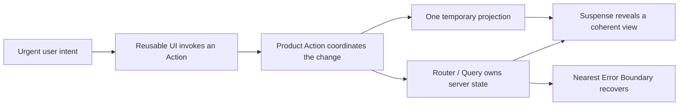

# Async React UX

Build async UI that responds immediately, preserves useful content, reveals coherent regions, and recovers locally. Choose APIs from the interaction semantics; do not add new React APIs merely to appear modern.

## Core model

Treat a Transition as a render of a possible next world. Urgent input may interrupt it; React commits only a coherent world. Keep side effects out of render and make resource/component identity explicit.

| Layer | Owns |
| --- | --- |
| reusable UI | Action prop invocation, pending/disabled/a11y feedback |
| product component | domain intent, concurrency and expected-error policy |
| router/data layer | Promise identity, cache keys, freshness, cancellation, invalidation |
| view boundaries | reveal order, retained content, unexpected-error recovery |

## Workflow

### 1. Inspect the project

1. Read React/renderer versions, stable versus Canary channel, router, data layer, SSR/RSC, Compiler, tests, and design-system primitives.
2. Prefer maintained framework/router/data integrations over demo routers or hand-built Promise caches.
3. Confirm the Compiler actually processes target components; fix purity or lint diagnostics instead of adding routine memoization.
4. Read [patterns.md](references/patterns.md) before changing async component behavior. When TanStack Query is installed or requested, read [tanstack-query.md](references/tanstack-query.md) completely. Read [testing.md](references/testing.md) before testing and [sources.md](references/sources.md) when semantics or release status are uncertain.

### 2. Write the interaction contract

Specify before implementation:

| State | Visible UI | Exit |
| --- | --- | --- |
| idle | confirmed data | intent |
| pending-fast | optimistic/current UI; no spinner | success/failure/slow |
| pending-slow | useful UI plus local cue | success/failure |
| expected error | retained/reverted UI plus correction or retry | retry/dismiss |
| unexpected error | nearest recovery boundary | reset/navigation |

Declare duplicate and concurrency semantics: latest-wins, queued, deduplicated, commutative, or mutually exclusive. Define optimistic reconciliation and rollback. Treat latency thresholds as measured product policy, not constants.

### 3. Select the declarative mechanism

| Need | Mechanism |
| --- | --- |
| controlled input, focus, pressed state | urgent state |
| slow consumer of urgent state | `useDeferredValue` |
| non-urgent navigation, filter, mutation | Action / Transition |
| form submission and result | `<form action>`, `useActionState`, `useFormStatus` |
| safe reversible prediction | `useOptimistic` or one cache strategy |
| first reveal of supported async resource | Suspense |
| routine refresh after reveal | Transition + retained content + local pending cue |
| independently recoverable failure | local Error Boundary |
| different entity/form instance | semantic `key` |
| external system React does not control | minimal Effect with cleanup |

Do not wrap controlled input updates in a Transition. A debounce limits request frequency; a deferred value changes render priority. Remove waterfalls and excess work before treating scheduling as a performance fix.

### 4. Compose components and boundaries

- Expose reusable interactions through `*Action` props. Let design components own interaction feedback; let product code own domain effects.
- Start independent work together and await late. Prefetch code and data on strong intent using the eventual resource key.
- Place Suspense boundaries around regions that should reveal together. Keep the persistent shell and already useful content outside replaceable fallbacks.
- Pair each reveal unit with the nearest useful error recovery. Return expected validation/conflict results; throw unexpected defects.
- Use `key` to state that an entity is a different component instance. Do not mirror props into state with an Effect. Keep component identity distinct from query/resource identity.
- Preserve semantic HTML, focus, keyboard use, live announcements, layout stability, reduced motion, and progressive enhancement.

### 5. Keep one source of truth

- Keep confirmed server state in the router/data cache and minimal draft state locally.
- Treat optimistic UI as a temporary projection. Pick exactly one owner: `useOptimistic`, mutation variables, or cache writes.
- Use stable client IDs and idempotency/version rules where retries or overlapping mutations can duplicate effects.
- Change a suspending query/resource key in a Transition so revealed content stays visible.
- With TanStack Query, let Query own server-state lifecycle and React own update priority, reveal, and presentation. Follow [tanstack-query.md](references/tanstack-query.md).

### 6. Avoid escape hatches by default

- Derive during render; perform user-caused work in its event/Action; load data in loaders, Server Components, or Suspense-aware resources.
- Allow `useEffect` only to synchronize a mounted component with a named external system. Require symmetric cleanup, complete dependencies, and Strict Mode safety. Prefer `useSyncExternalStore` for stores and `useEffectEvent` for non-reactive logic invoked by an Effect.
- Allow `useRef` only for non-rendering imperative handles when no declarative contract fits. Never use it as visible state, previous-prop bookkeeping, `isMounted`, or a dependency escape.
- Let React Compiler own memoization. Allow `useMemo`, `useCallback`, or `memo` only for measured regressions that remain with the Compiler or an external referential-identity contract; record the evidence.

### 7. Validate the experience

Follow project TDD rules and [testing.md](references/testing.md). Exercise fast, slow, failed, interrupted, repeated, and out-of-order operations—not only resolved mocks. Run typecheck, focused tests, accessibility checks, and a production build.

Observe Action duration, fallback exposure, stale-content duration, optimistic rollback, boundary recovery, retries, and superseded work without logging sensitive payloads.

## Release discipline

Verify APIs against installed versions. In React 19.2, Actions, Suspense, `useOptimistic`, `useDeferredValue`, `<Activity>`, and React Compiler are stable; `<ViewTransition>` and `addTransitionType` remain Canary in the cited material. Require explicit opt-in, pinned versions, graceful fallback, and tests for experimental APIs.

## Completion report

Report the interaction contract, responsibility/boundary choices, concurrency and rollback policy, tests, observability, experimental APIs, and residual risks. Include a compact state table or Mermaid flow only when the interaction has multiple meaningful states or boundaries.
