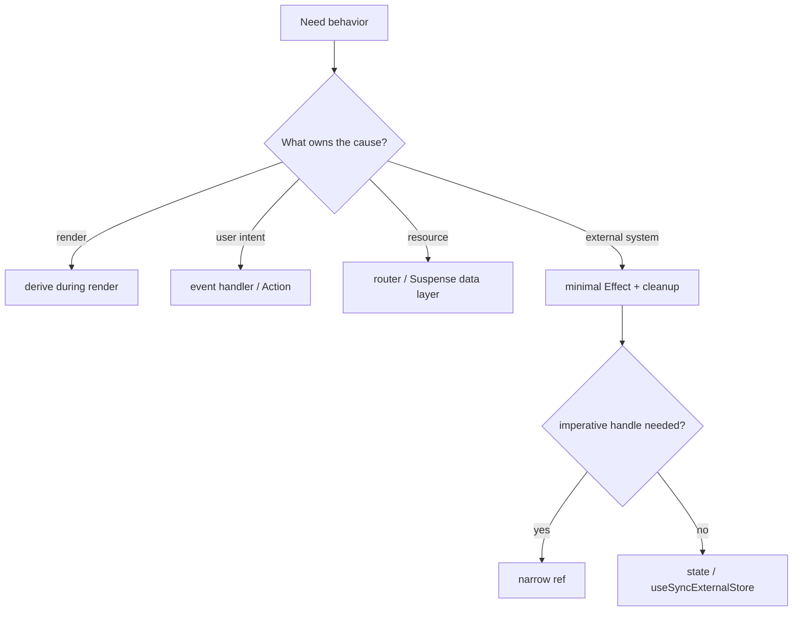

# Async React patterns

Use these implementation patterns after defining the interaction contract in `SKILL.md`.

## Contents

- [Action-oriented components](#action-oriented-components)
- [Transitions and retained content](#transitions-and-retained-content)
- [Optimistic state](#optimistic-state)
- [Suspense, errors, and identity](#suspense-errors-and-identity)
- [Loading and prefetching](#loading-and-prefetching)
- [Escape hatches and Compiler](#escape-hatches-and-compiler)
- [Activity and View Transitions](#activity-and-view-transitions)

## Action-oriented components

Turn async callbacks into Action props. This lets reusable UI own its pending behavior without knowing the domain operation.

```tsx
import { type ReactNode, useTransition } from "react"

function ActionButton({
  action,
  children,
}: {
  action: () => void | Promise<void>
  children: ReactNode
}) {
  const [pending, startTransition] = useTransition()

  return (
    <button
      aria-disabled={pending}
      aria-busy={pending}
      onClick={() => {
        if (!pending) startTransition(action)
      }}
    >
      {children}
    </button>
  )
}
```

- Name props `saveAction`, `deleteAction`, or `action` to communicate Transition invocation.
- Use `disabled` when activation and focus must be blocked; `aria-disabled` requires an event guard.
- Keep label and geometry stable. Delay a local indicator briefly and cancel it immediately on completion; never force a minimum spinner duration.
- Prefer `<form action>` and a descendant `useFormStatus` for form pending UI.
- After `await`, follow the installed React semantics; React 19.2 may require a nested `startTransition` for subsequent local state updates.

## Transitions and retained content

A Transition computes an interruptible next world. It is not a generic loading boolean and cannot make slow synchronous work fast.

- Keep controlled values, focus, disclosure, and direct feedback urgent.
- Transition route, tab, sort, filter, refresh, and mutation updates when their render may suspend or be expensive.
- Use `useDeferredValue` when the producer must remain urgent while a consumer may lag:

```tsx
const [query, setQuery] = useState("")
const deferredQuery = useDeferredValue(query)
const stale = query !== deferredQuery

return <ResultsRegion query={deferredQuery} aria-busy={stale} />
```

During a transitioned update, retain revealed content and add a local stale/pending cue. Use a skeleton for content never revealed or a genuinely new region. For search, encode latest-wins in the resource key/data layer; cancellation is an optimization, not the correctness mechanism.

## Optimistic state

Optimism is a reversible projection over confirmed state, not another database.

```tsx
const [optimisticItems, addOptimisticItem] = useOptimistic(
  items,
  (current, draft: Draft) => [
    ...current,
    { ...draft, status: "sending" as const },
  ],
)

async function sendAction(formData: FormData) {
  const draft = toDraft(formData) // includes a stable client ID
  addOptimisticItem(draft)
  await sendMessage(draft)
}
```

Before adopting optimism, define success reconciliation, automatic rollback, expected-error messaging, retry, duplicate intent, and overlapping-operation order. Use idempotency keys or versions where retries can repeat effects. Do not remove the only recovery affordance optimistically.

## Suspense, errors, and identity

Place boundaries by user-visible reveal and recovery units:

```tsx
<PageErrorBoundary>
  <PageShell>
    <Suspense fallback={<SummarySkeleton />}>
      <Summary />
    </Suspense>
    <SectionErrorBoundary>
      <Suspense fallback={<ListSkeleton />}>
        <List />
      </Suspense>
    </SectionErrorBoundary>
  </PageShell>
</PageErrorBoundary>
```

- Match fallback geometry to content; avoid a page spinner and a mosaic of flashing micro-boundaries.
- Suspense works only with supported resources: lazy code, cached Promises read by `use`, streaming/framework data, and documented integrations. Effect fetching does not activate it.
- Start sibling resources before reading either to avoid waterfalls.
- Represent validation, conflict, and correctable mutation failure as typed Action results. Let rejected resources and unexpected defects reach the nearest boundary.
- Recovery should retain unaffected UI, offer a meaningful retry/reset, restore focus when appropriate, and deduplicate telemetry.

Use a semantic `key` when the domain entity denotes another component instance:

```tsx
<ProfileForm key={user.id} user={user} />
```

Interpret this as “Alice's form disappeared and Bob's form appeared,” not “run an Effect to reset the same form.” Do not use unstable keys to force refetches; query keys identify resources, while React keys identify component instances.

## Loading and prefetching

- Start data at the route/server boundary or a user-intent event, not serially in child Effects.
- Never create `fetch()` Promises during render. Cache Promise identity or use the framework/query integration.
- Key resources by every defining input and define freshness, invalidation, error eviction, and memory bounds.
- Prefetch code and data on strong intent such as router intent, focus, pointer, or touch; reuse the exact eventual key.
- For auth-gated data, authenticate first, prefetch with a bounded navigation budget, then let the destination boundary reveal if work remains.
- Start independent requests together and stream coherent groups.

## Escape hatches and Compiler

Use this order:



Effects describe how the mounted component synchronizes with something outside React. They do not detect prop changes, derive/filter state, execute click consequences, orchestrate requests, notify parents, or reset local state. Encapsulate a justified Effect/ref in a small adapter and make it Strict Mode safe.

Keep render pure and follow the Rules of React so React Compiler can optimize it. Do not add `useMemo`, `useCallback`, or `memo` habitually. An exception needs profiler evidence that persists with the Compiler or a documented external identity contract.

## Activity and View Transitions

Use `<Activity mode="hidden">` on React 19.2+ when hidden UI should preserve state, clean up Effects, and prepare likely next content at low priority. Avoid retaining sensitive or memory-heavy trees.

Use `<ViewTransition>` only on an explicitly approved Canary setup until stable documentation says otherwise. The UI must remain semantically correct without animation, use stable identities, preserve focus/reading position, and honor `prefers-reduced-motion`. Do not adopt a demo router merely for animation.
