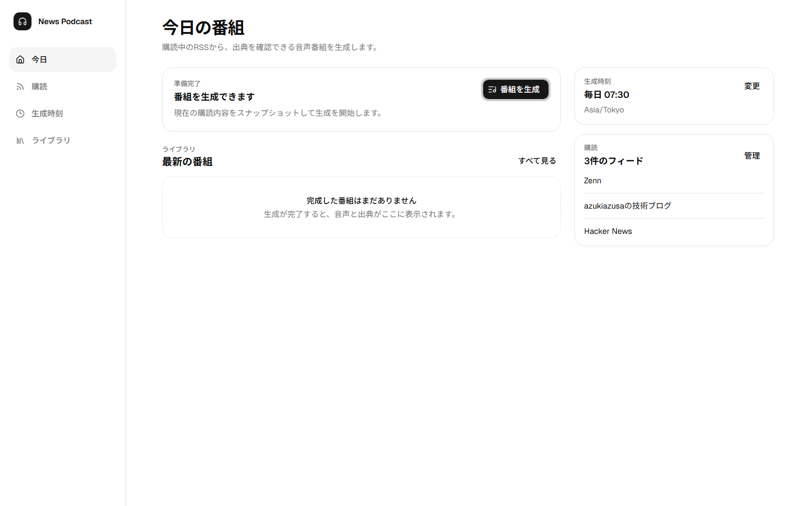
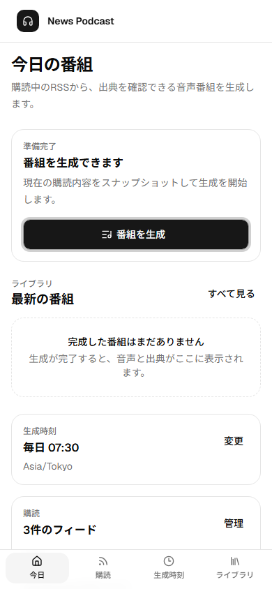

# News Podcast

RSSから選んだニュースを、出典付きの短い音声番組としていつでも聴けるアプリです。



<p align="center">
  
</p>

## できること

- 購読中のRSSをもとに、ニュース番組の生成を依頼できます。
- 生成中の状況を確認し、完成した番組を音声で再生できます。
- 各番組で元記事の出典を確認できます。
- 購読するフィードと日次の生成時刻を管理できます。

## 開発者向け情報

### 技術スタック

- React、Vite、TypeScript、Tailwind CSS、shadcn/ui、Base UI
- Hono、OpenAPI、SQLite/D1、Cloudflare Queues、VOICEVOX、OpenAI
- Storybook、Playwright、Vitest

### ローカルでの実行

Node.js 20以上とpnpmを用意します。

```bash
pnpm install
pnpm lint
pnpm format:check
pnpm dev
```

環境変数は`.env.example`を参照してください。

設計と判断の記録は[設計書](docs/design.md)と[ADR](docs/adr/)にあります。
