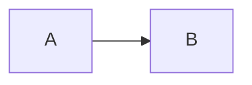

# Zenn syntax

@[card](https://example.com/guide?q=a\&b=c#section)

@[embed](https://github.com/octocat/Hello-World/blob/master/README#L1-L3 "https://github.com/octocat/Hello-World/blob/master/README#L1-L3")

> [!note]
>
> Useful message

More <strong>details</strong>

> [!warning]
>
> Nested warning

Inner

Inner body

$$
x^2
$$

Inline $a+b$.

Source: <https://zenn.dev/zenn/articles/markdown-guide>
