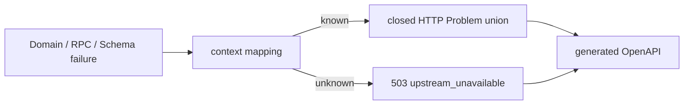

# ADR-0002: OpenAPI-first RESTと非同期エピソードジョブを採用する

- Status: Accepted
- Date: 2026-08-09
- Amended: 2026-08-20（Issue #6: HTTP Problemをclosed typed union化）
- Decision owners: Product owner / API
- Supersedes: N/A
- Superseded by: ADR-0008（契約正本のみ）、[ADR-0055](0055-same-origin-web-and-audio-delivery.md)（音声配信契約のみ）、[ADR-0085](0085-bind-idempotency-keys-to-logical-generation-actions.md)（retry-key optionalityのみ）
- Related: `packages/contracts/openapi/openapi.json`

## コンテキストと変更契機

RSS取得、LLM要約、TTSはHTTP要求中に完了させるには重く、再試行と重複要求を扱う必要がある。Webと二つのbackend実装で契約を一致させる必要もある。

## 決定

当初はYAML OpenAPIをHTTP契約の正本とし、ADR-0008以降はEffect HttpApiからOpenAPIを生成する。生成開始は `POST /v1/episode-jobs` が `202 + Location` を返し、必須 `Idempotency-Key` と状態 `queued/running/succeeded/failed/canceled` を契約化する。失敗jobのretryは別jobを作る。永続化の一意性は`owner + operation scope + key`で判定し、retry scopeには元job IDを含める。同じキーの再送は、そのscopeで作成済みのjobがterminal stateでも同じjobへ収束する。owner scope、Problem Details、cursor paging、短期音声URLを共通契約に含める。retryキーの必須化と論理操作への結び付けは[ADR-0085](0085-bind-idempotency-keys-to-logical-generation-actions.md)が上書きする。

Issue #6で、公開Problemを`status + code + title`が対応したclosed unionへ改訂する。Effect HttpApi契約を正本とし、実装の全code表はそのunionを`Record`で網羅する。文脈で翻訳済みのProblemだけを透過し、Schema/RPC/未知の失敗は保存内容・内部message・causeを含めない`upstream_unavailable`へ畳む。`detail`は内部情報との境界が曖昧なため公開せず、必要になった場合はcodeごとに安全なliteral/Schemaを先に契約化する。

## 判断要因

- 長時間処理をrequest lifecycleから分離する。
- local/cloudの重複配送でも一つの論理ジョブにする。
- frontend/server/contract testの不一致を生成型で検出する。
- Problem variant追加時にOpenAPI・実装表・上流code対応の不足を型検査で検出する。

## 却下案

| 案 | 却下理由 | 再検討条件 |
| --- | --- | --- |
| 同期 `POST /episodes` | timeoutと部分失敗を隠せない | 全段階が安定して短時間になる |
| Hono code-firstを契約源にする | runtime実装に正本が寄る | OpenAPI-first要件が撤回される |
| 生成時にsigned URLをEpisodeへ保存 | 期限と認可が永続表現へ混入する | 音声が完全公開になる |

## 結果

### 利点

- 冪等再送、状態追跡、retryable failureを明示できる。
- status/code/titleの不正な組合せと、status-shapedな内部エラーの透過を拒否できる。

### 欠点とリスク

- job storage、lease、outbox、reconcilerが必要になる。
- 未確定の生成入力をOpenAPIで早期固定できない。
- 新しい公開エラーはcontract、実装表、契約テストを同時に更新する必要がある。

## 影響と同期

| 対象 | 必要な変更 | 状態 | 証拠 |
| --- | --- | --- | --- |
| 設計書 | 状態と冪等性 | Done | `docs/design.md` 4-5章 |
| ドメイン/ユースケース | 状態機械 | Done | `packages/domain/src/episode-job.ts` |
| OpenAPI/外部契約 | 202/Location/headersとclosed Problem union | Done | Effect HttpApi、生成OpenAPI JSON（ADR-0008） |
| コード/ポート | create/cancel/retry route、terminal replay、typed Problem mapping | Done | Gateway handler、`adapters/nats/problems.ts`、Episode Production RPC |
| データ/ストレージ | operation-scoped unique idempotency + outbox | Done | Episode Production migrations |
| 実行/配備 | Worker分離 | Done | `apps/worker` |
| 認証/セキュリティ | owner scope、未知エラーの503 redaction、公開detailなし | Done | OpenAPI descriptions、Problem contract tests |
| フロント/品質保証 | polling states | Pending | 機能画面の承認後 |
| テスト/運用 | 状態遷移と主要4xx/5xxのcontract test | Done | domain tests、`problems.test.ts` |

## 再検討条件

- pipelineが十分短くなり非同期運用コストが便益を上回る実測が得られる。

## 受け入れゲートと未決事項

- Idempotency-Key保持期間。

## 検証証拠

- OpenAPI validation、状態遷移test。
- Red: statusだけを持つ内部failureがそのまま返り、OpenAPIも不整合なstatus/code/titleを受理した。
- Green: closed unionとtyped全件表で主要4xx/5xxを固定し、未知failureをredacted 503へ変換した。
