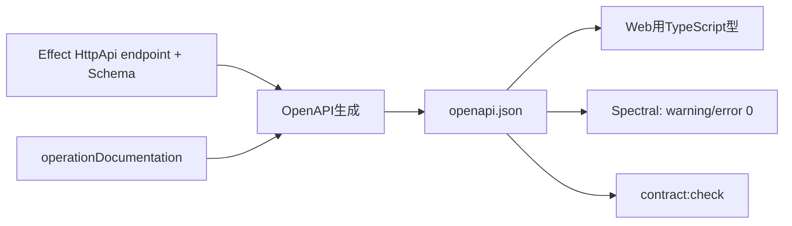

# ADR-0008: Hono code-first OpenAPIを契約の正本にする

- Status: Accepted
- Date: 2026-08-09
- Decision owners: Product owner / API
- Supersedes: ADR-0002の「YAMLを契約の正本とする」部分
- Superseded by: N/A
- Related: `apps/gateway/src/contract.ts`, `packages/contracts/openapi/openapi.json`

## コンテキストと変更契機

手書きOpenAPIとHTTP endpointの二重管理では、実装・response・Web型の差異を品質ゲートまで検出できない。

Issue #7で残っていたSpectral warning 45件は次のとおり分類した。

| 不足 | 件数 | 解消方法 |
| --- | ---: | --- |
| API server | 1 | same-originの`/`を明記 |
| `info.contact` | 1 | repositoryのIssue窓口を明記 |
| operation description | 43 | 全公開operationの利用条件を生成元へ追加 |

## 決定

Effect HttpApiのendpointとSchemaを正本にする。GatewayからOpenAPI JSONを生成し、`openapi-typescript` の生成型だけをWeb clientへ渡す。生成差分は `pnpm contract:check` で失敗させる。

2026-08-20以降、公開operationの利用条件は`apps/gateway/src/contract.ts`の`operationDocumentation`で一元管理し、OpenAPI生成時の純粋変換で各operationへ付与する。全operationに空でない`summary`と`description`があること、同一originのserverと連絡先があることをGateway契約テストで保証する。説明には認証・owner境界・冪等性・件数/日次予算など、利用者が呼び出し前に必要な制約を含める。主要な失敗は各responseのclosed HTTP Problem unionを参照する。

## 判断要因

- runtime validationと公開契約を同じ定義から作る。
- URL、params、body、responseの手書き型をWebから除く。
- API利用者がOpenAPI単体で認証境界、業務制約、主要な失敗を判断できるようにする。
- operation追加時の説明漏れを契約テストとSpectralで即時検出する。

## 却下案

| 案 | 却下理由 | 再検討条件 |
| --- | --- | --- |
| YAML正本を継続 | handlerとの二重管理になる | server実装を別言語へ移す |
| Effect内部型だけを配布 | OpenAPI client・外部利用へ接続しにくい | 外部契約を公開しない |
| 各endpointへ説明annotationを分散 | 43 operationで同じowner境界などが重複し、一覧性と更新性が落ちる | operationごとに別ownerが管理する |

## 結果

生成物 `openapi.json` と `openapi.ts` はチェックインし、直接編集しない。code-first schemaまたはoperation説明の変更時は両方を再生成する。新しいoperationに説明がなければ契約テストとSpectral lintが失敗する。

## 検証証拠

- `pnpm contract:check`
- `pnpm --filter @news-podcast/contracts lint`（Spectral warning/error 0）
- `pnpm --filter @news-podcast/gateway test`
- `pnpm typecheck`
