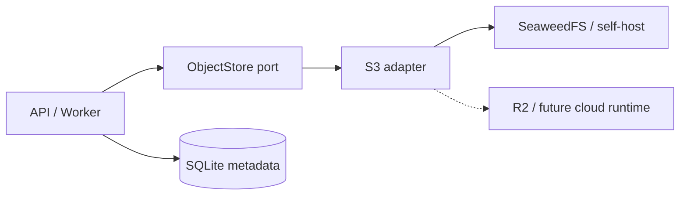

# ADR-0011: SeaweedFSをS3互換オブジェクトストレージとして採用する

- Status: Accepted
- Date: 2026-08-10
- Decision owners: Product owner / Platform
- Supersedes: ADR-0003のローカル音声保存方式
- Superseded by: N/A
- Related: `docs/design.md` オブジェクトストレージ節

## コンテキストと変更契機

従来はセルフホスト環境の音声をローカルファイルへ保存し、CloudflareだけR2を想定していた。RSSリーダー化により、音声に加えて元HTML、閲覧用HTML、Markdown、画像、CSS、フォントを永続化するため、用途ごとに保存実装が分裂しない共通基盤が必要になった。

## 決定

Application層に汎用`ObjectStore`ポートを置き、セルフホスト環境の実装としてSeaweedFSのS3 APIを使う。DBには所有権、状態、content type、byte length、object keyだけを保持し、本文とバイナリはObjectStoreへ保存する。bucketは非公開とし、APIが認可後に内容を配信する。

| 保存対象 | ObjectStore | SQLite |
| --- | --- | --- |
| HTML、Markdown、画像、CSS | 本体 | key、hash、MIME、サイズ |
| 音声 | WAV本体 | episodeとの関連、key、サイズ |
| 所有権・状態・出典 | N/A | 正本 |

## 判断要因

- S3互換でアプリケーションを製品固有APIから分離できる。
- SeaweedFSは単一コンテナから開始でき、小さなオブジェクトを多数扱える。
- セルフホストを正としながら将来R2へ同じportを適用できる。

## 却下案

| 案 | 却下理由 | 再検討条件 |
| --- | --- | --- |
| ローカルファイルを継続 | アーカイブ配信、重複排除、将来移行が用途別実装になる | ObjectStore要件が撤回される |
| MinIO | community server repositoryがarchiveされ、新規採用時の保守性を満たさない | 活発なOSS配布が再開する |
| RustFS | 採用時点でbeta系列 | stable releaseと運用実績を確認できる |
| Garage | 小規模分散用途には適するが、今回の単一ノード導入と小物体用途ではSeaweedFSを優先 | SeaweedFSの運用負担が実測で高い |

## 結果

### 利点

- 保存先を一つのportへ統一し、バックアップと移行を単純化できる。
- S3 clientのcontract testを異なる実装へ再利用できる。

### 欠点とリスク

- Composeへ永続サービスが一つ増える。
- SQLiteとObjectStoreの更新は単一transactionにならず、失敗時に孤児objectが残り得る。現在は冪等なkeyと再試行で利用経路を保護し、孤児回収は運用機能として追加する。

## 影響と同期

| 対象 | 必要な変更 | 状態 | 証拠 |
| --- | --- | --- | --- |
| 設計書 | 保存トポロジー更新 | Done | `docs/design.md` §8 |
| ドメイン/ユースケース | ObjectStore port | Done | `packages/application/src/ports.ts` |
| OpenAPI/外部契約 | access route更新 | Done | generated OpenAPI |
| コード/ポート | S3 adapter、音声移行 | Done | `packages/adapters/src/object-store`、`audio/object-audio-store.ts` |
| データ/ストレージ | object metadata | Done | migration 0005 |
| 実行/配備 | SeaweedFS service | Done | `compose.yaml` |
| 認証/セキュリティ | private bucket、owner認可 | Done | article/audio access services、API tests |
| フロント/品質保証 | N/A — HTTP契約の内側 | Done | N/A |
| テスト/運用 | S3 contract、backup・孤児回収手順 | Partial | 実体put/get/delete smoke済み。運用手順は今後追加 |

## 再検討条件

- SeaweedFS障害または運用負荷がSLOを継続的に満たさない。
- RustFS等のstable実装がcontract testと実測で優位になる。

## 受け入れゲートと未決事項

- None

## 検証証拠

- `docker compose up -d seaweedfs`で起動し、S3 adapterによるput/get/deleteを実体確認済み。
- 全体E2Eの音声再生経路で後方互換を確認する。
