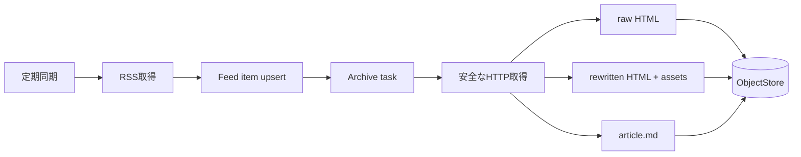

# ADR-0012: RSS記事を自動取得し安全な静的Webアーカイブとして保存する

- Status: Accepted
- Date: 2026-08-10
- Decision owners: Product owner / Content Platform
- Supersedes: N/A
- Superseded by: N/A
- Related: ADR-0011、ADR-0069、RSS Reader API

## コンテキストと変更契機

従来のRSS readerは生成時にfeedを取得するだけで、記事一覧、既読管理、本文保存を持たない。リンク切れ後も読み返せ、エージェントがRSS概要ではなく本文を参照できるよう、任意RSS登録と取得時点のsnapshotが必要になった。

## 決定

ユーザーは任意RSS URLを登録できる。schedulerは購読feedを定期同期し、新着記事を自動的にarchive taskへ送る。archiveは元レスポンス、外部assetを書き換えた閲覧用HTML、Markdownを版単位で保存する。scriptと外部通信を無効化し、専用archive origin相当のrouteから認可付きで配信する。

| 境界 | 規則 |
| --- | --- |
| URL取得 | private/link-local IPを拒否し、redirectごとに再検査する |
| 応答 | timeout、最大byte、許可MIMEを制限する |
| HTML | script、event handler、外部通信を除去する |
| asset | content hashで保存しsnapshot内URLへ書き換える |
| Markdown | 見出し、本文、リンク、引用、code、画像altを保持する |
| 更新 | 上書きせず新しいarticle snapshotを作る |

## 判断要因

- 元リンクが失効しても本文と見た目を参照できる。
- エージェント入力を安定した版へ固定できる。
- 任意RSS登録に伴うSSRFと保存HTMLのactive contentを隔離する。

## 却下案

| 案 | 却下理由 | 再検討条件 |
| --- | --- | --- |
| RSS descriptionだけ保存 | 記事内容を加味する品質要件を満たさない | 本文利用要件が撤回される |
| JavaScriptを再実行 | 再現性、安全性、外部追跡防止を満たさない | 隔離browser runtimeを導入する |
| 生成対象だけ保存 | RSS Readerとして後から閲覧できない | 容量制約が継続的に超過する |
| 常に最新版へ上書き | 過去episodeの根拠を再現できない | provenance要件が撤回される |

## 結果

### 利点

- オフライン閲覧とepisode provenanceが同じsnapshotを利用できる。
- RSS ReaderとPodcast生成が一つのcontent modelを共有する。

### 欠点とリスク

- JavaScript依存部分は元サイトと完全には一致しない。
- 大量feedでは保存容量と取得帯域の上限管理が必要になる。

## 影響と同期

| 対象 | 必要な変更 | 状態 | 証拠 |
| --- | --- | --- | --- |
| 設計書 | archive flowとdata model | Done | `docs/design.md` §8 |
| ドメイン/ユースケース | feed item、snapshot、read state | Done | application ports、LocalStore |
| OpenAPI/外部契約 | feed登録、記事一覧・詳細 | Done | generated OpenAPI |
| コード/ポート | fetch、sanitize、Markdown変換 | Done | `packages/adapters/src/rss`、`archive` |
| データ/ストレージ | feed_items、article_snapshots | Done | migration 0005 |
| 実行/配備 | sync/archive task | Done | `apps/worker/src/process-rss-archive.ts` |
| 認証/セキュリティ | SSRF、CSP、owner scope | Done | safe-fetch/article/API tests |
| フロント/品質保証 | RSS Reader画面 | Done | Articles画面、Playwright E2E |
| テスト/運用 | parser/archive/E2E | Done | unit、API、E2E suites |

## 再検討条件

- 保存失敗率、取得時間、容量が定めた運用上限を継続的に超える。
- 動的ページを保存すべき対象媒体が支配的になる。

## 受け入れゲートと未決事項

- None

## 検証証拠

- SSRF unit test、CSS/画像/フォントを含むarchive fixture test、RSS Reader E2Eを実装済み。
