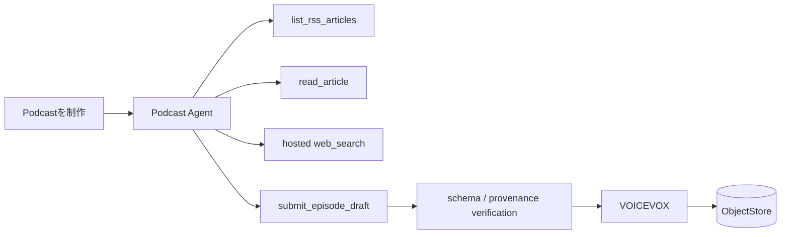

# ADR-0013: ツール駆動エージェントが記事を調査してPodcastを制作する

- Status: Accepted
- Date: 2026-08-10
- Decision owners: Product owner / Editorial
- Supersedes: ADR-0007
- Superseded by: N/A
- Related: OpenAI Responses API、ADR-0012

## コンテキストと変更契機

従来は直近24時間・最大10件のRSS概要を固定system promptへ一度渡す`SummaryGenerator`だった。記事本文を読み、必要ならWeb検索で事実確認し、記事選定と構成を自律的に行う要求を満たせない。

## 決定

単発のSummaryGeneratorを、複数turnで型付きtoolを呼ぶ`PodcastAgentRunner`へ置き換える。記事選定、調査順、構成、話題数、語り口はagentへ委ねる。認可、取得範囲、実行予算、出典整合性、成果物schema、保存、TTSはapplication側で決定論的に保証する。

| Agentが決める | システムが強制する |
| --- | --- |
| 記事選定、調査順序 | owner scopeとtool権限 |
| 番組構成、話題数 | 最大turn、tool call、HTTP時間 |
| 語り口、説明の深さ | 出典snapshot/search sourceの存在 |
| 補足検索の要否 | structured episode draftとTTS可能な本文 |

初期toolは読み取り系の`list_rss_articles`、`read_article`、Responses APIのhosted `web_search`と、唯一の成果物書き込み`submit_episode_draft`に限定する。RSS記事を主題の起点とし、Web検索は補足と事実確認に利用する。台本へ採用できるRSS出典は本文を読んだ記事だけとし、両者のprovenanceを区別して保存する。

## 判断要因

- 固定ルールではなく、利用可能な資料に応じて調査と構成を変えられる。
- tool境界によって自由度と安全性を両立できる。
- 過去episodeが参照した記事版を再現できる。

## 却下案

| 案 | 却下理由 | 再検討条件 |
| --- | --- | --- |
| 固定promptの大型化 | tool選択と反復調査を表現できない | agent要件が撤回される |
| LLMへDB/S3資格情報を渡す | 最小権限と監査性を満たさない | 却下を維持 |
| 最初から複数agent | 評価と障害原因の切り分けが複雑になる | 単一agentの品質不足をevalで確認する |
| Web検索を主題選定にも利用 | RSS Readerとの関係と番組の予測可能性が薄れる | product方針が明示的に変わる |

## 結果

### 利点

- 記事本文と追加調査を加味した柔軟な番組を作れる。
- tool callと成果物を保存し、品質評価と障害解析ができる。

### 欠点とリスク

- latencyとAPI費用の変動が大きくなる。
- 自由度を高めても、短いgoal、tool説明、停止条件というinstructionは必要である。
- provider応答の非決定性に対してeval corpusが必要になる。

## 影響と同期

| 対象 | 必要な変更 | 状態 | 証拠 |
| --- | --- | --- | --- |
| 設計書 | agent flowと権限境界 | Done | `docs/design.md` §8.3 |
| ドメイン/ユースケース | agent run、draft、source | Done | application ports、LocalStore |
| OpenAPI/外部契約 | job stage、episode source | Done | generated OpenAPI |
| コード/ポート | AgentRunner、tools | Done | `openai-podcast-agent.ts` |
| データ/ストレージ | agent_runs、tool_calls、snapshot source | Done | migration 0005 |
| 実行/配備 | API keyと実行limit | Done | config、worker composition root |
| 認証/セキュリティ | read-only tools、owner scope | Done | Agent tool-loop tests |
| フロント/品質保証 | 実行stageと出典表示 | Done | Web stage/source UI、E2E |
| テスト/運用 | deterministic fake、eval fixtures | Partial | fake/unit/E2E済み。品質eval corpusは今後追加 |

## 再検討条件

- 単一agentが代表evalで品質目標を満たさない。
- tool call費用またはp95 latencyが運用上限を超える。

## 受け入れゲートと未決事項

- None

## 検証証拠

- Agent tool-loop unit test、provenance validation、生成E2Eを実装済み。
