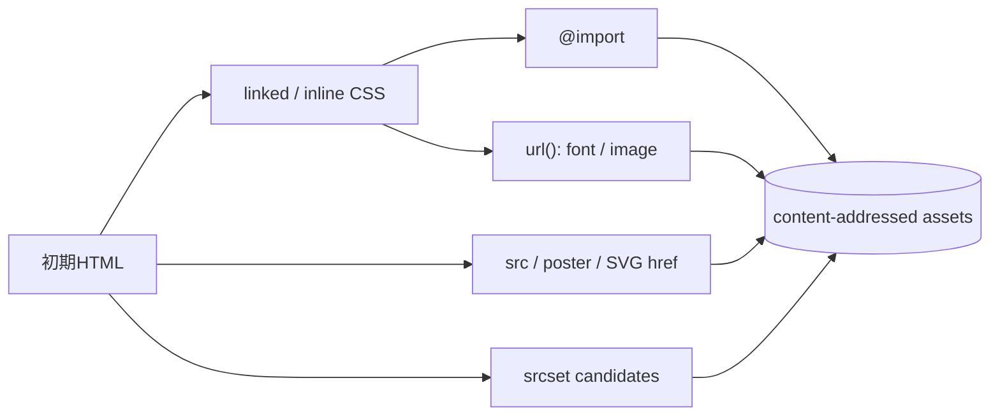

# ADR-0014: 静的Webアーカイブの完全性とresource上限

- Status: Accepted
- Date: 2026-08-10
- Decision owners: Product owner / Content Platform
- Supersedes: N/A
- Superseded by: N/A
- Related: ADR-0012、`docs/design.md` §8.2

## コンテキストと変更契機

ADR-0012はscriptを実行しない静的archiveを採用したが、初期実装はresourceを取得順に40件で打ち切った。画像やfontが先に枠を消費すると主要stylesheetが保存されず、通常のserver-rendered pageでも無装飾になる実例が発生した。また`srcset`を削除していたため、responsive imageを完全保存できなかった。

動的JavaScript実行後のDOM再現は引き続き対象外だが、初期HTMLとCSSから到達できる静的resourceは、明示した安全上限以内ならサイト固有の例外処理なしで保存する必要がある。

## 決定

archiveは初期HTMLから到達できるpassive resource graphを次の順序と規則で保存する。

| 規則 | 決定 |
| --- | --- |
| 優先順位 | linked stylesheetとその依存を先に保存し、その後inline CSSとHTML mediaを保存する |
| CSS | `@import`と宣言値内の`url()`を構文解析し、依存先を再帰保存する |
| responsive image | `img/source[srcset]`の全candidateを保存URLへ書き換える |
| 重複 | content hashが同じresourceは1件・1 byte列として上限へ計上する |
| 既定上限 | HTML 5 MiB、単一asset 20 MiB、asset合計100 MiB、重複除外後512件 |
| 設定 | 4つの上限はWorker環境変数で変更可能にする |
| 不完全な主要CSS | 壊れた元layoutを返さず、保存本文のreader viewへfallbackする |
| active content | script、iframe、外部通信は従来どおり無効化し、JavaScriptは実行しない |

## 判断要因

- 通常のserver-rendered pageをサイト別実装なしで再現する。
- 任意URL取得に必要なメモリ、帯域、保存容量の上限は維持する。
- 上限が十分な場合に取得順の都合で主要CSSが欠落しないようにする。
- 同じfontや画像の別URLを重複保存して上限を浪費しない。

## 却下案

| 案 | 却下理由 | 再検討条件 |
| --- | --- | --- |
| resourceを固定40件で取得順に打ち切る | 通常pageでも主要CSSが欠落し、上限の使い方が非決定的 | 採用しない |
| stylesheetだけ保存する | 画像、font、CSS背景、responsive imageが欠落する | 見た目の保存要件が撤回される |
| 上限を設けない | 任意URLから無制限の帯域・容量を消費できる | 信頼済みsourceだけを扱う別serviceへ分離する |
| headless browserでJavaScriptを実行する | 再現性、隔離、追跡防止の境界が変わる | `docs/design.md`の確認ゲート3が別ADRで承認される |

## 結果

### 利点

- 静的pageはresource上限内ならCSS、font、画像を含めてoffline replayできる。
- 上限値を配備環境の容量に合わせて調整できる。
- 主要CSSの取得失敗時も本文はreader viewで読める。

### 欠点とリスク

- 1記事あたりの取得時間と保存量は従来より増える。
- 初期HTMLに存在せずJavaScriptが生成するcontentは保存できない。
- 第三者serverが取得を拒否したresourceは、上限内でも保存できない。

## 影響と同期

| 対象 | 必要な変更 | 状態 | 証拠 |
| --- | --- | --- | --- |
| 設計書 | resource graph、既定上限、fallbackを追記 | Done | `docs/design.md` §8.2 |
| ドメイン/ユースケース | N/A — archive adapter内の保存policy | Done | N/A |
| OpenAPI/外部契約 | N/A — route schema変更なし | Done | N/A |
| コード/ポート | CSS再帰、srcset、hash重複排除、設定可能上限 | Done | `packages/adapters/src/archive/article-archiver.ts` |
| データ/ストレージ | schema変更なし、content-addressed keyを継続 | Done | migration変更なし |
| 実行/配備 | Workerへ上限設定を注入 | Done | `.env.example`、`apps/worker/src/node.ts` |
| 認証/セキュリティ | CSPとscript無効化を維持 | Done | API/archive tests |
| フロント/品質保証 | 実URLのdesktop replayを確認 | Done | Playwright検証 |
| テスト/運用 | CSS、srcset、重複、上限設定の回帰test | Done | adapters/worker/API test suites |

## 再検討条件

- 512件または100 MiBへ到達する通常記事が継続的に観測される。
- archive取得時間がscheduler間隔を継続的に超える。
- JavaScript生成本文の媒体が主要sourceの10%以上になる。

## 受け入れゲートと未決事項

- None

## 検証証拠

- Substack実記事: 72 assets、19 stylesheets、failed request 0、console error 0。
- Snowflake実記事: 132 assets、5 stylesheets、failed request 0、console error 0。
- `pnpm --filter @news-podcast/adapters test`
- `pnpm --filter @news-podcast/worker test`
