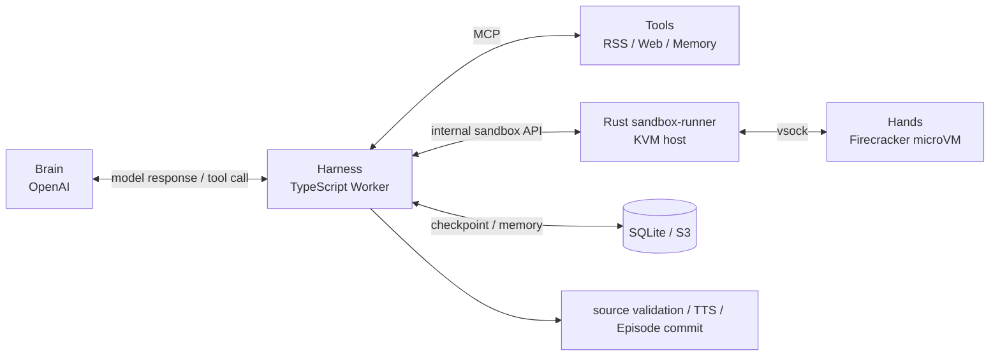
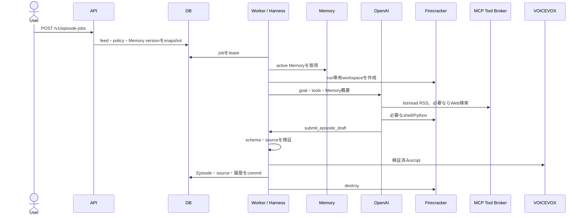
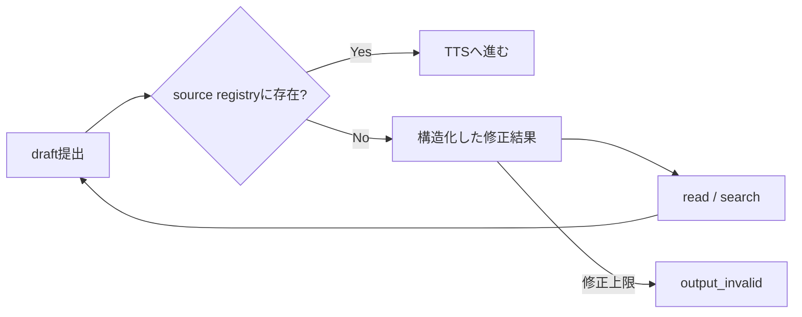

# ADR-0015: Firecrackerで隔離したAgent Harnessを実行時だけ起動する

- Status: Accepted
- Date: 2026-08-10
- Decision owners: Product owner / Agent Platform
- Supersedes: ADR-0013
- Superseded by: N/A
- Related: `docs/design.md` §8.4、`docs/security/agent-sandbox-threat-model.md`

## コンテキストと変更契機

ADR-0013は、保存記事とWeb検索を読むtool駆動Agentを採用した。しかし現在の実装はOpenAI Responses APIを直接loopし、Agentが実行できるのはapplication内の関数だけである。workspace、shell、run再開、承認、Agent単位のMemoryを安全に追加できる実行境界がない。また、未読・未検索と判定した出典は同じrunで修正させず、直ちに非再試行エラーにしている。

利用者は、Agentが具体的にいつ・どこで・どの権限で動くかを運用と開発の双方から確認でき、自由度を増やしてもhost、credential、他ownerへ到達できない基盤を必要としている。初期の信頼境界は、単一の信頼済み運用者と複数アカウントであり、ユーザー入力、Web内容、モデル出力、sandbox内processは信頼しない。

## 決定

Agentを常駐processにせず、手動または定期Episode jobを処理する間だけ起動する。TypeScript Worker上のHarnessがOpenAI Agents SDKを使ってturn、tool、retry、policyを管理し、shell/Python/CLIは専用KVM Linux hostのFirecracker microVMで実行する。RSS、Web検索、Memory、外部副作用はMCP Tool Brokerが仲介し、出典検証、VOICEVOX、Episode commitは決定論的なapplication処理としてsandbox外に残す。

`FirecrackerSandboxClient`はWorker内の非特権adapterであり、sandbox作成、exec、file、checkpoint、破棄要求を内部APIへ変換する。`sandbox-runner`は`/dev/kvm`、Firecracker、Jailerへアクセスできる唯一のhost daemonで、resource上限とpolicyを再検証する。microVM内のRust `guest-agent`はvsock経由の命令だけを受け、NICやapplication credentialを持たない。

### いつ、どこで動くか

| 契機 | Harness | Firecracker | 人の関与 |
| --- | --- | --- | --- |
| 手動生成 | APIがqueued jobを保存後、Worker lease時に開始 | Agentがworkspaceを必要とした時にrun専用VMを作る | 通常不要 |
| 定期生成 | Schedulerが同じapplication commandを作成 | 手動生成と同じ。承認待ち操作は拒否 | なし |
| 出典不整合 | 同一runで構造化エラーをmodelへ返す | 必要なら記事を再読込 | 最大2回自動修正 |
| 一時障害 | checkpointとtool call台帳から再開 | live VMを信用せず新VMへworkspaceを復元 | 通常不要 |
| 承認要求 | runを`waiting_approval`にしてcheckpoint | VMを停止しresourceを解放 | approve / deny |
| terminal | 成果物commitまたはfailureを保存 | VM、jail、scratchを破棄 | retryは新job |

### 手動・定期Episode生成

### 出典の自己修復

Web検索はResponses APIの`web_search_call.action.sources`をsource registryの正本にする。RSS sourceは`read_article`成功後だけ登録する。未登録sourceを提出した時はjobを即時失敗させず、`source_not_observed`と不足sourceをtool resultとして返し、同じrunで最大2回の再読込・再検索・再提出を許可する。

### Memoryとworkspace

| 状態 | scope | 別runへ継承 | 既定保持 |
| --- | --- | --- | --- |
| Run checkpoint | run | 同じrunの再開だけ | terminal後7日 |
| Session history | owner + Agent instance | 同じ対話 | 30日 |
| Workspace snapshot | run | 同じrunの再開だけ | terminal後7日 |
| Durable Memory | owner + Agent instance | active Memoryだけread-onlyで継承 | TTLまたは明示削除まで |

別runへ生workspaceを持ち越さない。次回runには検証済みMemoryだけをread-onlyでmaterializeする。ユーザーのpreferenceは明示操作だけで確定し、完成Episodeのtopic/source履歴は自動追加できる。Agentが生成したworking noteはproposalとして秘密・source・重複を検証し、TTLまたは承認を適用する。credential、記事本文全体、chain-of-thoughtはMemoryに保存しない。

### 権限と承認

初期Podcast policyは記事inputとMemoryをread-only、scratch/outputをread-write、sandbox networkをなし、package導入をdenyとする。Web検索はsandbox外のhosted toolを使う。外部write、永続公開、owner間共有はtool effectを`approval`とし、run ID、正規化引数hash、policy hash、有効期限へ承認を束縛する。定期jobはapprovalを待たず拒否する。

### 言語境界

Agent orchestrationはTypeScriptのOpenAI Agents SDK adapterから開始するが、Domain、DB、公開APIへSDK型を漏らさない。ToolはMCP、sandboxはversion付き内部HTTP/JSON、event/checkpoint/Memoryはversion付きschemaを正本とする。sandbox-runnerとguest-agentは最初からRustで実装し、将来はMCP tool、最後にAgent Engineの順でRustへ置換できる。

## 判断要因

- shellへ自由度を与えてもhardware virtualizationでhost境界を守る。
- KVM権限を通常のAPI/Workerから分離する。
- Agentの非決定的な判断と、認可、出典、TTS、commitを分離する。
- crash、approval、retryで同じtoolや成果物を二重実行しない。
- 長期Memoryを便利にしつつ、prompt injectionを別runへ永続化しない。
- MCPとproject固有schemaにより、TypeScriptからRustへ段階移行できる。

## 却下案

| 案 | 却下理由 | 再検討条件 |
| --- | --- | --- |
| WorkerからFirecrackerを直接操作 | Node WorkerへKVM/Jailer権限が広がる | sandbox-runner分離が運用不能と実証される |
| 通常のOCI containerだけを使う | host kernelを共有し、自由なshellに対する境界が弱い | trusted codeだけを実行する別profile |
| WASMも同時導入 | shell、Python、既存CLIを統一できず、二つのruntimeの運用・testが増える | 第三者pluginや高密度短時間toolが必要になる |
| 生workspaceをAgent Memoryにする | prompt injectionや生成scriptが別runへ残る | 採用しない |
| 最初から全体をRustへ移植 | 現在のTypeScript/OpenAPI資産を捨て、価値提供が遅れる | TS Engineが性能・信頼性目標を満たさない |

## 結果

### 利点

- Agentへshellとworkspaceを与えながら、hostとcredentialから隔離できる。
- runがいつ起動・停止・再開するかをJobとAgentRunから追跡できる。
- approval待ちでVMを止め、resourceを占有しない。
- Agent単位のpreferenceと履歴を安全に再利用できる。

### 欠点とリスク

- KVM対応Linux host、kernel、rootfs、Jailerの運用が増える。
- Firecracker hostの安全性はhost kernelと設定に依存する。
- OpenAI Sandbox Agentsはbetaであり、adapter更新が必要になり得る。
- workspace checkpointの直前に終了したshell commandは完了状態が不明になり得る。

## 影響と同期

| 対象 | 必要な変更 | 状態 | 証拠 |
| --- | --- | --- | --- |
| 設計書 | 配置、use case、Memory、retry | In progress | `docs/design.md` §8.4 |
| ドメイン/ユースケース | AgentRun、Approval、Memory、cancel/retry | Pending | Domain/Application |
| OpenAPI/外部契約 | run、approval、Memory、cancel/retry route | Pending | Hono schema / generated OpenAPI |
| コード/ポート | Agent Engine、MCP、Sandbox、Memory ports | Pending | packages/application |
| データ/ストレージ | run event、approval、Memory、checkpoint | Pending | migration 0006以降 |
| 実行/配備 | Rust runner、guest、kernel/rootfs | Pending | `crates/`、`infra/sandbox/` |
| 認証/セキュリティ | threat model、owner scope、Jailer | In progress | security document |
| フロント/品質保証 | timeline、approval、Memory、cancel/retry | Pending | Web tests |
| テスト/運用 | contract、KVM integration、isolation、eval | Pending | CI / KVM runner |

## 再検討条件

- warm sandbox ready p95が300ms、cold p95が2秒を継続的に超える。
- Firecracker host運用が生成可用性の主要因になる。
- 公開マルチテナント化し、host、鍵、quotaをtenant別に分離する必要がある。
- TS Agent Engineが性能または信頼性目標を満たさない。
- 第三者pluginまたは高密度の短時間toolにWASMが必要になる。

## 受け入れゲートと未決事項

- 実Firecracker smokeには固定したFirecracker release、guest kernel、rootfs artifactが必要。
- OpenAI Sandbox Agents betaはproject固有contract test通過を導入条件にする。

## 検証証拠

- ADR承認: 本計画をユーザーが明示的に実装依頼した。
- 実装・contract・security testの証拠は各sliceで追記する。
