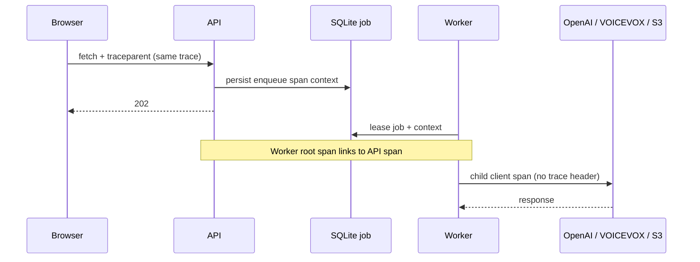

# ADR-0017: 同期HTTPを継続し非同期生成をSpan Linkで相関する

- Status: Accepted
- Date: 2026-08-10
- Decision owners: Product owner / Platform
- Supersedes: N/A
- Superseded by: N/A
- Related: ADR-0010、ADR-0016、`packages/observability`

## コンテキストと変更契機

Browserはsame-origin fetchへW3C `traceparent`を送るが、Node APIは受信contextを抽出せず、BrowserとAPIが別traceになっていた。APIは生成要求時のcontextをSQLiteへ保存し、Worker spanへlinkしているため非同期境界の因果関係は保持できる一方、同期HTTP境界と外部provider呼び出しの可視性が不足していた。

Episode生成は最長30分で再試行される。BrowserからWorker完了までを同じtrace IDへ連結すると、長時間traceと複数試行が一つの木へ混在するため、同期境界と非同期境界で異なる相関規則が必要である。

## 決定

同期same-origin HTTPはW3C Trace Contextの親子関係を継続し、SQLiteを介する非同期生成は試行ごとに独立したWorker traceを開始して、enqueue時のAPI spanへSpan Linkを張る。外部providerはWorker trace内のclient spanとして計測するが、管理外serviceへtrace headerは送らない。

| component | 実行場所 | trigger | trace境界 | sampling / durable state |
| --- | --- | --- | --- | --- |
| Browser SDK | Browser | same-origin fetch | `traceparent`/`tracestate`を注入 | 通常trace 20% |
| API | Node process | HTTP request | 有効なW3C parentを継続 | remote parentを優先、rootは20% |
| SQLite job | API/Worker共有DB | enqueue/lease | API contextを値として保存 | `trace_parent`、`trace_state` |
| Worker | Node process | lease取得・再試行 | 試行ごとにroot spanを作りAPIへlink | 生成trace 100% |
| OpenAI/VOICEVOX/S3 | 外部service | Worker処理 | Workerの子client span | header伝播なし、URL・内容を記録しない |
| Collector/SigNoz | 別process/container | OTLP受信 | span、link、属性を保存 | trace retention 15日 |

`baggage`は受信・永続化しない。不正なW3C headerは無視し、APIで新しいroot contextを作る。外部client spanは固定provider名、固定operation名、HTTP method/statusだけを記録し、URL、object key、本文、ユーザー情報、認証情報を記録しない。DNT、ユーザーのtelemetry設定OFF、`OTEL_ENABLED=false`では従来どおりSDKまたはadapterを開始しない。

## 判断要因

- BrowserとAPIの同期latencyを一つのtrace waterfallで確認できること。
- 長時間処理と再試行を独立traceとして検索・比較できること。
- 保存済みW3C contextでprocess crash後も因果関係を復元できること。
- 管理外serviceへの識別子伝播と高cardinality属性を避けること。

## 却下案

| 案 | 却下理由 | 再検討条件 |
| --- | --- | --- |
| Browserから全Worker試行まで同一trace ID | 最長30分と複数試行が一つのtraceへ混在する | backendが長時間非同期traceを試行単位で明瞭に表示できる |
| API→Workerの相関をjob IDだけにする | trace UIから因果関係を直接辿れない | backendがspan linkをサポートしなくなる |
| 全外部HTTPへ自動header伝播する | 任意RSSや管理外providerへtrace識別子を送る | 接続先が管理下になり相互計装される |
| RSS・記事・認証通信も同時に計装する | 生成経路の修正範囲を超え、privacy分類が増える | 各経路のlatency SLOを定義する |

## 結果

### 利点

- Browser→APIを同じtrace IDで追跡でき、API→Workerはlinkで辿れる。
- Worker stageと生成providerの待ち時間・失敗位置を一つのWorker traceで確認できる。
- DB migrationや外部HTTP契約の変更なしで導入できる。

### 欠点とリスク

- SigNoz上ではBrowser/API traceとWorker traceをlink経由で移動する必要がある。
- 管理外provider内部のserver spanは取得できず、client側の観測に限定される。
- 20% samplingのBrowser/API要求は個別調査時に欠落し得る。

## 影響と同期

| 対象 | 必要な変更 | 状態 | 証拠 |
| --- | --- | --- | --- |
| 設計書 | 同期継続・非同期link・外部client spanを明記 | Done | `docs/design.md` |
| ドメイン/ユースケース | N/A — trace contractはobservability境界に限定 | Done | application port変更なし |
| OpenAPI/外部契約 | N/A — W3C標準headerの内部処理のみ | Done | schema変更なし |
| コード/ポート | parent contextと安全なclient spanを追加 | Done | API/Worker/observability |
| データ/ストレージ | N/A — 既存trace列を利用 | Done | migration 0004 |
| 実行/配備 | Browser 20%、API 20%、Worker 100% | Done | Web/API/Worker composition root |
| 認証/セキュリティ | baggage拒否、外部伝播なし、属性allowlist維持 | Done | privacy/client span tests |
| フロント/品質保証 | Browser samplerとfetch伝播 | Done | Web tests |
| テスト/運用 | parent、link、retry、provider spanを検証 | Partial | unit/E2E完了、SigNoz smokeは実環境gate |

## 再検討条件

- SigNozがSpan Linkを検索・遷移できず、障害調査時間の目標を継続的に満たせない。
- Worker実行時間が短縮され、再試行を含む単一traceがbackend制限内へ常に収まる。
- OpenAI、VOICEVOX、S3が管理下の共通Collectorへserver spanを送信できる。
- RSS、記事、認証経路に独立したlatency SLOが設定される。

## 受け入れゲートと未決事項

- Linux実環境のSigNozでBrowser→API親子関係、API→Worker link、provider子spanを確認する。
- 未決事項なし。

## 検証証拠

- `pnpm format:check && pnpm lint && pnpm typecheck && pnpm test`
- `pnpm contract:check && pnpm test:e2e`
- SigNoz上のsynthetic job trace確認
