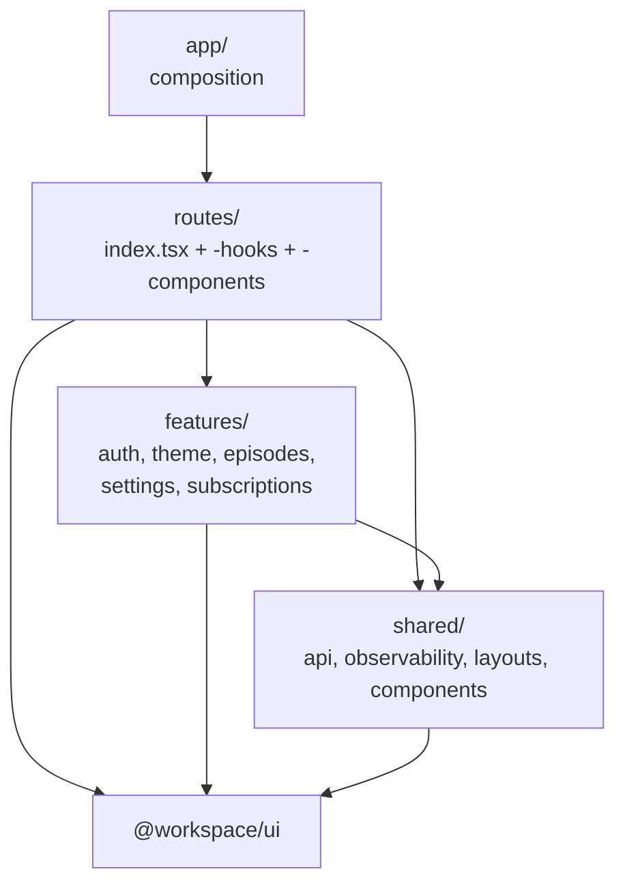

# ADR-0018: Web層をルートコロケーションと共有featureの二層へ分割する

- Status: Accepted
- Date: 2026-08-10
- Decision owners: Product owner / Web
- Supersedes: N/A
- Superseded by: N/A
- Related: ADR-0006、ADR-0009、`apps/web/src/routes`、`apps/web/src/features`、`apps/web/src/shared`

## コンテキストと変更契機

ADR-0009はfile-based TanStack Router、Suspense query、route/独立パネル単位の表示境界、`useOptimistic`を採用したが、実装は一部しか追随していない。

確認済み事実:

- `apps/web/src/features`の6ファイルのうち5ファイルは単一routeからのみ参照され、`features`が共有機能ではなくpage実体の置き場になっている。`subscriptions-page.tsx`は395行、`podcast-dashboard.tsx`は446行である。
- `<Suspense>`とError Boundaryは`apps/web/src`に存在せず、境界は`__root.tsx`の`pendingComponent`/`errorComponent`だけである。単一panelの取得失敗が全画面を落とす。
- `useOptimistic`は未使用で、`pendingIds`集合と`queryClient.setQueryData`による手書きrollbackで代替している。
- custom hookは`useTheme`と`useLogin`のみで、通信・状態遷移・表示ロジック・JSXが同一componentへ同居している。単体テストはpure functionの3ファイルのみで、jsdomとtesting-libraryを導入していない。
- `src/api`、`src/auth`、`src/observability`、`src/app`、`src/components`は技術基盤・共有UI・アプリ合成の区別なく並列している。

制約: URLは変更しない。`@workspace/ui`のprimitiveを増やさない。Storybookとscreenshot差分によるQA(ADR-0006)を維持する。関数あたりcyclomatic 7 / cognitive 6の予算(`docs/frontend-rebuild-quality-report.md`)を維持する。

## 決定

配置を「参照元route数」で決める。**単一routeからのみ参照するものはそのrouteのdirectoryへ置き、二つ以上のrouteから参照された時点で`features/`(ドメインあり)または`shared/`(ドメインなし)へ昇格する。**

各層の実行時点と責務:

| 層 | 配置 | 実行時点 | 責務 | 依存できる先 |
| --- | --- | --- | --- | --- |
| composition | `src/app` | Browser起動時に一度 | provider tree、router生成、QueryClient生成 | routes、features、shared |
| route | `src/routes/**/index.tsx` | navigation時(`loader`)とrender時 | 配線のみ。preload、表示境界の設置 | features、shared、`@workspace/ui` |
| page hook | `src/routes/**/-hooks/*.ts` | render時 | query、mutation、楽観更新、計測。JSXを返さない | features、shared |
| page view | `src/routes/**/-components/*.tsx` | render時 | propsのみで描画。server stateへ直接触れない | `@workspace/ui`、型 |
| shared feature | `src/features/<feature>` | 呼び出し元に従う | 二つ以上のrouteが使うドメイン機能。`index.ts`が公開API | shared、`@workspace/ui` |
| technical base | `src/shared` | 呼び出し元に従う | API client、observability、layout、境界component、test helper | `@workspace/ui` |

routeのdirectoryは`<segment>/index.tsx`をleaf pageとし、同階層に`-components/`、`-hooks/`、`-model.ts`を置く。TanStack Routerは`routeFileIgnorePrefix`既定値`-`により、これらをroute生成から除外する。build時のroute treeは`src/routeTree.gen.ts`へ生成し続ける。

featureは技術レベルでdirectoryを切る(`api/`、`hooks/`、`components/`、`model.ts`)。feature外からは`index.ts`経由でのみimportする。

逆向きの依存(`features`→`routes`、`shared`→`features`/`routes`、routeA→routeBの`-components`)、およびfeature内部への深いimportを禁止する。

表示境界は`shared/components/panel.tsx`の`Panel`へ集約する。`@tanstack/react-router`の`CatchBoundary`と`Suspense`を組み合わせ、新規依存を追加しない。`Panel`はcatch時に`recordBrowserEvent("panel.error")`を記録し、`reset`を再試行操作へ接続する。routeの`loader`は`ensureQueryData`をawaitせず先読みだけ行い、未達のpanelのみがfallbackを表示する。

購読変更などのAction内更新は`useOptimistic`と`startTransition`で行い、楽観適用はpure reducerとして切り出して環境非依存にテストする。確定状態はserver responseとし、成功後に`invalidateQueries`をawaitしてからTransitionを閉じる。componentは`@/app/query-client`のmodule singletonをimportせず`useQueryClient()`を使う。

テストは、pure functionとcustom hookをVitest(jsdom + `@testing-library/react`の`renderHook`)、presentational viewをStorybook interaction test、画面全体をPlaywrightで検証する。fetchのstub点は`shared/api/client.ts`の単一`openapi-fetch` clientに限定する。

## 判断要因

- 共有と専用をdirectoryで判別でき、変更影響範囲がpathから読めること。
- 独立panelの失敗と読み込みを分離し、ADR-0009の表示境界規則を実装で満たすこと。
- ロジックとviewを分離し、hookを単体テスト、viewをStorybookで個別に検証できること。
- 手書きrollbackを`useOptimistic`へ置換し、状態遷移の記述量と誤りを減らすこと。
- 新規runtime依存とUI primitiveを増やさないこと。

## 却下案

| 案 | 却下理由 | 再検討条件 |
| --- | --- | --- |
| `features/<domain>/<domain>-page.tsx`を維持 | 単一routeからしか使わないコードが共有領域に滞留し、共有判定ができない | 全pageが二つ以上のrouteから再利用される |
| すべてを`features/`へ集約 | 技術基盤とドメイン機能が同一階層へ混在し、依存の向きを規定できない | 技術基盤が単一moduleへ縮小する |
| flat dot記法(`_authenticated.subscriptions.tsx`)のまま`-`directoryを併置 | routeと専用部品の対応が命名規約だけの緩い結合になる | pageあたりの専用部品が常に1ファイル以下に収まる |
| `react-error-boundary`を追加 | routerが同等の`CatchBoundary`を提供しており依存が重複する | router側の境界APIが廃止される |
| Storybookとscreenshotのみで検証を継続 | hookのロジックを直接検証できず、分離の担保にならない | ロジックが全てpure functionへ出る |

## 結果

### 利点

- 単一routeの変更が他routeへ波及しないことをdirectory構造で保証できる。
- panel単位の失敗と再試行が可能になり、部分障害時も操作可能な領域が残る。
- hookが単体テスト可能になり、viewがpropsのみでStorybook fixtureと一致する。
- `useOptimistic`採用によりrollback処理が削除され、関数あたりの複雑度予算を満たしやすくなる。

### 欠点とリスク

- 既存pageの分解でファイル数が増え、一時的にimport経路の追跡が増える。
- routeのdirectory移行で`routeTree.gen.ts`のroute IDが変化する。URL不変をE2Eで確認する必要がある。
- jsdomとtesting-libraryの追加でdev依存が増え、Storybook `addon-vitest`との実行設定を分離する必要が生じ得る。
- `useOptimistic`の楽観値はTransition終了時にbase valueへ戻るため、`invalidateQueries`のawait順序を誤ると一瞬古い値が見える。

## 影響と同期

| 対象 | 必要な変更 | 状態 | 証拠 |
| --- | --- | --- | --- |
| 設計書 | UI構成節へ配置規則と表示境界を追記 | Pending | `docs/design.md` §7 |
| ドメイン/ユースケース | N/A — Web層の構成のみ | Done | 変更なし |
| OpenAPI/外部契約 | N/A — 契約とURLは不変 | Done | `packages/contracts` |
| コード/ポート | `routes`/`features`/`shared`の三層へ再配置、`Panel`追加 | Done | `apps/web/src` |
| データ/ストレージ | N/A — client側の構成のみ | Done | 変更なし |
| 実行/配備 | N/A — build出力とportは不変 | Done | `apps/web/vite.config.ts` |
| 認証/セキュリティ | `src/auth`を`features/auth`へ移設、認証gardは`_authenticated/route.tsx`で不変 | Done | ADR-0005、`safeRedirect`のunit test |
| フロント/品質保証 | jsdom Vitestを追加しhookを単体テスト、`components.json`のaliasを実在pathへ | Done | `apps/web/vitest.config.ts` |
| テスト/運用 | lint/build/unit/e2eで回帰を確認。visual baselineはwin32のみで、Linux上の実行は本ADR以前から未整備 | Partial | `pnpm --filter web test`(33)、`pnpm --filter web test:e2e`(12) |

共有featureは「二つ以上のrouteが参照する」規則の適用結果として`auth`、`theme`、`episodes`(`/`と`/library`)、`settings`(`/`と`/schedule`)、`subscriptions`(`/`と`/subscriptions`)となる。episode jobのqueryと表示modelは`/`からのみ参照するため`routes/_authenticated/-home/`へ置く。

## 再検討条件

- 単一featureが三つ以上のrouteから参照され、feature内でさらに分割が必要になる。
- panel単位の境界がscreenshot差分を不安定にし、視覚回帰の維持費が調査時間を上回る。
- TanStack Routerが`routeFileIgnorePrefix`または`CatchBoundary`の仕様を変更する。
- Server Componentsまたはstreaming SSRを導入し、境界の設置点がserver側へ移る。

## 受け入れゲートと未決事項

- URLが不変であることをE2Eで確認済み(12 passed)。
- visual baselineは`*-win32.png`しか存在せず、Linux上の`test:visual`は本ADR以前から欠落snapshotで失敗する。Windows環境またはLinux baselineの追加で確認する。

## 検証証拠

- `pnpm --filter web format:check && pnpm --filter web lint && pnpm --filter web build`
- `pnpm --filter web test`
- `pnpm --filter web test:visual && pnpm --filter web test:e2e`
