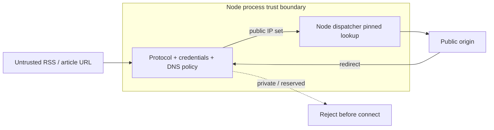

# ADR-0023: Nodeの任意URL取得で検査済みDNS結果へ接続を固定する

- Status: Accepted
- Date: 2026-08-11
- Decision owners: Project maintainers
- Supersedes: N/A
- Superseded by: N/A
- Related: ADR-0012、`docs/design.md` §8、`packages/adapters/src/http/safe-fetch.ts`

## Context and change trigger

ADR-0012は任意RSS・記事assetのSSRF対策として接続前とredirectごとのIP検査を要求する。従来の`createSafeFetcher`はDNSを検査した後、通常の`fetch`が同じhostnameを再解決していたため、検査後にpublic IPからprivate IPへ応答を変えるDNS rebindingで検査と実接続が分離していた。テスト用fetch注入と将来のCloudflare runtimeは維持しつつ、現在の実動Node API/Workerでは検査済みアドレスだけへ接続する必要がある。

## Decision

Node composition rootは専用のNode safe fetcherを生成し、URL検査で得たpublic IP集合をhostnameごとのrequest-scoped pinとしてprocess-local connection dispatcherへ渡す。dispatcherのsocket lookupはDNSを再問い合わせせず、その検査済み集合だけを返す。pinは接続確立または失敗時に`finally`で解放し、同一hostnameの並行取得はtoken単位で参照を保つ。同時にpinできるhostnameを1,024件へ制限し、超過時は接続前に失敗させる。redirectはmanualで処理し、各hopを再検査してpinを更新する。API/Worker停止時にdispatcherをcloseする。

テストやNode以外のruntimeが注入するfetchにはdispatcherを要求せず、既存のportable safe-fetch wrapperを維持する。ただし任意URLを実ネットワーク取得するNode本番経路は必ずNode safe fetcherをcomposition rootから注入する。

| When | Where | How |
| --- | --- | --- |
| APIで任意RSSを発見するとき | Node API process | 検査済みDNS結果を共有dispatcherのlookupへpinして接続 |
| WorkerがRSS・記事・assetを取得するとき | Node Worker process | 同じNode safe fetcherをRSS reader/archiveへ注入 |
| HTTP redirectごと | Node safe fetch adapter | Locationを解決し、scheme/credential/hostname/IPを再検査してpinを更新 |
| process停止時 | Node API/Worker signal handler | dispatcherをcloseし、keep-alive socketとpoolを解放 |
| unit test / Cloudflare runtime | injected fetch / runtime固有adapter | portable wrapperを使用し、Node dispatcherへ依存しない |

検査結果はprocess memoryだけに存在し、durable stateへ保存しない。接続失敗は呼び出し元の既存RSS/archive失敗処理へ返し、次回処理でDNSを再検査する。private IPへのfallbackは行わない。

## Decision drivers

- DNS検査とsocket接続を同じアドレス集合へ束縛し、SSRF不変条件を実接続時にも守る。
- Node専用依存をcomposition rootに留め、Cloudflareとテスト注入を壊さない。
- redirect、接続失敗、process終了で明確な再検査・cleanup境界を持つ。

## Rejected alternatives

| Alternative | Reason rejected | Reconsider when |
| --- | --- | --- |
| DNS事前検査後に通常fetch | socket接続時の再解決を制御できずTOCTOUが残る | N/A |
| hostnameをURL上のIPへ置換 | HTTPS SNI/証明書検証とHost semanticsを壊す | TLSを終端する信頼済みegress proxyを採用する |
| 全runtimeをNode dispatcherへ統一 | Cloudflare WorkersにNode socket/undici dispatcherを持ち込めない | Cloudflareが同等dispatcher APIを提供する |
| private networkへの明示allowlist | 現在の任意URL機能にprivate origin要件がなく、SSRF境界を弱める | 管理者設定のprivate feed機能と別trust zoneが承認される |

## Consequences

### Positive

- DNS rebinding後もNode socketは検査済みpublic IPだけへ接続する。
- redirect先にも同じ不変条件を適用できる。
- Node dispatcherの所有者とterminal cleanupが明示される。

### Negative and risks

- Node実行経路にUndici dispatcherの直接依存が増える。
- DNS rotation直後の接続失敗ではprivate/nonvalidated addressへfallbackせず、次回処理まで失敗する。
- portable wrapper単体は注入fetchのsocket解決を制御できないため、本番Node compositionでの専用factory利用をテストで維持する必要がある。

## Impact and synchronization

| Surface | Required change | Status | Evidence |
| --- | --- | --- | --- |
| Design documents | Node任意URL取得のDNS pin規則を追記 | Done | `docs/design.md` §8 |
| Domain and use cases | N/A — SSRF制御はadapter/runtime責務 | Done | N/A |
| OpenAPI and external contracts | N/A — HTTP API形状・statusは不変 | Done | N/A |
| Application code and ports | N/A — `fetch`互換seamを維持 | Done | N/A |
| Data and storage | N/A — pinはprocess memoryのみ | Done | N/A |
| Runtime and deployment | Node API/Workerでfactory生成と終了時close | Done | `apps/api/src/node.ts`、`apps/worker/src/node.ts` |
| Authentication and security | 検査済みDNS結果へsocket lookupを固定 | Done | `packages/adapters/src/http/safe-fetch.ts` |
| Frontend and quality assurance | N/A — UI/UX契約は不変 | Done | N/A |
| Tests and operations | rebinding防止、並行pin解放、reserved IP拒否を検証 | Done | `packages/adapters/src/http/safe-fetch.test.ts`、adapter/API/Worker suites |

## Reconsideration conditions

- Cloudflare側で任意URL取得を実装し、runtime固有の接続先IP制御方式が必要になる。
- 信頼済みegress proxyが導入され、DNS検査と接続制御をproxyへ一元化できる。
- DNS rotation由来の接続失敗率がRSS同期の1%を継続的に超える。

## Acceptance gates and open questions

- None — DNS rebinding修正は2026-08-11の包括レビューで明示承認済み。

## Validation evidence

- `pnpm --filter @news-podcast/adapters test` — 136 tests passed。
- `pnpm --filter @news-podcast/api test` — 36 tests passed。
- `pnpm --filter @news-podcast/worker test` — 14 tests passed。
- adapters/API/Workerのtypecheckとlintに成功。
- `pnpm contract:check && pnpm contract:lint`に成功（外部契約差分なし）。
