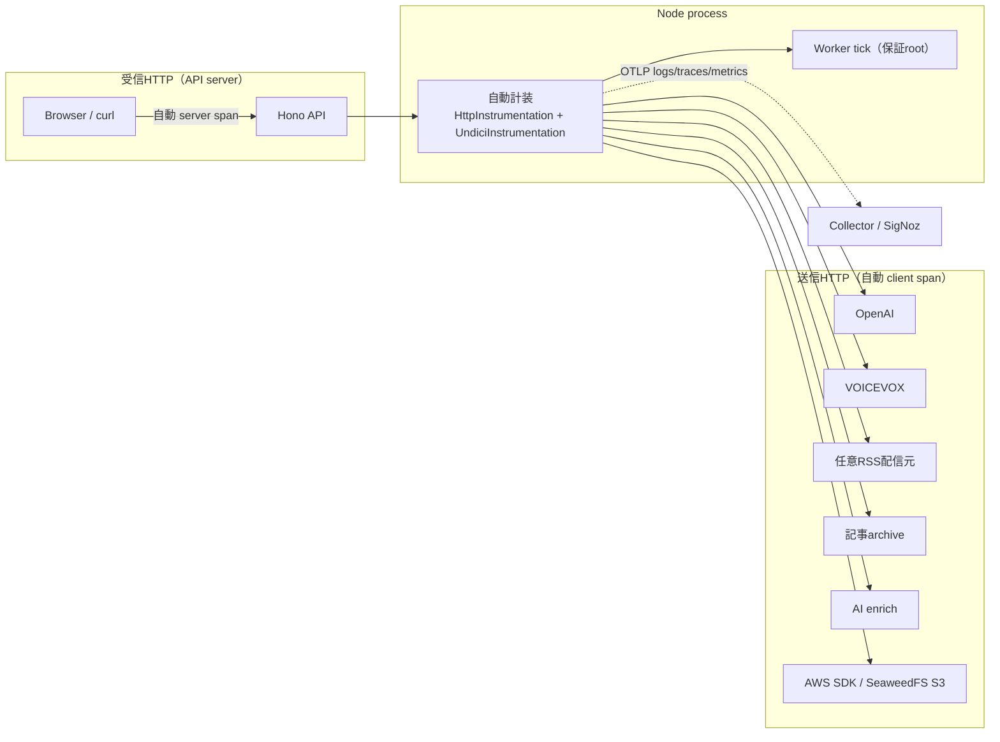
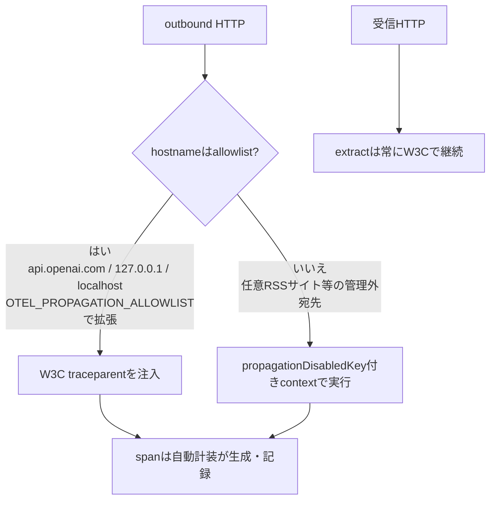
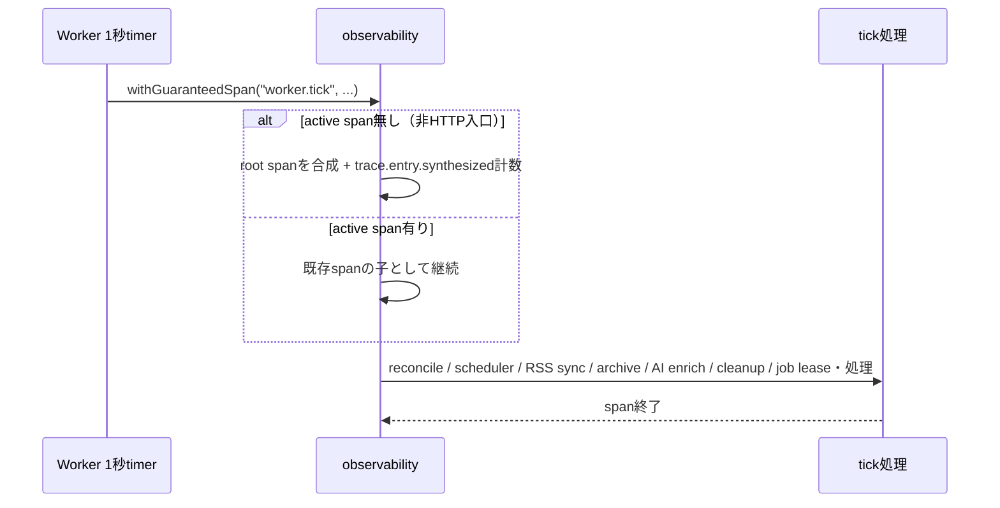

# ADR-0025: 自動計装を正本とするトレース保証

- Status: Accepted
- Date: 2026-08-11
- Decision owners: Product owner / Platform
- Supersedes: N/A
- Superseded by: N/A
- Related: ADR-0010、ADR-0016、ADR-0017、`packages/observability`、`infra/observability`

## コンテキストと変更契機

従来の計装は「呼び出しごとの手動span」を正本にしていた。APIミドルウェアは手動の`http.request` spanを持ち、OpenAI・VOICEVOXは`createTracedFetch`、RSS・記事archive・AI enrichはadapter内の個別計装に依存していた。そのため以下にカバレッジの穴があった。

- グローバル`fetch` / `undici.fetch` / `node:http` を経由するoutbound HTTP（OpenAI、VOICEVOX、RSS、記事archive、AI enrich、AWS SDK S3）は、手動spanを置き忘れると無spanのまま沈黙した。
- 非HTTP入口（Workerの定期tick）にはspanが存在せず、scheduler・RSS同期・cleanup・job処理のtraceが欠落した。
- 失敗したspanやlogに`error.message`が残らず、障害の一次情報が欠けていた。

現在の実動構成はNode + SQLite + SeaweedFSであり、Cloudflare consumerは未接続のため、今回の対象はNodeのみとする。

## 決定

**自動計装（`@opentelemetry/instrumentation-http` + `@opentelemetry/instrumentation-undici`）をトレースの正本とする。** 手動spanは業務意味がある箇所（`episode.process`、`episode.<stage>`、provider属性）だけに残し、HTTP境界のspan生成は自動計装へ委ねる。

| 設計 | 内容 |
| --- | --- |
| 自動計装のbaseline化 | `createNodeObservability`が`OTEL_ENABLED=true`でhttp/undici計装を登録。undiciは`diagnostics_channel`を使うため、グローバル`fetch`・`undici.fetch`・`node:http`の全outboundと、APIの全inboundが自動spanになる |
| register-first entry | `@news-podcast/observability/node/register`の`getNodeObservability`を**最初のimport**で評価し、`@hono/node-server`やAWS SDKが`node:http`を静的キャプチャする前に計装をpatchする。同時に`installProcessErrorListeners`（uncaughtException/unhandledRejection → 構造化log + `process.error` + flush + exit(1)）を登録する |
| Allowlist伝播ゲート | ADR-0017の「管理外serviceへtrace headerを送らない」を**部分改訂**して一般化。`AllowlistTextMapPropagator`が`propagationDisabledKey`付きcontextではW3C Trace Contextの注入をスキップ。`installPropagationGate`がグローバルfetchと`node:http/https`をラップし、非allowlist宛先（任意RSSサイト等）への注入だけを止める。span自体は自動計装が生成し続け、トレース欠落は発生しない。allowlist既定は`api.openai.com`・`127.0.0.1`・`localhost`で、`OTEL_PROPAGATION_ALLOWLIST`で拡張できる。`createNodeSafeFetcher`は任意の`propagate`フックを持ち、composition rootが`createPropagationHook()`を渡すことでDNS pin経路も同じ契約を守る。extract（受信）は常にW3C |
| 保証root | `withGuaranteedSpan(name, op)`がactive span無しのときroot spanを合成し、`trace.entry.synthesized`を計数する。Workerは`tick()`全体を`withGuaranteedSpan("worker.tick", ...)`で包み、scheduler・RSS同期・archive・AI enrich・cleanup・job処理が常にtrace IDを持つ。`assertActiveSpan(name)`は非本番でspan欠落をthrow（fail-fast）、本番では計装欠落をエラーにせずmetricとruleで監視する |
| エラー詳細 | 失敗logとspanにredact済み`error.message`（URL・email・secret置換、500文字cap）と`error.type`を記録し、呼び出し元は`failure.code`・`error.retryable`・`http.route`・`operation.stage`を付与する。`error.message`は高cardinalityのため**metric属性へは入れない** |
| API middleware | 手動`http.request` spanを廃止し、自動`http.server` spanへ依存する。ルーティング後に`http.route`（`context.req.routePath`）を設定し、`api.request` log、5xxでの`http.server.error`計数、`assertActiveSpan`による欠落検出を行う |

### Allowlist伝播ゲートの判定

### Worker tickの保証root

`baggage`は受信・永続化しない。不正なW3C headerは無視し、APIで新しいroot contextを作る。DNT、telemetry設定OFF、`OTEL_ENABLED=false`では従来どおりSDKまたはregisterを開始しない。

## 判断要因

- 呼び出しごとの手動計装はカバレッジに穴を作り、新規outboundの追加ごとに忘れ得る。自動計装で物理的にspan欠落を作らない。
- undiciの`diagnostics_channel`とglobal fetch・`node:http`を経由する実装により、既存の全outbound経路を修正なしでspan化できる。
- W3C注入の抑制だけを伝播ゲートで制御し、span生成とprivacy契約（ADR-0010）を分離する。
- 本番の可用性と計装の健全性を両立するため、fail-fastは非本番限定にし、本番は低cardinality metricとruleで監視する。

## 却下案

| 案 | 却下理由 | 再検討条件 |
| --- | --- | --- |
| 手動計装を全面維持 | 呼び出しごとの登録コストが高く、新規outbound追加でカバレッジの穴が再発する。global fetch系の経路は手動spanで追いにくい | 自動計装が対象runtimeで利用できなくなり、手動以外の手段が無い |
| 全外部HTTPへtrace headerを伝播 | 任意RSSや管理外providerへ識別子を送り、ADR-0010のPrivacy契約に違反する | 接続先が管理下になり相互計装される、または接続先ごとの同意が取れる |
| 本番を含め常にactive spanを強制する | 計装欠落や誤設定で本番処理自体が停止し、可用性を損なう | 計装欠落をavailabilityより優先する要件が発生する |

## 結果

### 利点

- APIのinboundと全outbound HTTP（OpenAI、VOICEVOX、RSS、archive、AI enrich、S3）が自動spanになり、調査の入口が一つに揃う。
- Workerの定期処理は保証rootで必ずtrace IDを持ち、非HTTP入口の欠落が無くなる。
- 失敗spanとlogにredact済み`error.message`・`error.type`が残り、初動調査がlog/traceで完結する。
- processクラッシュが構造化log + `process.error` + flush後にexit(1)し、ADR-0016のlease回収へ確実に委ねられる。

### 欠点とリスク

- 自動計装のspanは手動spanより属性が少ないため、業務属性は引き続き手動付与が必要（`episode.<stage>`、provider属性）。
- undici計装が`diagnostics_channel`へ依存するため、Nodeバージョンやundici内部実装の変更でspan欠落が起き得る（`assertActiveSpan`と`trace.entry.synthesized`で検出）。
- `error.message`はredact済みとはいえlogs/tracesへ平文で残るため、redact漏れリスクはテストで管理する必要がある。

## 影響と同期

| 対象 | 必要な変更 | 状態 | 証拠 |
| --- | --- | --- | --- |
| 設計書 | 自動計装baseline、register-first、伝播ゲート、保証root、error.message方針を追記 | Done | `docs/design.md` §6.1、`docs/architecture.md` §7 |
| ドメイン/ユースケース | N/A — trace契約はobservability境界に限定 | Done | application port変更なし |
| OpenAPI/外部契約 | N/A — W3C標準headerの内部処理のみ | Done | schema変更なし |
| コード/ポート | http/undici自動計装、register-first entry、伝播ゲート、`withGuaranteedSpan`/`assertActiveSpan`、error.message redaction | Done | `packages/observability` |
| データ/ストレージ | N/A — 既存trace列を利用 | Done | migration変更なし |
| 実行/配備 | API/Workerでregisterを最初にimport、`createPropagationHook()`をsafe fetchへ注入 | Done | `apps/api/src/node.ts`、`apps/worker/src/node.ts` |
| 認証/セキュリティ | allowlist伝播、`error.message`のredaction、metric属性の低cardinality維持 | Done | `packages/observability/src/propagation.ts`、`privacy.ts` |
| フロント/品質保証 | N/A — Browser側契約はADR-0017のまま不変 | Done | Web契約変更なし |
| テスト/運用 | register-first、伝播gate、synthesized、process error、API middlewareのunit test | Partial | automated tests。SigNoz smokeは実環境gate |
| 監視 | `trace.entry.synthesized`・`http.server.error`・`process.error`のrule、API 5xx / 未計装入口 / process errorのdashboard panel、log-based rule（`rss.sync.failed`・`article.archive.failed`・AI enrich失敗） | Partial | `infra/observability/terraform`（rule/dashboard適用は実環境gateに残る） |

## 再検討条件

- Cloudflare Workers実装で自動計装が使えず、手動spanまたはruntime固有の計装方式へ戻す必要が生じる。
- OpenAI、VOICEVOX、S3が管理下の共通Collectorへserver spanを送信できるようになり、client側計装を縮小できる。
- 任意RSS等の管理外宛先へtrace headerを送る要件が発生し、allowlist方針を見直す。
- `trace.entry.synthesized`が継続的に高止まりし、非HTTP入口の計装設計そのものを見直す。
- `error.message`のredact情報量不足で障害調査が不十分になり、属性方針を再検討する。

## 受け入れゲートと未決事項

- Linux実環境のSigNozで、API入り口の自動`http.server` spanとoutbound（OpenAI、VOICEVOX）の自動client spanを確認する。
- 非allowlist宛先（任意RSS）への`traceparent`非注入と、span自体の記録を実環境で確認する。
- Worker tickの保証rootと`trace.entry.synthesized` metric、`process.error`（クラッシュ注入）、`http.server.error`（5xx注入）のrule発火とSMTP通知を確認する。
- 未決事項なし。

## 検証証拠

- `pnpm format:check && pnpm lint && pnpm typecheck && pnpm test`
- `pnpm contract:check && pnpm test:e2e`
- `terraform -chdir=infra/observability/terraform validate` と`plan`
- SigNoz上のsynthetic trace確認（API→provider、worker.tick保証root、伝播ゲート）
