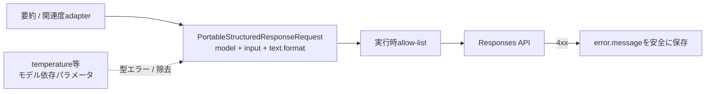

# ADR-0026: OpenAI Responsesリクエストの可搬サブセット境界

- Status: Accepted
- Date: 2026-08-12
- Decision owners: Product owner / Platform
- Supersedes: ADR-0021の「関連度リクエストへ`temperature: 0`を指定する」方針
- Superseded by: N/A
- Related: ADR-0021、`packages/adapters/src/ai-enrich/openai-responses.ts`、[OpenAI GPT-5.6ガイド](https://developers.openai.com/api/docs/guides/latest-model)

## コンテキストと変更契機

既定モデルを`gpt-5.6-luna`へ変更した後も、関連度リクエストは旧来の`temperature: 0`を送っていた。Responses APIはHTTP 400
`Unsupported parameter: 'temperature' is not supported with this model.`を返し、要約生成後の多数の関連度処理が終端失敗した。

TypeScriptが検出できなかった理由は、リクエストを`JSON.stringify({...})`して`fetch`の`BodyInit`へ渡していたためである。`JSON.stringify`は任意の値を受け取り、
`OpenAiConfig.model`も環境変数由来の`string`なので、コンパイラには「このモデルではこのパラメータが禁止」という対応関係が存在しなかった。

## 決定

AI補助の構造化出力リクエストは、全採用モデルで利用する共通部分だけを表す`PortableStructuredResponseRequest`を必ず通す。

- 型は`model`、`input`、`text.format`だけを許可し、オブジェクトリテラルの余剰プロパティ検査でモデル依存パラメータを拒否する
- builderは許可フィールドを新しいオブジェクトへコピーし、型を迂回した値も実行時に除去する
- モデル依存パラメータが必要になった場合、共通型を拡張せず、対象モデルを判別する専用契約と実API smokeを追加する
- OpenAIの非2xx応答は本文全体ではなく`error.message`だけを取り出し、キューとObservabilityへ原因を残す
- 要約と関連度は独立した成果物として扱い、関連度失敗時も保存済み要約を表示する

## 判断要因

- `OPENAI_MODEL`は運用時に差し替え可能で、静的なモデル別型だけでは実行時設定との一致を保証できない
- 共通経路を安全な最小サブセットに限定すれば、モデル変更時の非互換パラメータ混入を既定で防げる
- 外部API障害時にも、成功済みの成果物と具体的な失敗理由を失わないことが必要

## 却下案

| 案 | 却下理由 | 再検討条件 |
| --- | --- | --- |
| `fetch`へ直接任意JSONを渡し続ける | `JSON.stringify`/`BodyInit`はAPIリクエスト形状やモデル能力を検査しない | N/A |
| SDKの汎用request型だけを使う | API全体で有効なoptional項目は表せても、環境変数のモデル値との組み合わせを常に禁止できるとは限らない | SDKがモデル別の判別共用体と実行時検証を公式提供した場合 |
| 400を受けてから疑わしいパラメータを削除して再試行 | 意図しない要求変更、追加コスト、原因の隠蔽が起きる | APIが安全な互換ネゴシエーションを提供した場合 |
| 対応表を手書きして全モデル能力を列挙 | 新モデル追加のたびに陳腐化し、未登録モデルの扱いが不明確になる | 複数のモデル依存機能を実際に使う要件が増えた場合 |

## 結果

### 利点

- モデル非対応パラメータは通常の実装経路ではコンパイル時と実行時の二重で遮断される
- 4xxの具体的原因がDB/ログへ残り、HTTP statusだけの障害より短時間で診断できる
- 関連度障害が要約の閲覧性へ波及しない

### 欠点とリスク

- 共通型にない新API機能は、専用契約を設計するまで利用できない
- OpenAI側の能力変更を型だけで自動検知はできないため、モデル変更時の実API smokeは引き続き必要
- `error.message`は外部入力なので、既存のObservability redactionと文字数上限に依存する

## 影響と同期

| 対象 | 必要な変更 | 状態 | 証拠 |
| --- | --- | --- | --- |
| 設計書 | AI adapter契約テストへ可搬サブセットを追加 | Done | `docs/design.md` §7 |
| ドメイン/ユースケース | N/A — provider HTTP境界の規則 | Done | application port変更なし |
| OpenAPI/外部契約 | N/A — 記事レスポンスのoptional項目は既存契約どおり | Done | contract差分なし |
| コード/ポート | 共通request型、実行時allow-list、4xx message抽出 | Done | `packages/adapters/src/ai-enrich/openai-responses.ts` |
| データ/ストレージ | N/A — 既存`article_relevance.error`へ保存 | Done | migration変更なし |
| 実行/配備 | `temperature`を送信しない | Done | 要約・関連度adapter |
| 認証/セキュリティ | エラー本文全体を保存せずmessageだけを抽出 | Done | `readOpenAiErrorMessage` |
| フロント/品質保証 | 関連度なしでも要約を表示 | Done | `article-ai-block.test.tsx` |
| テスト/運用 | request shape、400詳細、要約単体表示、実API smoke | Done | adapter/web tests、`gpt-5.6-luna` smoke |

## 再検討条件

- モデル固有機能を2種類以上利用する要件が発生した場合、capability別の判別共用体を検討する
- OpenAI SDKがモデルIDと対応パラメータを結び付けた実行時validatorを提供した場合、共通境界を置き換える
- 互換性400が再発した場合、固定smokeをCIまたはデプロイ前gateへ昇格する

## 受け入れゲートと未決事項

- None

## 検証証拠

- `pnpm --filter @news-podcast/adapters test`
- `pnpm --filter @news-podcast/adapters typecheck`
- `pnpm --filter web test`
- `pnpm --filter web typecheck`
- `gpt-5.6-luna`への最小Responses API requestがHTTP 200になることをローカルsmokeで確認
