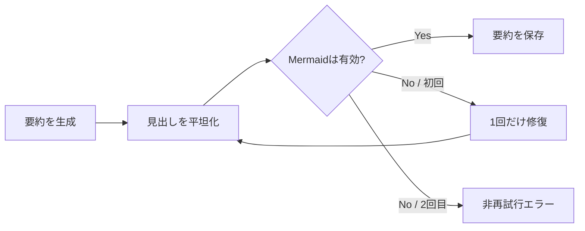

# ADR-0027: フラットで検証済みのAI記事要約

- Status: Accepted
- Date: 2026-08-12
- Decision owners: Platform
- Supersedes: ADR-0021の要約形式とMermaid検証方針
- Superseded by: N/A
- Related: `packages/adapters/src/ai-enrich/openai-article-summarizer.ts`

## Context and change trigger

`## 要点`や`要点：`はAI要約ブロック内で情報を重複させる。Mermaidは生成後に構文検証されず、表示時まで破損を検知できなかった。

## Decision

- 要約本文は見出しを使わず、結論から始まるフラットな日本語Markdownとする
- `要点・結論・概要・まとめ`の見出しラベルは生成指示と後処理の両方で除去する
- MermaidコードブロックはMermaid 11のparserで検証する
- 不正時の修復要求は1回だけとし、2回目も不正なら非再試行エラーにする
- プロンプト版を`summary-v3`へ上げ、旧要約を再生成対象にする

## Decision drivers

- 要約の情報密度と読み始めの速さ
- 破損図を保存しない品質契約
- 修復処理の無限ループ防止

## Rejected alternatives

| Alternative | Reason rejected | Reconsider when |
| --- | --- | --- |
| 表示時だけMermaidを検証 | 破損データが保存・再利用される | 保存前検証のコストが許容できなくなった場合 |
| 成功するまで修復 | 無限ループとコスト暴走を招く | 外部で総試行数を強制できる場合 |
| Mermaidを禁止 | 関係性の把握に有効な記事がある | 図の利用率が継続的にゼロの場合 |

## Consequences

### Positive

- 要約が見出し重複なしで直接読める
- 保存済みMermaidは生成時点で構文検証済みになる

### Negative and risks

- 不正Mermaid時は最大1回分の追加トークンと待ち時間が発生する
- parser依存によりadapterの依存サイズが増える

## Impact and synchronization

| Surface | Required change | Status | Evidence |
| --- | --- | --- | --- |
| Design documents | ADR-0021から本ADRへ正本を移す | Done | `docs/adr/0021-ai-article-enrichment.md` |
| Domain and use cases | N/A — `ArticleSummarizer`契約内の品質規則 | Done | N/A |
| OpenAPI and external contracts | N/A — `aiSummary`の型はMarkdown文字列のまま | Done | `packages/contracts/openapi/openapi.json` |
| Application code and ports | 平坦化・構文検証・1回修復 | Done | `openai-article-summarizer.ts` |
| Data and storage | prompt versionをv3へ更新 | Done | `ai-enrich/shared.ts` |
| Runtime and deployment | Mermaid parser依存を追加 | Done | `packages/adapters/package.json` |
| Authentication and security | N/A — owner境界に変更なし | Done | N/A |
| Frontend and quality assurance | 既存Markdown/Mermaid表示を継続 | Done | `apps/web/src/shared/markdown` |
| Tests and operations | 平坦化・修復上限・構文エラーを検証 | Done | summarizer tests |

## Reconsideration conditions

- Mermaid修復率または修復失敗率が継続的に10%を超える場合
- 追加リクエストのコストが要約生成費の20%を超える場合

## Acceptance gates and open questions

- None

## Validation evidence

- `pnpm --filter @news-podcast/adapters test`
- `pnpm --filter @news-podcast/adapters typecheck`
