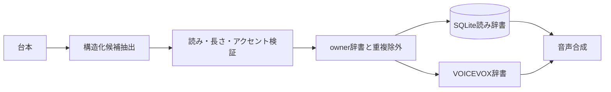

# ADR-0028: 構造化された読み辞書候補抽出

- Status: Accepted
- Date: 2026-08-12
- Decision owners: Platform
- Supersedes: N/A
- Superseded by: N/A
- Related: `docs/design.md`§8、`apps/worker/src/reading-term-extractor.ts`

## Context and change trigger

読み辞書の自動登録は自由形式JSONを正規表現で抽出し、失敗を記録せず空配列として扱っていた。モデルの応答形が少し変わるだけで登録が0件になり、原因も観測できなかった。

## Decision

- 台本生成後・音声合成前に、Responses APIのstrict JSON Schemaで最大30件を抽出する
- 対象を英略語、英数字技術語、製品・サービス・企業・人・地名、複数読みの固有名詞とする
- 全角カタカナ、長さ、アクセント範囲を検証し、NFKC＋case foldで重複を除く
- ownerの既存辞書とも同じ正規化キーで照合する
- 抽出失敗を`reading_dictionary.extraction_failed`、登録成功を`reading_dictionary.term_added`で観測する

## Decision drivers

- 読み誤りを音声合成前に減らす
- 抽出失敗を運用で発見できるObservability
- 不正なAI出力を辞書へ入れない契約

## Rejected alternatives

| Alternative | Reason rejected | Reconsider when |
| --- | --- | --- |
| 自由JSON＋正規表現を継続 | 応答形の揺れを検出できない | structured outputが利用不能になった場合 |
| 候補を無検証で全登録 | 誤読を固定化し辞書品質を下げる | 人手承認キューを必須化した場合 |
| 音声合成後に抽出 | 初回音声へ辞書が反映されない | 音声の自動再生成を導入した場合 |

## Consequences

### Positive

- 辞書登録数と失敗原因が安定・可視化する
- 表記ゆれによる重複登録を抑えられる

### Negative and risks

- 台本ごとに1回の追加AIリクエストが必要
- AIの読み推定が誤る可能性は残るため、設定画面で編集・削除できる契約を維持する

## Impact and synchronization

| Surface | Required change | Status | Evidence |
| --- | --- | --- | --- |
| Design documents | EpisodeProductionのTTS前処理を明記 | Done | `docs/design.md`§8.3 |
| Domain and use cases | N/A — 既存EpisodeProduction内の前処理 | Done | N/A |
| OpenAPI and external contracts | N/A — 読み辞書CRUD契約は不変 | Done | OpenAPI reading dictionary routes |
| Application code and ports | 構造化抽出と正規化を分離 | Done | `reading-term-extractor.ts` |
| Data and storage | N/A — 既存`reading_dictionary`を利用 | Done | migration 0015 |
| Runtime and deployment | 抽出失敗イベントを追加 | Done | observability contract |
| Authentication and security | owner既存辞書との照合を維持 | Done | `process-episode-job.ts` |
| Frontend and quality assurance | 手動編集・削除を維持 | Done | reading dictionary manager |
| Tests and operations | 構造化出力・検証・重複をテスト | Done | `reading-term-extractor.test.ts` |

## Reconsideration conditions

- AI自動登録語の手動修正率が10%を超える場合
- 抽出失敗イベントが24時間で3回以上継続する場合
- 読み辞書抽出が番組生成時間の10%を超える場合

## Acceptance gates and open questions

- None

## Validation evidence

- `pnpm --filter @news-podcast/worker test`
- `pnpm --filter @news-podcast/worker typecheck`
- `pnpm --filter @news-podcast/observability typecheck`
