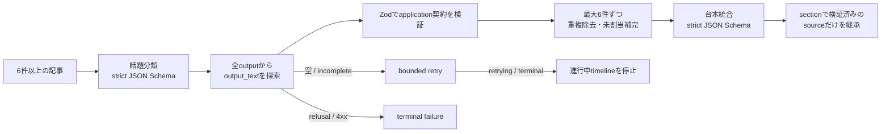

# ADR-0029: 分割Podcast生成の応答境界を構造化・検証する

- Status: Accepted
- Date: 2026-08-12
- Decision owners: Platform / Editorial
- Supersedes: N/A
- Superseded by: N/A
- Related: ADR-0013、ADR-0026、ADR-0031、`docs/design.md` §8.3、[OpenAI Structured Outputs](https://developers.openai.com/api/docs/guides/structured-outputs)

## Context and change trigger

6件以上の記事で有効になる分割生成は、話題分類と台本統合のResponses API応答を`output[0].content[0].text`から取得していた。しかし`output`はreasoningやmessageなど複数種の項目を含み、本文の位置は固定されない。

SigNoz MCPで2026-08-11〜12のWorkerログを調査したところ、直近3件の`pipeline-input-invalid`はOpenAIがHTTP 200を返した約8秒後に`OpenAI returned empty response`で失敗していた。うちtrace 1件ではOpenAI client spanが成功し、その直後の`episode.researching_sources`だけが失敗していた。provider障害ではなく、正常応答を固定位置で解釈したadapter障害である。

また、jobが失敗して`RUN_ERROR`を受信しても、AG-UI timelineの未完了stepが`done: false`のまま残り、画面ではエラーと「記事を調査中」のspinnerが同時表示された。

## Decision

分割生成のprovider境界では、位置ではなく判別子とschemaで応答を解釈する。

- 話題分類と台本統合はResponses APIの`text.format`へstrict JSON Schemaを指定する
- `output`全体から`type = output_text`のcontentを探索し、reasoningが先行しても本文を取得する
- JSON parse後にZodで文字数、UUID、配列上限を再検証する
- 分類結果は選択記事との集合演算で正規化し、重複・未知IDを除外して未割当記事を最大6件単位で補完する
- 統合モデルにはsource URLを生成させず、各sectionでprovenance検証済みのURLだけを継承する
- HTTP 408/409/429/5xx、空・不完全・schema不適合応答は一時障害として既存の最大4attemptへ渡す。refusalとその他4xxは再試行しない
- transport failureも一時障害へ統一し、caller cancellation・lease喪失・job deadlineの理由はprovider errorへ変換せず伝播する
- 選択記事は全件の`read_article`実行と全URLの引用を提出条件とし、不足は同一run内の構造化修正へ返す
- AG-UIの`job.retrying`、`RUN_ERROR`、`RUN_FINISHED`は未完了timelineを必ず閉じる。次attemptの`RUN_STARTED`と`STEP_STARTED`だけが再開する

## Decision drivers

- Responses APIの異種`output`配列を安全に扱う
- 記事数によってだけ顕在化する別実装経路の契約差をなくす
- 一時的なprovider出力欠落と永続的なrequest/refusalを分け、無駄な再試行と即時失敗を減らす
- backendの終端状態と画面の進捗表現を一致させる
- 統合処理による未検証source混入を防ぐ

## Rejected alternatives

| Alternative | Reason rejected | Reconsider when |
| --- | --- | --- |
| `output[0]`の固定取得を維持 | reasoning等が先頭に来る正常応答を空と誤判定する | N/A |
| 自由形式JSONを正規表現で抽出 | schema不適合を生成後まで検出できず、括弧を含む本文にも脆い | providerが構造化出力を提供しなくなった場合 |
| 全エラーを同じ条件で再試行 | request契約違反やrefusalを4回繰り返す | providerが安全な互換ネゴシエーションを提供した場合 |
| 統合モデルがsource URLを再生成 | sectionで検証していないURLを混入できる | 統合段階にも同等のprovenance toolを実装した場合 |
| 記事数を5件以下へ制限 | 症状を隠すだけで、多記事Podcastの要求を満たさない | Productが多記事生成を廃止した場合 |

## Consequences

### Positive

- reasoning-firstの正常応答を受理できる
- providerの構造化出力とapplication validationの二重契約になる
- 空応答は自動回復し、永続障害は既存のattempt上限・alert・traceへ集約される
- エラーまたは再試行待ちでspinnerが残らない
- 選択記事は分類モデルの欠落や重複に左右されず、必ず1sectionへ割り当てられる

### Negative and risks

- 分割生成だけで2種類のJSON Schemaを保守する必要がある
- 一時的な空応答は追加attempt分のlatencyとAPI費用を生む
- providerがJSON Schema subsetを変更した場合はrequest 4xxとして停止するため、モデル更新時のsmoke testが必要

## Impact and synchronization

| Surface | Required change | Status | Evidence |
| --- | --- | --- | --- |
| Design documents | 多記事時の構造化境界とretry/terminal UI遷移を追加 | Done | `docs/design.md` §8.3 |
| Domain and use cases | N/A — `PodcastAgentRunner`契約は不変 | Done | application port差分なし |
| OpenAPI and external contracts | N/A — job/event wire schemaは既存範囲 | Done | OpenAPI差分なし |
| Application code and ports | response探索、schema検証、分類正規化、retry分類 | Done | `sectional-openai-podcast-agent.ts` |
| Data and storage | N/A — checkpoint/source schemaは不変 | Done | migration差分なし |
| Runtime and deployment | N/A —既存Responses endpoint、model、attempt上限を利用 | Done | config差分なし |
| Authentication and security | 統合段階で新規sourceを受理しない | Done | section sourceの和集合のみ保存 |
| Frontend and quality assurance | retry/terminalでtimelineを閉じ、次attemptで再開 | Done | Web reducer tests |
| Tests and operations | reasoning-first、空応答retry、終端/retry状態遷移を回帰test化 | Done | adapter/Web tests、SigNoz trace調査 |

## Reconsideration conditions

- 分割生成の空・schema不適合応答が15分で3回以上発生した場合、model/prompt/schema互換性を再調査する
- 多記事生成のp95がagent stage deadlineの80%を継続的に超えた場合、section並列度または記事上限を再設計する
- OpenAI SDKが判別済みoutput helperとruntime schema validationを提供し、現在のadapter検証を完全に置換できる場合

## Acceptance gates and open questions

- None

## Validation evidence

- SigNoz MCP: `episode.failed`ログとtraceでHTTP 200後のadapter誤判定を確認
- `pnpm exec vitest run packages/adapters/src/sectional-openai-podcast-agent.test.ts`
- `pnpm --filter @news-podcast/adapters typecheck`
- `pnpm --filter web exec vitest run src/routes/_authenticated/-home/model.test.ts src/routes/_authenticated/-home/hooks/use-generation-stream.test.ts`
- `pnpm --filter web typecheck`
- 設定済みモデルへのstrict schema smokeがHTTP 200 / `completed`となり、`output = [reasoning, message]`から有効な`output_text`を取得
