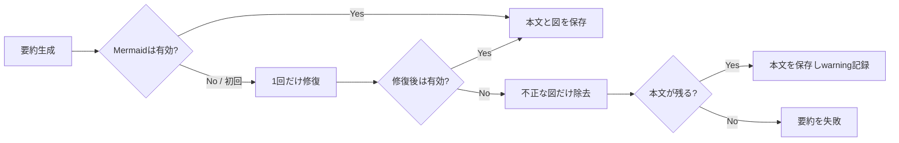

# ADR-0030: 不正な要約図を本文から隔離して縮退する

- Status: Accepted
- Date: 2026-08-12
- Decision owners: Platform / Product
- Supersedes: ADR-0027の「修復後もMermaidが不正なら要約全体を失敗させる」方針
- Superseded by: N/A
- Related: ADR-0021、ADR-0027、`packages/adapters/src/ai-enrich/openai-article-summarizer.ts`

## Context and change trigger

記事詳細のAI再計算が503となった。SigNoz MCPで対象traceを確認すると、Markdown取得と2回のOpenAI Responses APIはすべて成功していたが、初回と修復後の両方に不正Mermaidが含まれ、`ArticleSummaryError: OpenAI response contained invalid Mermaid after one repair attempt`で要約本文ごと破棄されていた。

要約本文は利用可能であり、Mermaidは理解を補助する任意要素である。任意の図が壊れたために必須の要点と後続の関連度計算を失敗させるのは、障害隔離の境界が逆転している。

## Decision

要約本文を必須成果物、Mermaidを任意の補助成果物として分離する。

- Mermaidは従来どおり保存前にMermaid 11 parserで検証し、初回不正時は1回だけ修復する
- 修復後も不正なら、不正なMermaid code blockだけを除去する
- 除去後に本文が残れば要約成功とし、`invalid-mermaid-removed` warningを返す
- 閉じていないMermaid fenceも末尾から除去し、不完全な図を保存しない
- Enrich Workerはwarningを保持し、API/Worker composition rootが`article.enrich.summary.degraded`構造化ログへ変換する
- 15分で3件を超える縮退はSigNoz alertで検知する
- 除去後に本文が空なら従来どおり非再試行エラーとする

## Decision drivers

- 必須の要点本文を任意の図の失敗から隔離する
- 壊れたMermaidを保存しない品質契約を維持する
- 修復の無限ループと追加費用を防ぐ
- 縮退成功を通常成功に埋没させず、反復傾向を観測する

## Rejected alternatives

| Alternative | Reason rejected | Reconsider when |
| --- | --- | --- |
| 要約全体を失敗させる | 利用可能な本文と後続関連度計算まで失う | 図が本文と不可分な成果物になった場合 |
| 成功するまで修復する | latency・費用・停止性の上限がなくなる | provider側で修復回数と費用を強制できる場合 |
| 不正図をそのまま保存する | 表示時エラーと壊れた永続データを許す | N/A |
| Mermaidを全面禁止する | 正常な図の理解補助価値まで失う | 縮退率が15分窓で継続的に10%を超える場合 |

## Consequences

### Positive

- 図が壊れても要点と関連度の再計算を完了できる
- 保存済みMermaidは引き続き構文検証済みになる
- 縮退率を構造化ログとalertで追跡できる

### Negative and risks

- 修復に失敗した要約では図が表示されない
- fence除去ロジックとwarning契約の保守が増える
- providerが図だけで情報を返した場合は要約全体が失敗する

## Impact and synchronization

| Surface | Required change | Status | Evidence |
| --- | --- | --- | --- |
| Design documents | 本文必須・図任意の縮退境界を追加 | Done | `docs/design.md` §8 |
| Domain and use cases | summary resultへ低cardinality warningを追加 | Done | `packages/application/src/ports.ts` |
| OpenAPI and external contracts | N/A — 公開する`aiSummary`はMarkdown文字列のまま | Done | OpenAPI差分なし |
| Application code and ports | 不正図除去後の本文返却 | Done | `openai-article-summarizer.ts` |
| Data and storage | N/A — 保存形式とprompt versionは不変 | Done | migration差分なし |
| Runtime and deployment | N/A — provider呼出回数上限は2回のまま | Done | `MAX_SUMMARY_ATTEMPTS` |
| Authentication and security | N/A — owner/記事境界は不変 | Done | route差分なし |
| Frontend and quality assurance | N/A —図なしMarkdownを既存rendererで表示 | Done | component差分なし |
| Tests and operations | 二重不正、warning伝播、構造化ログ、反復alert | Done | adapter tests、Terraform rule |

## Reconsideration conditions

- `article.enrich.summary.degraded`が15分で3件を超えた場合、対象model・prompt・Mermaid構文傾向を調査する
- 縮退率が生成要約の10%を継続的に超えた場合、Mermaid生成の停止または専用図schemaを検討する
- 図除去後に本文も空となるfailureが1件でも発生した場合、要約schemaを本文と図の別fieldへ分割する

## Acceptance gates and open questions

- None

## Validation evidence

- SigNoz MCP: 対象traceでOpenAI HTTP 200が2回成功後、Mermaid検証だけで503になったことを確認
- `pnpm --filter @news-podcast/adapters exec vitest run src/ai-enrich/openai-article-summarizer.test.ts src/ai-enrich/enrich-worker.test.ts`
- adapters/application/API/Worker typecheck
- Terraform validate
