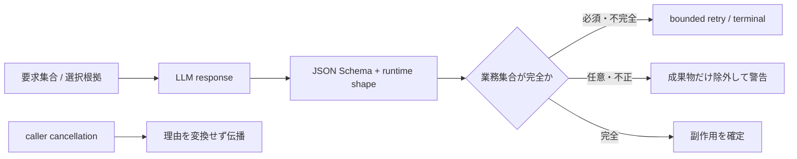

# ADR-0031: LLM応答の完全性を検証し、失敗を成果物単位で隔離する

- Status: Accepted
- Date: 2026-08-12
- Decision owners: Platform / Editorial
- Supersedes: N/A
- Superseded by: ADR-0057（provider境界）、ADR-0058（進捗監査）
- Related: ADR-0021、ADR-0028、ADR-0029、ADR-0030、`docs/design.md` §8.3

## Context and change trigger

LLM呼び出しを横断監査したところ、JSON Schemaの形が正しくても、業務上必要な集合の完全性までは保証されていなかった。関連度のバッチ応答は未知IDを除外して一部だけ成功にできたため、欠落記事がlease期限まで`processing`に残る経路があった。Podcast Agentは選択記事を全件読む指示を出していたが、提出時には全件を読んで引用したことを強制していなかった。

また、単記事と多記事の経路でHTTP 4xx、transport failure、空応答、caller cancellationの分類が異なり、同じ障害が記事数によって終端失敗または再試行になっていた。読み辞書抽出は非2xx・空応答・不正JSONを空配列へ変換し、正常な「候補0件」と区別できなかった。

SigNoz MCPの7日ログでは、`episode.failed` 18件のうち詳細が残る直近3件がHTTP 200後の空応答、AI enrich 917イベントのうち184件がrequest 400、2件が不正Mermaidだった。provider HTTP成否だけでなくapplication契約の検証結果を状態遷移と監視へ接続する必要がある。

## Decision

LLM応答は「JSONとして妥当」だけでなく、要求した成果物の完全性と副作用範囲までapplication境界で検証する。2026-08-16以降、schema decodeとprovider failure分類はADR-0057のEffect AI境界、進捗監査はADR-0058のdurable AG-UI eventが担い、本ADRの業務完全性・失敗隔離規則だけを継続する。

- バッチ応答は入力IDと出力IDが完全な1対1であることを検証する。未知、欠落、重複が1件でもあればバッチを成功扱いしない
- 選択記事Podcastは全選択記事の`read_article`実行と、全選択記事URLの引用を提出条件にする。不足は同一run内の構造化修正へ返す
- 選択記事集合が保存済み記事から欠落していればモデル呼び出し前に終端化し、プロンプト準備失敗でもAgent監査runを必ず閉じる
- function toolの文字数制約とapplicationのZod制約を一致させ、provider境界と保存境界の差を減らす
- HTTP 408/409/429/5xx、transport failure、空・不完全・壊れた応答は再試行可能、request 4xxとrefusalは終端とする
- オンデマンドAI enrichは空・不正な構造化応答を同じ呼び出し内で1回だけ再取得し、request 4xx・refusalは再送しない
- callerのabort理由はprovider errorへ包み直さず伝播し、lease喪失・job deadline・明示キャンセルの状態遷移を保つ
- 任意成果物は親成果物から失敗を隔離する。不正Mermaidは図だけ除外し、読み辞書抽出失敗は番組生成を継続する
- 有効な空集合と検証失敗を区別する。非2xx、空応答、不正JSONを成功の空配列へ変換しない
- LLMが提案した永続データは入力根拠に存在することを確認する。読み辞書の`surface`は台本内に存在する場合だけ登録する

## Decision drivers

- HTTP 200後の契約違反でも処理中状態を必ず収束させる
- 記事数や実装経路によらない再試行分類
- LLMの欠落・重複・幻覚を永続化前に止める
- 任意の補助成果物によって主要成果物を失わない
- 既存のtrace、失敗イベント、alertへ原因を流す

## Rejected alternatives

| Alternative | Reason rejected | Reconsider when |
| --- | --- | --- |
| strict JSON Schemaだけを信頼する | ID集合の完全性、入力根拠、caller cancellationはSchemaで保証できない | providerが入力集合との対応まで署名・検証する場合 |
| 妥当な部分だけ保存する | 欠落項目がlease中に残り、部分成功と処理中を区別できない | item単位の独立responseとcommitへ分割した場合 |
| 全契約違反を終端にする | 一時的な空・不完全応答から自動回復できない | providerが決定論的な完全応答を保証する場合 |
| 任意成果物の失敗で全体を失敗させる | Mermaidや読み辞書が主要成果物ではない | Productが補助成果物を必須へ変更した場合 |
| 任意成果物の失敗を空配列にする | 正常な0件と障害が観測上同一になる | typed resultでdegraded理由を別途必須化した場合 |

## Consequences

### Positive

- 不完全な関連度応答でキュー項目が`processing`に残らない
- 選択記事の読み飛ばしと出典欠落を同一run内で修正できる
- 多記事・単記事でprovider障害の状態遷移が一致する
- lease喪失やキャンセルが誤ってprovider retryへ変換されない
- 補助処理の失敗を主要成果物から隔離しつつ監視できる
- 永続的なAI enrich失敗はキューのattempt上限へ直ちに進み、同じrequest 4xxを4回繰り返さない

### Negative and risks

- 一部だけ妥当なバッチも再実行するため、追加のAPI費用が発生する
- 選択記事の全件読込・引用によりAgent turnとtool callが増える
- application契約を変更した際はprovider schemaとruntime validatorを同時更新する必要がある

## Impact and synchronization

| Surface | Required change | Status | Evidence |
| --- | --- | --- | --- |
| Design documents | LLM完全性・失敗隔離規則を追加 | Done | `docs/design.md` §8.3 |
| Domain and use cases | N/A — 既存portの戻り型を維持 | Done | application差分なし |
| OpenAPI and external contracts | N/A — 公開HTTP・event schemaは不変 | Done | contract差分なし |
| Application code and ports | バッチ完全性、選択根拠、retry/cancel分類 | Done | OpenAI adapters |
| Data and storage | N/A — 既存queue/job/dictionary schemaを利用 | Done | migration差分なし |
| Runtime and deployment | 読み抽出失敗を既存warnへ流す | Done | Worker catch boundary |
| Authentication and security | owner scopeと選択記事制約を維持 | Done | `read_article` validation |
| Frontend and quality assurance | N/A — 既存終端/retry投影を利用 | Done | wire schema差分なし |
| Tests and operations | 欠落・重複・未知・4xx・transport・cancel・幻覚を回帰test化 | Done | adapter/Worker tests、SigNoz MCP |

## Reconsideration conditions

- LLM契約違反が15分で3件を超えた場合、model・prompt・schema互換性を調査する
- バッチ完全性違反による再試行がAI enrichコストの5%を超えた場合、item単位commitを検討する
- 選択記事の自己修正がagent turn上限の20%を継続して消費する場合、提出前の決定論的チェックpointを追加する

## Acceptance gates and open questions

- None

## Validation evidence

- SigNoz MCP: 7日分の`episode.failed`と`article.enrich.*`ログを横断集計
- `pnpm --filter @news-podcast/adapters exec vitest run src/openai-podcast-agent.test.ts src/sectional-openai-podcast-agent.test.ts src/ai-enrich/openai-relevance-scorer.test.ts src/ai-enrich/enrich-worker.test.ts`
- `pnpm --filter worker exec vitest run src/reading-term-extractor.test.ts src/process-episode-job.test.ts`
- `pnpm --filter @news-podcast/adapters typecheck`
- `pnpm --filter worker typecheck`
