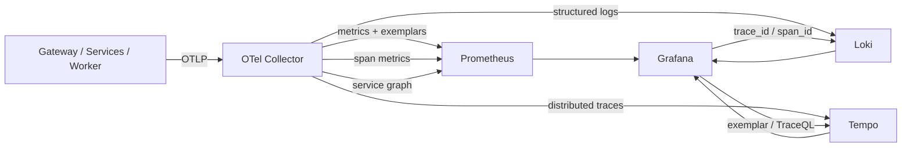

# ADR-0032: OTelの後段をGrafana相関監視基盤へ移行する

- Status: Accepted
- Date: 2026-08-12
- Decision owners: Product owner / Platform
- Supersedes: ADR-0010（OTel契約とprivacy方針は継続し、SigNoz/ClickHouseだけを置換）
- Superseded by: N/A
- Related: ADR-0016、ADR-0017、ADR-0025、`packages/observability`、`infra/observability`

## コンテキストと変更契機

メトリクス、ログ、トレースを保存するだけでは、サービス間依存や障害原因の切り分けがブラックボックスになる。アラートから代表trace、同じtraceのログ、依存先サービスへ連続して移動でき、HTTP・NATS・DB・外部providerの因果関係を同じ相関モデルで調査できる必要がある。

## 決定

OpenTelemetryを唯一の計装・転送契約として維持し、保存・検索・可視化をGrafana、Prometheus、Loki、Tempoへ移行する。OTel Collectorでspan metricsとservice graphを生成し、Grafana datasource相関でmetrics、logs、tracesを相互リンクする。

- trace contextは同期HTTPではparent、非同期enqueue/consumeではproducer spanへのlinkとして伝播する。
- すべての構造化logへOTel SDKが`trace_id`と`span_id`を付け、LokiからTempoへ遷移可能にする。
- Tempo datasourceはtrace-to-logs、trace-to-metrics、service mapを提供する。
- dashboard、datasource、alert、notification policyはprovisioning fileを正本とし、UI変更を恒久設定にしない。
- metricsには高cardinality IDを入れず、job/message IDはtrace/logだけに許可する。
- CollectorまたはGrafana stack障害で業務処理を止めず、欠落・drop・export失敗自体を監視する。

## 判断要因

- RED/USE/SLO、構造化ログ、distributed trace、service graphを一つのUIで調査できる。
- OTLPを維持するためapplication codeを保存backendへ結合しない。
- PromQL、LogQL、TraceQLとprovisioning fileで監視仕様をversion管理できる。
- exemplarsとtrace IDにより集計から個別実行へ降りられる。

## 却下案

| 案 | 却下理由 | 再検討条件 |
| --- | --- | --- |
| SigNozを継続 | 利用者がGrafana移行と相関監視の強化を選択した | Grafana stackで要求する相関を実現できない |
| Grafanaだけ導入してSigNozも維持 | 二重保存、二重alert、調査手順の分岐が生じる | 法的または組織的に二重保存が必要になる |
| logs/metricsだけを監視 | 非同期処理とサービス間因果を復元できない | システムが単一同期processになる |
| providerの自動計装だけ | NATS、outbox/inbox、domain workflowの意味的な境界が見えない | 自動計装が業務相関を完全に表現できる |

## 結果

### 利点

- alertからservice graph、trace、同一trace logへ一続きに調査できる。
- HTTP、NATS、SQLite、providerのどこで時間・失敗が生じたかを切り分けられる。
- dashboardとalertのdriftをGit差分で検出できる。

### 欠点とリスク

- Prometheus、Loki、Tempo、Grafanaの運用・容量設計・backupが必要になる。
- service graphとspan metricsは正しいspan kind、peer/service属性、trace伝播に依存する。
- head samplingで落ちたtraceは復元できないため、失敗・長時間traceを残すsampling方針が必要になる。

## 影響と同期

| 対象 | 必要な変更 | 状態 | 証拠 |
| --- | --- | --- | --- |
| 設計書 | Grafana相関構成、調査導線 | Done | `docs/design.md`、`docs/architecture.md` |
| ドメイン/ユースケース | N/A — telemetry backendを知らない | Done | dependency rules |
| OpenAPI/外部契約 | N/A — 公開APIを変更しない | Done | `packages/contracts/openapi/openapi.json` |
| コード/ポート | trace/log correlation、NATS semantic span | Pending | `packages/observability` |
| データ/ストレージ | Prometheus/Loki/Tempo volumeとretention | Pending | `infra/observability` |
| 実行/配備 | LGTM Compose、Collector routing | Pending | `infra/observability/compose.yaml` |
| 認証/セキュリティ | Grafana認証、OTLP ingress、privacy filter | Pending | provisioning、Collector config |
| フロント/品質保証 | browser traceの継続 | Pending | browser telemetry tests |
| テスト/運用 | dashboard、alert、相関、backup smoke | Pending | observability runbook |

## 再検討条件

- 1日あたりのtelemetry量またはquery latencyが単一host構成のSLOを30日間継続して超える。
- head samplingにより障害traceを取得できない事例が月2件以上発生する。
- Grafana stackの運用負担が障害調査時間の短縮効果を上回る。

## 受け入れゲートと未決事項

- SMTP資格情報、通知先、Grafana admin secretは配備先secretとして必要。
- 本番retentionとvolume容量は実測7日分のingestion量から最終調整する。

## 検証証拠

- Compose configと各componentのready endpoint。
- synthetic traceでservice graph、metrics exemplar、trace-to-logs、logs-to-traceを確認する。
- alert発火、再通知、復旧通知、watchdogのGrafana非依存通知を確認する。
