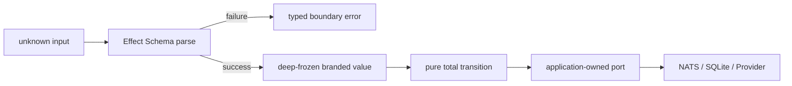

# ADR-0034: 関数型ドメインモデルとEffect境界へ移行する

- Status: Accepted
- Date: 2026-08-12
- Decision owners: Product owner / Architecture
- Supersedes: ADR-0001
- Superseded by: N/A
- Related: ADR-0016、ADR-0033、`docs/architecture.md`

## コンテキストと変更契機

従来の共有`domain/application/adapters` packageとclass中心の実装では、Bounded Contextの所有権、mutableな中間状態、境界入力の検証漏れを型検査だけで判別できない。Context間の型共有も、サービスを分けても同時変更が必要な分散モノリスを生む。

## 決定

4 Bounded Contextを関数とimmutable dataだけで実装し、Effect v4をapplication/runtimeの標準effect systemにする。自己定義class、setter、部分初期化されたentityを禁止する。

- `unknown`はadapter/runtime境界だけに置き、`Schema.decodeUnknownEffect`によるparse成功後の型だけを内側へ渡す。
- parserは余剰propertyも拒否し、成功値を再帰的にfreezeする。Booleanを返す`validate` APIは公開しない。
- ID、時刻、URL、冪等性keyなどはbrand/refinementで区別する。
- lifecycleはdiscriminated unionと状態別の全域関数で表す。許可されない遷移を受け取る関数を定義しない。
- applicationはdata-firstなport recordとEffectを受け取る高階関数にし、adapter実装をimportしない。
- Context間はversion付きprotocol envelopeだけを共有し、domain型を共有しない。envelopeはmessage/correlation/causation ID、actor、W3C trace contextを必須にする。
- 例外的なmutable SDK/Node interopは`infrastructure/unsafe`へ閉じ、parse直後にimmutable値へ変換する。

## 判断要因

- 型検査を業務状態機械の実行可能な仕様にする。
- 検査済みか不明なprimitiveを内側へ持ち込まない。
- 副作用、再試行、資源寿命、失敗channelをEffectとして明示する。
- サービス境界とcompile-time依存境界を一致させる。

## 却下案

| 案 | 却下理由 | 再検討条件 |
| --- | --- | --- |
| mutable entity class + repository | 時系列でのみ有効な部分状態を生成でき、遷移契約が型に現れない | N/A |
| DTOを受けて各use caseでvalidate | 同じ入力の検査が分散し、検査前後が同じ型になる | N/A |
| Context共通domain package | 偶然似た型が境界を越え、独立変更を妨げる | Bounded Contextを統合する |
| 独自Result/DI/runtime | Effectと重複する抽象化・interopが増える | Effectが必要機能を失う |
| shallow freeze | nested array/recordから不変条件を破壊できる | 全runtimeが言語レベルimmutable dataを提供する |

## 結果

### 利点

- 不正な状態遷移、brandの取り違え、未parse入力がcompile-timeで露出する。
- domain testはframework、clock、DB、networkを使わず決定論的になる。
- NATS/HTTP/DB/Providerの失敗とtelemetry spanを同じEffect実行graphへ接続できる。

### 欠点とリスク

- 既存Hono/Zod/class APIとの段階移行中は二つのmodelが一時的に共存する。
- Effect v4 betaの破壊的変更へ追従する必要があるためversionを厳密固定する。
- brandは実行時の検査を代替しないため、全boundaryが共通parse関数を通ることをarchitecture testで監査する。

## 影響と同期

| 対象 | 必要な変更 | 状態 | 証拠 |
| --- | --- | --- | --- |
| 設計書 | 関数型Onion、parse flow、移行状態 | Done | `docs/architecture.md` |
| ドメイン/ユースケース | 4サービス配下へimmutable modelを実装 | In progress | `services/*/src` |
| OpenAPI/外部契約 | Effect HttpApiから生成 | Pending | `apps/gateway` |
| コード/ポート | Effect v4、port record、deep freeze | In progress | `packages/kernel`, `services/*` |
| データ/ストレージ | service別SQLiteとparse adapter | Pending | service migrations |
| 実行/配備 | NATS中心のservice runtime | Pending | Compose |
| 認証/セキュリティ | Better Auth結果をActorへparse | In progress | `services/identity-access` |
| フロント/品質保証 | 生成OpenAPI clientへ更新 | Pending | `apps/web` |
| テスト/運用 | 状態表test、依存検査、OTel相関 | In progress | service tests、architecture check |

## 再検討条件

- Effect v4 stable移行時にbeta APIとの差分が確定する。
- deep freezeが実測でCPU時間の5%を継続して超える。
- protocol/schema versioningだけではContextの独立配備を維持できない変更頻度になる。

## 受け入れゲートと未決事項

- None。

## 検証証拠

- kernel/protocol/service unit test、workspace typecheck、architecture dependency test。
