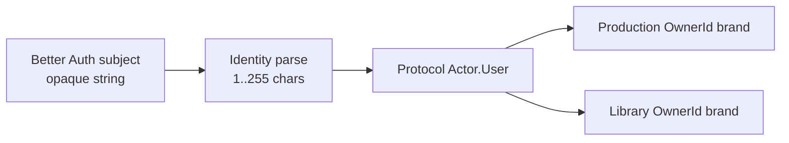

# ADR-0035: 認証主体IDをopaque値としてContext間で伝播する

- Status: Accepted
- Date: 2026-08-13
- Decision owners: Product owner / Architecture
- Supersedes: N/A
- Superseded by: N/A
- Related: ADR-0034、`packages/protocols`、`services/identity-access`

## コンテキストと変更契機

Better Authが返す利用者IDはUUIDに限定されない。一方、Context間`Actor`とProduction/Libraryの所有者IDがUUIDだけを許すと、正しい外部セッションでもGatewayから先の全操作が503になる。利用者IDの形式変換は認証の正当性を高めず、対応表の新たな可用性・移行リスクを増やす。

## 決定

認証providerが発行した主体IDを、空白以外を含む1〜255文字のopaqueな文字列として扱う。Identity境界で一度parseし、Context間`Actor.User.userId`へそのまま伝播する。各Contextは異なるbrandで所有者IDへparseし直し、表示、分解、形式推測をしない。

## 判断要因

- 実在する認証provider IDを拒否しない。
- 内部UUID対応表という追加のstateful serviceを避ける。
- IDの意味を形式から推測せず、認証済みActorだけを信頼する。

## 却下案

| 案 | 却下理由 | 再検討条件 |
| --- | --- | --- |
| provider IDをUUIDに限定 | Better Authの有効な主体を認証後に拒否する | 全providerがUUID発行を契約する |
| 内部UUID対応表を持つ | 可用性、migration、削除・統合の一貫性問題を増やす | 複数provider主体を統合する要件が確定する |
| emailを所有者IDにする | 変更・再利用され、PII露出も増える | N/A |

## 結果

### 利点

- Google等の正常セッションが形式差だけで503にならない。
- protocolと各Contextの所有者scopeが同じ値で相関できる。

### 欠点とリスク

- UUID前提の既存schema、fixture、DB移行を更新する必要がある。
- opaque IDをURLやlogへ無制限に出さないprivacy規律が必要になる。

## 影響と同期

| 対象 | 必要な変更 | 状態 | 証拠 |
| --- | --- | --- | --- |
| 設計書 | Actor/所有者ID規則 | Done | 本ADR、`docs/functional-ddd-migration.md` |
| ドメイン/ユースケース | Context別OwnerId parser | In progress | Production/Libraryの移植工程 |
| OpenAPI/外部契約 | 利用者IDはopaque string | Done | Gateway session schema |
| コード/ポート | protocol ActorとIdentity parser | Done | `packages/protocols`、`services/identity-access` |
| データ/ストレージ | TEXT列を継続 | Done | service別SQLite schema |
| 実行/配備 | N/A — topologyは変わらない | Done | N/A |
| 認証/セキュリティ | provider主体をIdentityだけで信頼化 | Done | Identity RPC tests |
| フロント/品質保証 | ID形式を仮定しない | Done | session contract |
| テスト/運用 | 非UUID主体の縦断test | In progress | runtime E2E工程 |

## 再検討条件

- 複数providerのaccount linkingで一人の利用者を単一主体へ統合する要件が確定する。
- providerの最大ID長が255文字を超える。

## 受け入れゲートと未決事項

- None。

## 検証証拠

- Protocol、Identity、Gateway、Production、Libraryのcontract/unit/E2E test。
