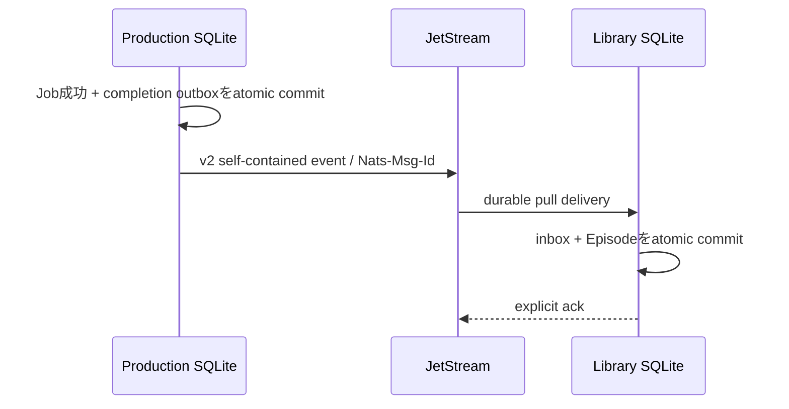

# ADR-0036: SQLite単一writerとJetStreamでサービス間整合性を保つ

- Status: Accepted
- Date: 2026-08-13
- Decision owners: Product owner / Architecture
- Supersedes: N/A
- Superseded by: N/A
- Related: ADR-0034、ADR-0062、`docs/functional-ddd-migration.md`、`packages/protocols`

## コンテキストと変更契機

4つのContextは独立DBを所有するため、Productionの完了とLibraryの公開を同一DB transactionにできない。NATS Coreだけではconsumer停止中の通知を保持できず、publisher成功前にoutboxを消すと番組が恒久的にLibraryへ現れない。一方、分散transactionはSQLite/NATS/S3を跨げず、運用負荷も不釣り合いである。

## 決定

各stateful serviceは専用SQLite volumeと単一writer processを持つ。service内の状態とoutbox/inboxは同一transactionで更新し、service間はJetStreamのat-least-once配送と冪等consumerで収束させる。

- 完了eventはLibraryが必要なtitle、script、audio metadata、sources、completedAtをすべて含み、Production DBを参照させない。
- publisherはJetStream ack後にだけoutboxをpublishedへ更新する。
- consumerは`messageId`をinbox dedupe keyにし、保存transaction成功後にだけackする。失敗時は上限付きbackoffでnackする。
- consumerは`max_ack_pending=1`でSQLite書込順序を保ち、stream/durableはComposeで明示的にprovisionする。
- 長時間生成leaseはtokenでfenceし、heartbeatは「token一致かつ未失効」の場合だけ延長する。stale検出時はprovider処理をabortする。

## 判断要因

- process crash、再配送、publish重複で業務データを失わない。
- ContextのDB所有権と独立変更を維持する。
- 障害点をoutbox age、delivery count、ack/nackとして観測できる。

## 却下案

| 案 | 却下理由 | 再検討条件 |
| --- | --- | --- |
| NATS Coreで完了通知 | consumer停止中の通知を失う | 完了通知が再構築可能な一時情報になる |
| LibraryがProduction DBを読む | Context所有権と独立配備を破る | 2 Contextを統合する |
| 分散transaction | SQLite、S3、NATSを跨ぐ現実的なtransaction managerがなく運用負荷が高い | 単一transactional platformへ統合する |
| exactly-onceを主張 | network partition下では外部副作用を含む一回性を保証できない | N/A |

## 結果

### 利点

- crash後にoutbox relayとdurable consumerを再開すれば収束する。
- LibraryはProduction停止中も既存番組を提供できる。
- event schemaがContext間の明示的な所有権境界になる。

### 欠点とリスク

- 一時的なeventual consistencyがあり、queue age監視が必要になる。
- streamの誤削除、poison message、SQLite backup/restoreを運用手順へ含める必要がある。
- consumer schemaを破壊する場合は新subject versionと移行期間が必要になる。

## 影響と同期

| 対象 | 必要な変更 | 状態 | 証拠 |
| --- | --- | --- | --- |
| 設計書 | 非同期整合性とfencing flow | Done | 本ADR、`docs/architecture.md` |
| ドメイン/ユースケース | lease、retry、completion materialization | Done | Production/Library domain/application tests |
| OpenAPI/外部契約 | eventualな生成状態を返す | In progress | Gateway job API |
| コード/ポート | outbox/inbox/heartbeat port | Done | `services/episode-production`、`services/episode-library` |
| データ/ストレージ | service別SQLite、outbox/inbox | Done | SQLite adapter tests |
| 実行/配備 | stream/durable provision、単一replica | Done | `compose.yaml` |
| 認証/セキュリティ | ownerをevent payloadでparse | Done | v2 protocol/consumer tests |
| フロント/品質保証 | eventual state表示 | In progress | Web切替工程 |
| テスト/運用 | 実NATS E2E、coverage、queue監視 | Done | `pnpm test:e2e:functional`、`pnpm test:coverage:functional` |

## 再検討条件

- stateful serviceを同時に2 replica以上へ水平拡張する。
- 1 SQLite DBのwrite latency p95が継続して50msを超える。
- JetStream復旧目標または保持期間が30日を超える。

## 受け入れゲートと未決事項

- 各service DBのbackup/restore演習は旧runtime削除前に完了する。

## 検証証拠

- `pnpm test:e2e:functional`
- `pnpm test:coverage:functional`
- Production outbox、Library inbox/durable consumer、lease heartbeatのunit/integration tests。
