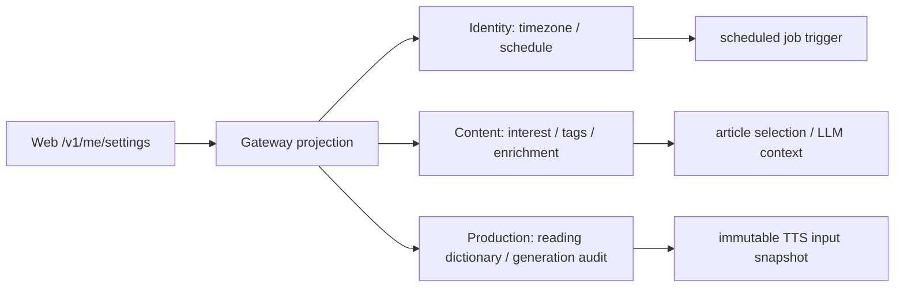

# ADR-0037: 個人設定を利用するContextが正本を所有する

- Status: Accepted
- Date: 2026-08-13
- Decision owners: Product owner / Architecture
- Supersedes: N/A
- Superseded by: N/A
- Related: ADR-0024、ADR-0028、ADR-0033、ADR-0034、`docs/functional-ddd-migration.md`

## コンテキストと変更契機

旧runtimeの`user_settings`、タグ、読み辞書、Agent memoryは単一SQLiteとAPIに集約されていた。これをそのままIdentityへ移すと、認証Contextが記事選定、LLM入力、TTS発音、生成監査の変更理由まで知り、各serviceの独立変更と障害隔離を失う。一方、Webの`/v1/me/settings`は一画面で複数設定を返すため、外部契約と内部所有権を同一にする必要はない。

## 決定

個人設定は「保存UI」ではなく、その設定を使って業務判断するContextが正本を所有する。Gatewayは認証済みownerで各Contextを問い合わせ、外部API用projectionを合成する。

| データ | 正本 | 不変条件 |
| --- | --- | --- |
| timezone・配信時刻・最終実行local date | Identity Access | ownerごとに1日1回。job作成成功後だけ完了日を進める |
| interest profile・tag・suggestion・enrichment state | Content Knowledge | 記事状態との更新を同一DB transactionにする |
| reading dictionary | Episode Production | 生成attempt開始時にsnapshot化し、実行中の編集を反映しない |
| job/Agent run/tool call/memory approval | Episode Production | job/attempt/owner lineageを失わず監査可能にする |

- owner IDはGatewayが認証結果から注入し、HTTP bodyやqueryのownerを信用しない。
- Context間でDBを直接参照しない。RPC replyまたはself-contained eventだけを使う。
- 外部の合成responseは一部成功を正常扱いしない。必要なContextが利用不能ならstableな503を返す。
- scheduled jobのidempotency keyは`scheduled:{localDate}`とし、timezone評価結果のlocal dateを使用する。

## 判断要因

- 認証、記事判断、音声品質、生成監査を別々に変更・復旧できる。
- LLM/TTS入力を後から再現できる。
- owner境界を各SQLite queryでも強制できる。
- UI都合の集約をdomain所有権へ持ち込まない。

## 却下案

| 案 | 却下理由 | 再検討条件 |
| --- | --- | --- |
| 全設定をIdentityへ集約 | IdentityがContent/Productionのdomain知識と可用性を背負う | 3 Contextを同一serviceへ統合する |
| Gateway専用settings DB | Gatewayが業務stateを所有し、利用側との二重書込が発生する | Gatewayを業務Contextへ変更する |
| 旧共有SQLiteを参照 | 独立配備、backup、障害隔離を破る | functional migrationを撤回する |
| 読み辞書をVOICEVOXだけに保存 | provider交換・再現・owner分離ができない | providerがtenant別versioned dictionaryを保証する |

## 結果

### 利点

- serviceごとの契約と障害影響が明確になる。
- TTS品質とscheduled生成の再現性をテスト可能になる。
- tag/enrichment更新を記事stateとatomicに保てる。

### 欠点とリスク

- Gatewayにresponse合成とfailure mappingが増える。
- `/v1/me/settings`は複数RPCのうち最遅のlatencyに依存する。
- 旧共有DBからservice別DBへowner単位で移す変換・照合が必要になる。

## 影響と同期

| 対象 | 必要な変更 | 状態 | 証拠 |
| --- | --- | --- | --- |
| 設計書 | 個人設定の所有Contextを明示 | Done | 本ADR |
| Identity | schedule domain、SQLite、due/complete | Done | `services/identity-access` tests |
| Content | article state、tag/enrichment transaction | In progress | `services/content-knowledge` tests |
| Production | dictionary snapshot、Agent audit | In progress | `services/episode-production` tests |
| Protocols/Gateway | ownerをactorから導出しprojectionを合成 | In progress | protocol/Gateway tests |
| OpenAPI/Web | 外部shapeを維持し新Gatewayへ切替 | Pending | contract/Web E2E |
| Migration | owner別export/importと件数/hash照合 | Pending | migration runbook |

## 再検討条件

- settings合成のp95が継続して300msを超える。
- 2つ以上のContextが同じ設定へ同期書込する要件が発生する。
- Production以外の複数Contextがreading dictionaryを業務判断に利用する。

## 受け入れゲートと未決事項

- 旧runtime削除前に、owner別の設定・タグ・辞書件数と内容hashを新DBと照合する。
- Gateway統合E2Eで、別ownerのIDを指定してもデータが見えないことを確認する。

