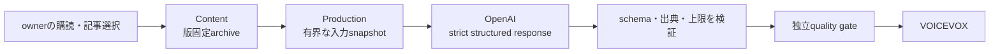

# ADR-0038: 本番生成を保存済み出典による有界な構造化生成に限定する

- Status: Accepted
- Date: 2026-08-13
- Decision owners: Product owner / Architecture
- Supersedes: ADR-0013、ADR-0015
- Superseded by: ADR-0057（LLM境界）、ADR-0058（進捗監査）、ADR-0059（自動選定）
- Related: ADR-0007、ADR-0016、ADR-0026、ADR-0050、ADR-0080、`docs/functional-ddd-migration.md`

## コンテキストと変更契機

ADR-0013はhosted Web検索を使うtool駆動Agent、ADR-0015はFirecracker上の汎用Harnessを本番経路にした。関数型DDD移行では、Content Knowledgeがowner選択済み記事と版固定したarchiveを所有し、Episode Productionが厳格なResponses schema、deadline、応答上限、retry、出典検証を強制する経路を実装した。一方、一般Agent Harness、hosted Web検索、Firecracker boot backendにはP0の受け入れ要件とSLOがない。

要件のない自由度を本番へ残すと、prompt injection、出典再現性、費用・latency、sandbox運用が主要フローのリスクになる。

## 決定

本番の台本生成は、ownerが選択した版固定済み記事だけを入力にする有界な構造化生成を唯一の経路とする。OpenAI adapterは厳格なJSON schema、byte/deadline上限、一時障害だけの有界retryを適用し、入力にないURLを出典として受理しない。

一般Agent Harness、shell/workspace、MCP Broker、Firecracker、hosted Web検索は実装しない。2026-08-16に未使用だったAgent run/tool call/memory監査もADR-0058で削除し、lineageと進捗はEpisode Jobとdurable AG-UI eventへ一本化した。

## 判断要因

- 番組の全出典をowner選択と版固定archiveへ遡れる。
- LLM障害、費用、latencyを決定論的な境界で制御できる。
- Web内容や生成コードを実行する信頼境界をP0から除ける。
- 記事追加調査が必要かは、先に品質指標と利用者要件で判断できる。

## 却下案

| 案 | 却下理由 | 再検討条件 |
| --- | --- | --- |
| hosted Web検索を常時有効化 | 入力集合と費用が変動し、版固定・owner選択を迂回する | 検索必須の編集要件、出典保存方式、品質eval、費用/latency SLOが揃う |
| Firecracker Agent HarnessをP0へ移植 | shell/workspaceを必要とする受け入れ要件がなく、KVM運用と攻撃面だけが増える | sandbox内toolが不可欠なユースケースとisolation SLOを承認する |
| LLMを使わない固定テンプレート | 複数記事の自然な構成と要約品質を失う | 構造化生成が品質・費用SLOを継続して満たさない |

## 結果

### 利点

- 入力、出力、出典、失敗分類を再現・監査しやすい。
- 一般AgentやWeb検索の不安定性がEpisode生成の可用性を下げない。

### 欠点とリスク

- 保存済み記事の外にある最新情報を自動補足できない。
- sandbox toolや入力外Web検索を必要とする生成は提供できない。
- Agent監査APIを削除したため、旧clientとの後方互換はない。

## 影響と同期

| 対象 | 必要な変更 | 状態 | 証拠 |
| --- | --- | --- | --- |
| 設計書 | 本番生成経路と意図的除外を明示 | Done | `docs/architecture.md`、移行ガイド |
| ドメイン/ユースケース | archive snapshotを入力にする有界生成 | Done | `services/episode-production/src/application` |
| OpenAPI/外部契約 | N/A — LLM/tool実装は公開HTTP契約に露出しない | Done | Gateway OpenAPI |
| コード/ポート | Effect AI structured generationと出典検証 | Done | `services/episode-production/src/adapters/providers/openai-script-generator/` |
| データ/ストレージ | GenerationPlan、checkpoint、AG-UI eventで再現・監査 | Done | Episode Production repository tests、ADR-0058/0059 |
| 実行/配備 | Harness/Web検索とFirecracker実装を物理削除 | Done | workspace、Docker、architecture gate |
| 認証/セキュリティ | owner選択外sourceと記事内命令へ従ったdraftを受理しない | Done | script generator tests、ADR-0080 |
| フロント/品質保証 | N/A — Webはjobと出典を表示し、生成方式へ依存しない | Done | Web contract |
| テスト/運用 | fake provider、provider境界、縦断E2E、version固定adversarial eval | Done | functional E2E、coverage gate、`pnpm provider-security-eval` |

## 再検討条件

- 保存済み記事だけでは編集品質目標を満たせないことをversion固定evalで確認する。
- 利用者が補足Web調査またはsandbox toolを必要とするユースケースを承認する。
- 検索sourceの版固定、prompt injection対策、月額費用、p95 latencyのSLOを定義する。

## 受け入れゲート

- fake providerを使う購読→生成→Library E2E、provider timeout/retry/schema拒否test、model変更時のadversarial evalがGreenである。
- workspace、Docker、CIから旧Agent RuntimeとFirecracker参照が消えている。

## 検証証拠

- `services/episode-production/src/adapters/providers/openai-script-generator.test.ts`
- `services/episode-production/src/adapters/providers/openai-script-generator.eval.test.ts`
- `pnpm test:e2e:functional`
- `pnpm test:coverage:functional`
