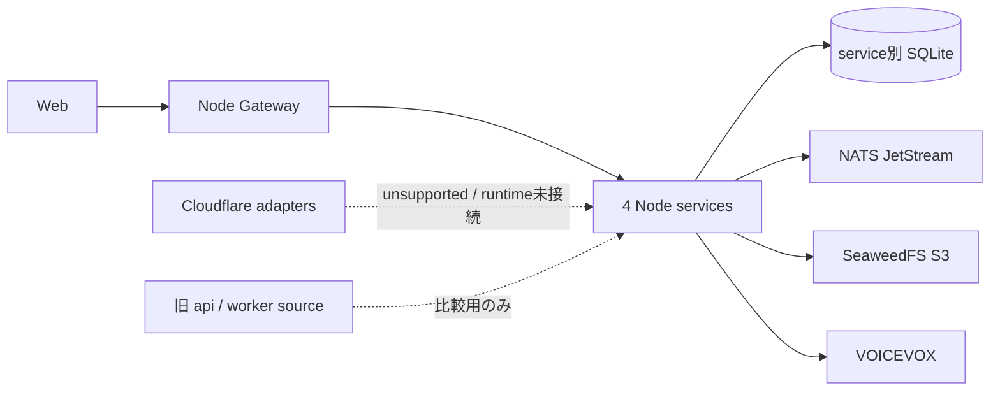

# ADR-0039: Node self-host runtimeだけをsupported deploymentにする

- Status: Accepted
- Date: 2026-08-13
- Decision owners: Product owner / Architecture
- Supersedes: ADR-0003
- Superseded by: N/A
- Related: ADR-0011、ADR-0033、`compose.yaml`、`docs/functional-ddd-migration.md`

## コンテキストと変更契機

ADR-0003はNode/SQLiteとCloudflare/D1の二系統を想定したが、Cloudflare側は業務repository、queue consumer、認証、VOICEVOX接続が完成せず、同一contractを保証するtestもない。関数型DDD移行で実装・運用検証されたのは、Node、service別SQLite、NATS JetStream、SeaweedFS、VOICEVOXからなるself-host構成である。

未完成adapterをsupportedと表示すると、復旧手順、データ整合性、認証境界の保証範囲を誤る。

## 決定

Node self-host runtimeを唯一のsupported deploymentとする。default `compose.yaml`はGateway、4 Context services、NATS JetStream、SeaweedFS、VOICEVOX、Webを起動する。

Cloudflare/D1/R2/Queues adapterと旧`apps/api` / `apps/worker`はruntime・Composeから外す。sourceは移行比較と履歴のため残してよいが、新規機能、運用手順、SLOの対象にしない。Cloud runtimeを再導入する場合は、後続ADRで利用理由とcontract suiteを承認する。

## 判断要因

- 実装済みの整合性、backup/restore、可観測性を一つの配備形態へ集中する。
- SQLite single-writer、NATS durable delivery、外部provider境界の実証結果をそのまま運用できる。
- 未完成runtimeを本番対応と誤認しない。

## 却下案

| 案 | 却下理由 | 再検討条件 |
| --- | --- | --- |
| Node/Cloudflare両方をsupportedに維持 | Cloud側の業務処理・認証・contract testがない | Cloud固有の事業要件、owner、運用SLO、同一contract suiteが揃う |
| 旧API/Workerをdefault Composeへ残す | 二重の正本と共有DB依存を復活させる | rollback演習で一時起動が必要な場合に限定した別定義を作る |
| sourceを直ちに削除 | 比較・監査に必要な履歴まで同時に失う | 1 releaseの比較とrollback演習が完了する |

## 結果

### 利点

- supported topology、データ所有、復旧手順が一意になる。
- CIと運用検証を未完成adapterへ分散しない。

### 欠点とリスク

- managed edge runtimeの選択肢を現時点では提供しない。
- 残存sourceをruntime正本と誤認しないためのarchitecture gateが必要になる。

## 影響と同期

| 対象 | 必要な変更 | 状態 | 証拠 |
| --- | --- | --- | --- |
| 設計書 | supported topologyをNode self-hostに限定 | Done | `docs/architecture.md`、移行ガイド |
| ドメイン/ユースケース | N/A — runtime非依存 | Done | service内依存境界 |
| OpenAPI/外部契約 | Gatewayを唯一の正本にする | Done | `apps/gateway/src/contract.ts`、`packages/contracts` |
| コード/ポート | 旧/Cloud sourceは比較用でruntime未接続 | Done | composition root、architecture test |
| データ/ストレージ | service別migration/backup/restore | Done | state migration/SQLite state tests、runbook |
| 実行/配備 | default Composeを新topologyだけにする | Done | `compose.yaml` |
| 認証/セキュリティ | Identity HTTPをGatewayだけからproxy | Done | Identity/Gateway auth proxy tests |
| フロント/品質保証 | Web proxyをGatewayへ向ける | Done | Compose、Web contract tests |
| テスト/運用 | Compose、E2E、coverage、recoveryを確認 | Done | Compose config、functional/Web E2E、coverage、state tests |

## 再検討条件

- Cloud固有の配備要件、可用性または費用優位が定量化される。
- D1/R2/Queues、認証、外部TTSを同じ公開契約で検証するcontract suiteと運用ownerを用意する。

## 受け入れゲートと未決事項

- 旧sourceの物理削除は1 releaseの比較とrollback演習後に別変更として行う。

## 検証証拠

- `docker compose config`
- `pnpm architecture:check`
- `pnpm test:state-migration`
- `pnpm test:sqlite-state`
