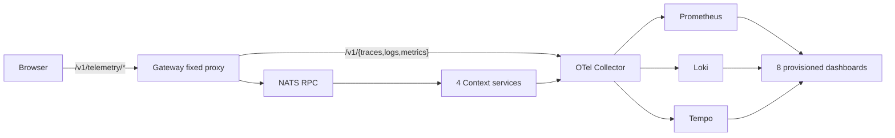

# ADR-0040: 全経路Observabilityと再起動検証

- Status: Proposed
- Date: 2026-08-13
- Decision owners: Product owner / Platform
- Supersedes: N/A
- Superseded by: ADR-0047（observed stackのprovider選択に限る）
- Related: ADR-0017、ADR-0025、ADR-0032、ADR-0047、`infra/observability`、`scripts/observability-smoke.mjs`

## Context and change trigger

実装前の稼働stackで、次の事実を確認した。

- Grafana APIのDashboard検索結果は0件だった。
- Grafana logにはprovisioning directoryの`permission denied`があった。hostのprovisioning/dashboards directory modeは700だった。
- `provider_request_duration_bucket`、`http_server_error_total`、`system_filesystem_utilization`など、既存Dashboard/Alertが参照する系列はPrometheus queryで空だった。
- Gatewayの`/v1/telemetry/{traces,logs,metrics}`は404だった。
- Tempo `/ready`は再確認時点では200だった。過去の503を推測で再現したものとして扱わず、readiness healthcheck追加後に再起動で再確認する。
- 実在する依存endpointはNATS `/healthz?js-enabled-only=true`、VOICEVOX `/version`、SeaweedFS Filer `/status`、Master `/cluster/status`だった。

この状態では、障害時の入口からservice map、trace、相関log、metricへ移動する導線と、再起動後も同じ設定が適用される証拠が不足している。

## Decision

OpenTelemetry/Grafanaの正本を次の運用契約へ拡張する。



- Grafana provisioningはhostの700/600権限に依存しないよう、init containerがDashboard JSONとprovisioning treeをnamed volumeへコピーし、ディレクトリを0555、ファイルを0444へ正規化する。Grafanaはread-only mountする。Grafana/Prometheus/CollectorはCompose healthcheck、Loki/TempoはGrafana経由のreadinessとdatasource healthで検証する。
- GatewayはBrowserの相対OTLP endpointだけを受け、Collector originへ固定path mappingする。method、request/response byte、timeoutをGatewayで制限する。
- Dashboard/AlertはPrometheus/Loki/Tempoで実測した系列だけを参照する。Episode ProductionはSQLiteの状態snapshotとworker outcomeから`episode.jobs`、queue age、started/succeeded/retry/failed/canceled/lease metricsを発行する。
- service map、TraceQL、Tempo trace-to-logs、Loki logs-to-trace、Prometheus exemplar-to-traceをprovisioningで接続する。
- Dashboard UID、alert rule UID、datasource health、Collector accepted/refused/export failure、service graph edge、Browser proxy、実依存endpointを`pnpm observability:smoke`で検証する。trace IDを渡した場合はTempo/Loki/Prometheusの相関も検証する。
- 完了判定はvolumeを削除しないstack停止・再起動後の実測結果で行う。未確認のprovider、exporter、endpointは追加しない。

## Decision drivers

- 障害原因をAlertから依存関係、trace、同一trace_idのlog、metricへ短い導線で特定する。
- provisioning permission errorと設定driftを再起動後に検出する。
- Browser telemetryを業務APIやCollectorの内部originへ直接結合しない。
- 実在するmetric/endpointだけを使い、空Queryを監視成功と誤認しない。

## Rejected alternatives

| Alternative | Reason rejected | Reconsider when |
| --- | --- | --- |
| Grafana UIでDashboardを手作業作成 | 再起動・再配備で失われ、Gitで差分検証できない | provisioningを廃止する明確な運用責任が生じる |
| Grafanaをrootで起動して700 directoryを読む | runtime権限を広げ、原因を隠す | host file ownership policyを変更し、rootless検証を満たす |
| 未確認のprovider/host metricをDashboardへ残す | 空Queryで障害を見逃す | 実データとexporterが追加され、smokeで確認できる |
| BrowserからCollector:4318へ直接送る | Collector originを公開し、同一originの相関境界を崩す | 認証付き外部OTLP ingressを別ADRで採用する |

## Consequences

### Positive

- Gateway/API/NATS/service/provider/DBのspanとservice graphを同一Dashboardから調査できる。
- Browser error/Web Vital、Episode queue/state、Collector pipelineを別Dashboardで直感的に切り分けられる。
- 再起動後のDashboard UID、datasource health、proxy応答、依存endpointを機械的に再確認できる。

### Negative and risks

- Grafana Dashboard JSONとAlertのquery driftを継続的に検証する必要がある。
- Browser Web Vital metricの実名はSDK/Collector/Prometheusの変換結果に依存するため、再起動後にquery smokeで確定する必要がある。
- Tempo/Loki/Prometheusのvolumeを保持するため、過去データと新しいE2Eデータを時刻・trace IDで分離して読む必要がある。

## Impact and synchronization

| Surface | Required change | Status | Evidence |
| --- | --- | --- | --- |
| Design documents | Gateway proxy、8 Dashboard、調査順序を反映 | Done | `docs/design.md`、`docs/architecture.md` |
| Domain and use cases | N/A — metric発行はruntime/adapterに閉じる | Done | `services/episode-production/src/runtime/service.ts` |
| OpenAPI and external contracts | N/A —内部OTLP proxyで公開APIを変更しない | Done | Gateway contract unchanged |
| Application code and ports | Episode state snapshotをSQLite adapterからruntimeへ提供 | Done | `sqlite-job-repository.ts`、repository test |
| Data and storage | N/A —既存volumeを再起動で保持 | Done | Compose volume definitions、volume list unchanged |
| Runtime and deployment | Grafana file mounts、healthcheck、Browser proxy | Done | `infra/observability/compose.yaml`、Gateway runtime |
| Authentication and security | Collector origin非公開、byte/timeout上限、Grafana auth | Done | `telemetry-proxy.ts`、Grafana env |
| Frontend and quality assurance | relative Browser OTLP endpointをGatewayへ接続 | Done | `apps/web/src/shared/observability/otel.ts`、proxy test |
| Tests and operations | static validation + API/endpoint smoke + final restart E2E | Done with follow-ups | `pnpm observability:validate`、`pnpm observability:smoke`、functional E2E |

## Reconsideration conditions

- Browser Web VitalがCollector accepted後もPrometheusへ現れず、SDK metric名またはpipelineの別設計が必要になった場合。
- service graph edge、trace-to-logs、logs-to-trace、exemplar-to-traceのいずれかが再起動後の実traceで確認できない場合。
- Prometheus/Loki/Tempo volumeのingestionまたはquery latencyがローカルSLOを超える場合。

## Acceptance gates and open questions

- `docker compose ... down --remove-orphans`後、volumeを削除せず`pnpm dev:up:observed`で起動する。
- 全必要serviceのhealth、Grafana Dashboard 8件、datasource 3件、provisioning errorなしを確認する。
- 実サービスフローでtrace IDを取得し、Tempo root trace、service graph、Loki同一trace_id、Prometheus span metric/exemplarを確認する。
- 404 route、fake provider failure、queue/NATS遅延、Collector export failureの切り分け結果を記録する。安全な既存failure hookがないケースは未達理由を記載する。

## Validation evidence

- Red: `curl .../api/search?type=dash-db`、Grafana logs、Prometheus empty queries、Gateway OTLP 404、Tempo readiness再確認。
- Green: `pnpm observability:validate`、Gateway telemetry proxy tests、Episode SQLite snapshot tests、Dashboard JSON validation。
- 最終再起動は次の順で実行し、各コマンドが終了コード0だった。`down`では`-v`を指定せず、Observability 6 volumeとApplication 9 volumeを保持した。

  ```text
  docker compose -f compose.yaml -f compose.observability.yaml down --remove-orphans
  docker compose -f infra/observability/compose.yaml down --remove-orphans
  pnpm dev:up:observed
  ```

- 再起動後の実測は、Application 6 serviceが`healthy`、NATS provision/init containerが`Exited (0)`、Web/SeaweedFSが正常稼働、Grafana/Prometheusが`healthy`、Collectorが稼働、Tempo/Lokiがreadyだった。Grafana APIはHTTP 200、Dashboard 8件、Alert rule 7件、Prometheus/Loki/Tempo datasource 3件がすべて`OK`、Grafana provisioning permission errorは再発しなかった。
- 実サービスフローではBrowserのGateway相対OTLP requestが200、認証・購読操作でBrowser Web Vital (`browser_web_vital_count`: FCP/LCP/TTFB)と`browser_event_total{event_name="subscription.changed"}`を確認した。Episode job APIは202を返し、実ジョブはfake providerを使用し、記事がないためprovider呼び出し前の`content_materialization_invalid`でterminal failureになった。
- 新しいroot trace `c7785502c136038a5d604e9c544edb63`はTempoで3 batch、`http.server POST`、NATS publish/receive/process、`episode-production.create-job`、SQLite saveを含んだ。同じtrace IDのLoki stream 1件、Prometheus span metrics、exemplar 755件を`OBSERVABILITY_TRACE_ID`付きsmokeで確認した。Service graphは11 edge、`gateway -> episode-production`を含んだ。Loki datasourceのTraceID derived fieldとTempo datasourceのtrace-to-logs/trace-to-metrics設定もAPIで確認した。
- 障害注入の実測:

  | Case | Observed result | 判定 |
  | --- | --- | --- |
  | Collector停止 | Browser OTLP proxy `503`、再起動後 `200` | 検出・復旧できた |
  | 未知API route | HTTP `404`、Tempo trace `c796759c6fa9d18612e6cfd1ebd77d71`に`RouteNotFound`、Loki相関ログなし、404 Prometheus seriesなし | 未達。入口log/metricを追加する |
  | Episode consumer停止 | job submitはGateway `503`（NATS RPC timeout/consumer unavailable） | queue滞留そのものは未確認。安全なqueue delay hookがない |
  | fake provider failure | provider前のcontent materialization failureになった | 未達。runtimeに記事fixture/failure hookがない |

- したがって、本ADRは「全相関経路の実測」は完了したが、404入口のlog/metric、fake provider failure、queue滞留の実障害注入を残課題として`Proposed`のままとする。これらを完了条件にする場合は、外部APIへ接続しない決定的なfailure fixtureと、監査可能なqueue-delay test hookを別変更で追加する。
