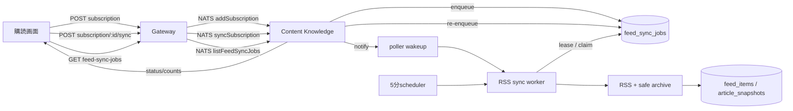

# ADR-0041: RSS同期を永続キューで実行し購読直後に起動する

- Status: Proposed
- Date: 2026-08-13
- Decision owners: Product owner / Content Platform
- Supersedes: N/A
- Superseded by: N/A
- Related: [ADR-0012](adr/0012-rss-reader-web-archive.md)、[ADR-0002](adr/0002-openapi-async-jobs.md)、`GET /v1/me/feed-sync-jobs`、`POST /v1/me/feed-subscriptions/{subscriptionId}/sync`

## Context and change trigger

購読登録APIは購読行を保存するだけで、RSS取得・記事archiveの開始や進捗を記録していなかった。既定のpoll intervalは300秒（5分）で、登録直後に同期されず、失敗しても記事一覧からは原因を判断できなかった。

記事の発見と本文archiveは外部HTTPを含むため、リクエスト処理へ同期的に組み込むとGatewayの応答時間・再試行・再起動耐性を損なう。一方、単なるメモリキューではprocess再起動時に未処理の購読を失う。

## Decision

Content Knowledgeが所有するSQLiteに、feedごとに1件の`feed_sync_jobs`を保存する。購読登録時は`Queued`へ投入し、Content workerがlease付きでclaimして`Processing`へ遷移させ、RSS項目ごとのarchive結果を記録する。workerの定期cycleは既存の5分間隔を維持するが、購読登録時の通知で待機を中断して即時cycleを開始する。

公開APIはowner-scopedな`GET /v1/me/feed-sync-jobs`と、ownerが有効な購読を明示的に同じキューへ再投入する`POST /v1/me/feed-subscriptions/{subscriptionId}/sync`（202）とする。手動同期は登録時と同じfeed単位のjobを再利用し、queued / processing中のjobは重複投入せず、完了・失敗済みjobは再試行可能なqueuedへ戻す。Webはqueued/processing中だけ短い間隔で状態と記事一覧を再取得し、状態を購読画面と記事一覧へ表示する。

## Decision drivers

- 5分pollの待機を理由に、登録直後のユーザーへ空の記事一覧を見せ続けない。
- 失敗した同期やRSS更新を、5分cycleを待たず利用者が再試行できる。
- RSS取得・archiveの遅延や失敗をHTTP応答から分離し、再起動後も処理対象を失わない。
- owner境界をNATS payloadではなくContent側のsession actor由来のqueryで守る。
- 既存のSSRF検査済みRSS readerとarchive処理をworkerから再利用する。

## Rejected alternatives

| Alternative | Reason rejected | Reconsider when |
| --- | --- | --- |
| 購読POST内でRSSを同期実行 | 外部HTTP遅延・失敗が購読登録の応答を巻き込む | RSS取得が常に短時間で完了し、要求の同期SLOが定義された場合 |
| process内だけのqueue | 再起動・複数instanceでqueued workを失う | 外部durable queueを標準基盤として導入する場合 |
| 5分cycleだけで新規購読を拾う | 登録直後の待機時間が長く、現在のUX問題を解消しない | 明示的な「次回同期まで待つ」UXを採用する場合 |
| UIから記事一覧を無期限poll | 同期失敗を表示できず、不要なAPI負荷が続く | server pushで終端状態を確実に配信する場合 |

## Consequences

### Positive

- 登録直後にworkerが走り、ユーザーは処理中・完了・失敗を確認できる。
- queue row、lease、件数、errorがSQLiteに残り、再起動後の再取得と調査が可能になる。
- 5分schedulerは継続するため、新着RSSの定期同期も失わない。

### Negative and risks

- feedごとのqueue rowとstatus APIを保守する必要がある。
- lease期限、外部HTTP timeout、archive処理時間のずれで重複処理が起こり得るため、archive側の冪等性を維持する必要がある。
- 現在のUIは短いintervalのpollingであり、利用者数が増えた場合はSSE等のpushへ再評価する。

## Impact and synchronization

| Surface | Required change | Status | Evidence |
| --- | --- | --- | --- |
| Design documents | queue、wake、UI表示、5分定期cycleを記載 | Done | `docs/design.md`、`docs/architecture.md` |
| Domain and use cases | queue job/status/outcomeを追加 | Done | `services/content-knowledge/src/domain/feed-sync.ts` |
| OpenAPI and external contracts | owner-scoped status・手動再投入endpointを追加 | Done | `apps/gateway/src/contract.ts`、`packages/contracts/openapi/openapi.json` |
| Application code and ports | enqueue/claim/completeとworkerを追加 | Done | `services/content-knowledge/src/application/feed-sync-worker.ts` |
| Data and storage | `feed_sync_jobs` SQLite tableを追加 | Done | `services/content-knowledge/src/adapters/sqlite-feed-sync-queue.ts` |
| Runtime and deployment | poller wakeupをRPCとschedulerへ接続 | Done | `services/content-knowledge/src/runtime/node.ts` |
| Authentication and security | owner query、既存safe RSS readerを維持 | Done | content RPC、feed sync tests |
| Frontend and quality assurance | status card、手動同期ボタン、article refresh、sync noticeを追加 | Done | `apps/web/src/routes/_authenticated/subscriptions` |
| Tests and operations | unit/integration/contract/UI/E2E validation | Done | `pnpm typecheck`、`pnpm lint`、content/gateway/web tests、feed sync E2E |

## Reconsideration conditions

- feed sync jobのqueued ageが5分を超える状態が継続する場合。
- RSS同期の重複archive、lease切れ、失敗再試行が実運用で観測される場合。
- active user数に対する1秒pollingのAPI負荷が定めた閾値を超える場合。

## Acceptance gates and open questions

- user確認待ちの機能選択はない。fake stackで購読登録後の同期表示から記事表示までのE2Eを完了させた。外部RSS originを使う本番stackの実取得は環境依存のため未実施。
- 将来のpush通知方式（SSE/WebSocket）は、polling負荷の実測後に別ADRで決める。

## Validation evidence

- Red: 購読登録後にqueue/statusが存在せず、既存pollerの5分待機中は即時同期されない再現テスト。
- Green: content/gateway/webの型検査・単体/結合テスト、契約生成、登録直後のwakeテスト。
- 手動同期: 所有者の購読IDをContent側で検証し、永続キューへ再投入して、UIの「待機中」表示までE2Eで確認。
- `pnpm typecheck`、`pnpm lint`、content 147 tests、gateway 59 tests、web 143 tests、fake-stack E2E 14 tests（追加同期シナリオを含む）が成功した。同期シナリオでは「同期中」表示、記事一覧の同期通知、完了後の新着記事表示を確認した。
