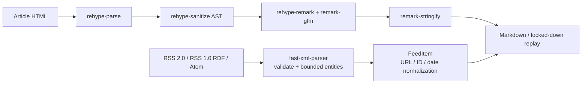

# ADR-0042: 構造化入力を著名なパーサーとAST pipelineで処理する

- Status: Accepted
- Date: 2026-08-14
- Decision owners: Product owner / Content Platform
- Supersedes: N/A
- Superseded by: N/A
- Related: [ADR-0012](0012-rss-reader-web-archive.md)、[ADR-0014](0014-static-archive-completeness.md)、`pnpm parser:check`

## Context and change trigger

RSS/Atomと記事HTMLは、入れ子、名前空間、CDATA、エンティティ、属性、壊れた入力を持つ構造化フォーマットである。従来のContent Knowledgeには次の実装があった。

- RSS readerが正規表現で`rss`/`feed`/`item`/`entry`を切り出し、CDATAと一部のエンティティを置換していた。
- 記事archiveが正規表現でHTMLタグを除去し、すべての本文を平坦な文字列としてMarkdownへ書いていた。
- そのためRSS 1.0/RDF、名前空間付きAtom、数値エンティティ、CDATA内の見かけ上の終了タグ、見出し・リンク・強調・コードの構造を正しく扱えなかった。

入力サイズ上限やSSRF検査は既存のHTTP境界で必要だが、通信の安全性と文書構造の解釈は別の責務である。Markdown表示側は既にremark/rehypeのAST pipelineを使っているため、archive生成側も同じ原則へ揃える。

## Decision

構造化文書の構文解釈は、正規表現やタグ除去の自前実装ではなく、専用ライブラリのparser/state machineとAST変換へ委譲する。

- RSS/Atomは`fast-xml-parser`で整形式検証してからrootを判別し、RSS 2.0、RSS 1.0/RDF、Atomのitem/entryを構造化する。parser側でCDATA、XML/HTMLエンティティ、名前空間、Atom alternate link、日時を扱う。
- 記事HTMLは`rehype-parse`でHASTへ変換し、`rehype-sanitize`でactive contentと危険属性を除去する。その後`rehype-remark`、`remark-gfm`、`remark-stringify`でMarkdown ASTをシリアライズする。Replay HTMLは`hast-util-to-html`で安全に生成する。
- 記事HTMLのAST変換は、入力1 MiB、ASTノード5万、AST深さ128、生成Markdown 1 MiBを上限とし、`ResourceLimit`でS3保存前に拒否する。Markdownの空判定はASTを走査し、全体のシリアライズを重複実行しない。
- HTTP fetchのbyte/timeout/SSRF境界、parserのentity expansion/nesting上限、ドメインSchema検証を維持する。parserは入力制限の後に実行する。
- 正規表現はURL・日時・固定された小さな語彙などの字句検証には使ってよいが、XML/HTML/Markdownの文書構造を判定する用途には使わない。
- `scripts/check-parser-boundaries.mjs`を品質gateにし、対象adapterが専用parserをimportしていることと、parser boundary内に正規表現構文がないことを検査する。

## Decision drivers

- RSS/Atom/HTMLの仕様差と入れ子を正しく扱う。
- Markdownの構造を保持し、下流のremark/rehype rendererと同じAST契約へ揃える。
- untrusted inputのactive content、entity expansion、resource消費を境界で制御する。
- parserの選定・利用漏れをテストと静的gateで検出する。

## Rejected alternatives

| Alternative | Reason rejected | Reconsider when |
| --- | --- | --- |
| 正規表現でタグ・CDATA・エンティティを切り出す | 入れ子、名前空間、CDATA内のタグ文字列、XML整形式を表現できない | 対象が構造化文書ではなく、仕様が固定された単純な字句だけになった場合 |
| RSS/Atom parserを自前の状態機械として実装する | 仕様差・エラー処理・entity/resource制限の保守をプロジェクトが負担する | 必要な仕様が既存ライブラリで表現できず、独立した適合性テストと保守担当を確保した場合 |
| HTMLをタグ除去してplain textとして保存する | 見出し、リンク、強調、リスト、codeの意味を失い、Markdownの構造を壊す | readerが構造を一切必要としない要件へ戻った場合 |
| XML/HTML parserを全serviceで共有する | Bounded Context間のruntime依存を増やし、入力境界の責務を曖昧にする | parser契約を独立したshared packageとして管理する必要とownerが確定した場合 |

## Consequences

### Positive

- RSS 1.0/RDF、名前空間付きAtom、CDATA、数値エンティティ、壊れたXMLを明確に扱える。
- HTML由来Markdownが見出し・強調・リンク・コード・GFM tableなどの構造を保持する。
- parser/libraryの責務、sanitize、serialize、HTTP境界が分離され、テストの対象が明確になる。

### Negative and risks

- 依存packageとlockfileの更新、security advisory、major upgradeを保守する必要がある。
- HTML-to-Markdownの出力形式は変わるため、既存snapshotの再生成時に差分が発生する。
- HTMLの本文抽出はreader viewではなく文書全体を対象とする。媒体ごとのarticle extractionが必要になった場合は別の決定が必要になる。

## Impact and synchronization

| Surface | Required change | Status | Evidence |
| --- | --- | --- | --- |
| Design documents | RSS/AtomとHTML/Markdownのparser境界を記載 | Done | `docs/design.md`、`docs/architecture.md` |
| Domain and use cases | N/A — `FeedItem`/archive commandの契約は維持 | Done | 既存domain tests |
| OpenAPI and external contracts | N/A —公開schemaの形は不変 | Done | contract diffなし |
| Application code and ports | N/A —parserはadapter/infrastructure boundaryに閉じる | Done | `services/content-knowledge/src/*` |
| Data and storage | N/A —既存object keyとSQLite schemaを維持 | Done | archive/catalog tests |
| Runtime and deployment | parser dependencyをContent serviceへ追加 | Done | `services/content-knowledge/package.json`、`pnpm-lock.yaml` |
| Authentication and security | XML entity上限、HTML sanitize、CSP replayを維持・強化 | Done | parser/capture tests |
| Frontend and quality assurance | 既存remark/rehype表示pipelineは再利用し、生成Markdownの構造を検証 | Done | `apps/web/src/shared/markdown`、capture test |
| Tests and operations | parser境界の静的gateをlintへ追加 | Done | `scripts/check-parser-boundaries.*`、`pnpm parser:check` |

## Reconsideration conditions

- RSS/Atomの適合性テストで未対応仕様が継続的に検出される。
- parserのCPU、memory、entity expansion、Markdown生成時間が運用上限を超える。特に入力・AST・出力上限で十分に抑えられず、共有Nodeプロセスの同期処理が長時間化する場合は、変換をdeadline付きworkerへ隔離する。
- HTML本文抽出の品質が構造保持より重要になり、Readability等の専用article extractionが必要になる。
- parser依存の脆弱性対応やNode runtime更新により別ライブラリへ移行する合理的根拠が得られる。

## Acceptance gates and open questions

- None

## Validation evidence

- Red: RSS 1.0/RDF、CDATA内の`</item>`、名前空間付きAtom、数値エンティティ、壊れたXMLの再現テストを追加し、旧実装で失敗することを確認した。
- Green: `pnpm --filter @news-podcast/content-knowledge test -- http-rss-feed-reader.test.ts`、`pnpm --filter @news-podcast/content-knowledge test -- http-s3-article-capture.test.ts`、typecheck、lint。
- `node --test scripts/check-parser-boundaries.test.mjs`と`node scripts/check-parser-boundaries.mjs`でparser import/regex禁止gateを確認した。
