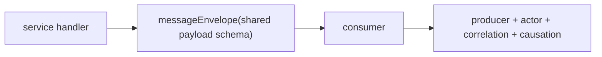

# ADR-0045: RPC返信封筒とpeer policyを共有契約にする

- Status: Accepted
- Date: 2026-08-15
- Decision owners: Platform
- Supersedes: N/A
- Superseded by: N/A
- Related: `packages/protocols`, `packages/rpc-contract-tests`, ADR-0017

## コンテキストと変更契機

`production.create-job.v1`だけが裸の返信DTOを使い、GatewayとProductionが同じDTOを二重定義していた。consumerはproducer・correlation・causationを検査したがService actor名を検査せず、Productionの6 owner RPCはproducerを検査していなかった。個別testは通っても、実handler bytesを実consumerへ渡すtestがなかった。

## 決定

- 全RPC返信を`messageEnvelope(payloadSchema)`にする。`CreateEpisodeJobReplySchema`は`packages/protocols`だけが所有する。
- Gateway owner RPCは`producer=gateway + User`、session解決は`producer=gateway + Anonymous`、service間はproducerとService actor名の一致を要求する。
- 外側envelopeを解析できない要求には返信せず、warningと失敗spanを残す。clientはtimeoutを503へ畳む。
- request/reply 26 subjectをtest-only registryで固定し、重要なwire変更は実handler→実consumer接続testを必須にする。
- NATS認証・subject ACLは今回追加しない。

## 判断要因

- wire DTOの単一正本、相関系譜、actor偽装検出、producer/consumer同時変更。

## 却下案

| 案 | 却下理由 | 再検討条件 |
| --- | --- | --- |
| create-jobだけ裸返信を維持 | driftを温存する | N/A |
| 各adapterでpeer検査を独自実装 | policy差分が再発する | N/A |
| malformed要求へ裸のerror返信 | 返信自体の契約と相関を保証できない | transportが標準error envelopeを提供した場合 |

## 結果

### 利点

- DTO、envelope、peer/lineage検査を接続した回帰testで守れる。

### 欠点とリスク

- 認証なしNATSではproducerとactorの同時偽装を防げない。これは意図的な残存リスクである。

## 影響と同期

| 対象 | 必要な変更 | 状態 | 証拠 |
| --- | --- | --- | --- |
| 設計書 | RPC境界規則 | Done | `docs/design.md`, `docs/architecture.md` |
| OpenAPI/外部契約 | N/A — 内部NATS契約 | Done | N/A |
| コード/ポート | shared reply/envelope/peer | Done | `packages/protocols`, Gateway, Production |
| データ/ストレージ | N/A — DB migrationなし | Done | N/A |
| 認証/セキュリティ | 残存spoofing riskを明記 | Done | 本ADR |
| フロント/品質保証 | 503互換 | Done | Gateway tests |
| テスト/運用 | handler-consumer接続 | Done | `packages/rpc-contract-tests` |

## 再検討条件

- shared NATSまたは非信頼networkへ配備するとき、NATS account/credential/subject ACLを必須化する。

## 受け入れゲートと未決事項

- None

## 検証証拠

- `pnpm --filter @news-podcast/rpc-contract-tests test`
- `pnpm --filter @news-podcast/gateway test`
- `pnpm --filter @news-podcast/episode-production test`
