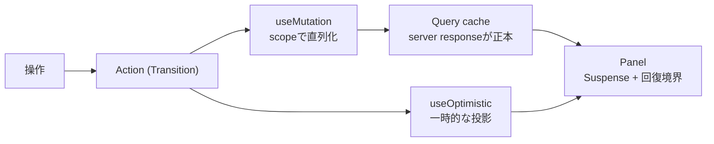

# ADR-0047: Async UIの責務を宣言的な仕組みへ固定する

- Status: Accepted
- Date: 2026-08-15
- Decision owners: Product owner / Web
- Supersedes: ADR-0009
- Superseded by: N/A
- Related: ADR-0006、ADR-0018、ADR-0060（状態の所在と計測を追加）、`apps/web/src/routes`, `apps/web/src/shared/components/panel.tsx`

## コンテキストと変更契機

ADR-0009 で決めた「TanStack Router/Query + Suspense query + Transition + `useOptimistic`」という骨格は、運用の結果として妥当だった。骨格そのものを変える理由はない。

一方、同じ問題に対する手段が実装ごとに分かれ、**宣言的に書けるはずの箇所が手続きで残っていた**。

- 直列化: 自前のpromise連鎖 (`shared/lib/action-queue.ts`)。hook単位で鎖が切れ、一覧と本文から同じ記事を操作すると並行していた
- 応答の追い越し: `AbortController`でabortし、遅れて届いた応答を捨てる
- 非同期フォーム: `SaveState`の手書きステートマシンとタイマ (アプリ内で唯一`useTransition`を使わない経路)
- 表示と回復: routeによって`isLoading`/`isError`の手書き分岐と`Suspense`が混在
- メモ化: React Compiler未導入のため、`useMemo`/`useCallback`と依存回避refが各所に散在

さらに、`Panel`の「再試行」がReactの境界だけをresetしQueryのerror stateを残していたため、**再試行が実際には再取得しない**不具合があった。表示境界と回復境界の担当が曖昧だったことが原因である。

ADR-0009 の決定は有効だが、上記の運用規則を含めて記述し直す必要があるため、本ADRで置き換える。

## 決定

ADR-0009 の骨格を引き継いだ上で、責務の割り当てを以下に固定する。同じ問題に対する手段を1つに絞り、読み手が選択肢を再検討せずに済むようにする。

| 関心事 | 担当 |
| --- | --- |
| 取得・鮮度・invalidation | TanStack Query (`queryOptions`を単一の契約) |
| 初回表示と取得失敗からの回復 | `Panel` = `QueryErrorResetBoundary` + `CatchBoundary` + `Suspense` |
| 更新の優先度と既存表示の維持 | React Transition |
| 同一対象への連打の直列化 | mutationの`scope` |
| 非同期フォームの状態 | `useActionState` (idle/saving/saved/error) |
| 一時的な投影 | `useOptimistic`。確定値は常にserver response |
| メモ化 | React Compiler |

適用規則:

- **表示単位と回復単位を一致させる。** 取得の成否を`isLoading`/`isError`で描き分けない。それは`Panel`の責務。ただし「本文が取れなければアーカイブ表示へ落とす」のような**正常な分岐**は境界へ投げず、その場で扱う。
- **回復は対でresetする。** Reactの境界とQueryのerror stateの片方だけをresetしない。
- **「別の実体」は`key`で表す。** 記事を切り替えるたびにEffectでローカルstateを消して回らない。切り替えがTransition内で起きる限り、前の内容は次が揃うまで表示され続ける。
- **Effectは外部システムとの同期にだけ使う。** props/server stateのstateへのミラー、前値検出による派生は禁止。ただし値の更新がrenderを引き起こす必要がある場合、それはミラーではなく必要なstateである。
- **メモ化はCompilerに任せる。** `useMemo`/`useCallback`/`memo`は、計測された退行が残る場合か外部との参照同一性の契約がある場合にだけ、根拠をコメントで添えて使う。Effectの依存配列を安定させる目的では使わず、依存の持ち方 (値そのもの・`useEffectEvent`) を直す。
- **デバウンスと優先度を混同しない。** デバウンスは要求頻度の制限であり`shared/lib/use-debounced-callback.ts`に一本化する。renderの優先度を下げたい場合は`useDeferredValue`を使う。

## 判断要因

- 手段が1つに定まっていないと、レビューのたびに同じ議論が再発する。
- 表示境界と回復境界の担当が曖昧だと、再試行が効かない類の不具合が検出されない。
- 依存配列の保守コストが、React Compiler導入のリスクを上回った。
- 自前の並行制御は、ライブラリが同じ保証をより広い範囲で与えられる。

## 却下案

| 案 | 却下理由 | 再検討条件 |
| --- | --- | --- |
| ADR-0009をそのまま維持し運用で揃える | 方針だけでは実装ごとに手段が分かれ、現に分かれた。規則として書く必要がある | N/A |
| 自前のpromise連鎖による直列化 (`action-queue`) | hook単位で鎖が切れ、component横断では並行する。Queryの`scope`が同じ保証をより広く与える | 記事ごとなど、より細かい直列化単位が必要になった場合 |
| `AbortController`で保存の追い越しを防ぐ | `useActionState`がActionを直列化し最後の結果だけをstateにするため、追い越し自体が起きない | Actionを使わない経路で並行保存が必要になった場合 |
| Effectでstateへミラーして再renderを促す | 1 render余分に遅れる上、mirrorが正本と乖離しうる | 値がrender出力に不要で、かつ再renderも不要な場合はrefで持つ |
| Compilerを入れず手動メモ化を続ける | 依存配列の保守コストが導入リスクを上回った | Compilerが特定componentで最適化を諦め、計測可能な退行が出た場合 |
| 全ての非同期をSuspenseへ載せる | 「本文が取れない」のような正常な分岐まで境界へ飛び、画面ごと落ちる | 全ての取得失敗が回復不能になった場合 |

## 結果

### 利点

- 再試行が実際に再取得する。表示と回復の担当が`Panel`1箇所に集約される。
- 記事切り替えで前の記事が消えない (Transition内でのインスタンス差し替え)。
- 同一対象への連打がcomponent横断で直列化され、最終状態が最後の操作と一致する。
- 依存配列とメモ化の保守が不要になり、hookの本文が短くなる。

### 欠点とリスク

- React Compilerが有効な前提のコードになるため、Rules of React違反は「ビルドが黙って最適化を諦める」形で現れる。renderの純粋性 (render中のref書き換えなど) はlintとレビューで守る必要がある。
- `useEffectEvent`はcleanupから呼べない。unmount時に最新値を読む用途では、Effectで更新するrefを使う。
- `Panel`が回復の単一窓口になったため、パネル内でqueryを追加するときは「境界に投げるべき失敗か、その場で扱う分岐か」を必ず判断する必要がある。
- ビルド依存が増える (`babel-plugin-react-compiler`, `@rolldown/plugin-babel`, `@babel/core`)。

## 影響と同期

| 対象 | 必要な変更 | 状態 | 証拠 |
| --- | --- | --- | --- |
| 設計書 | N/A — 画面仕様は変えない | Done | `docs/design.md` |
| ドメイン/ユースケース | N/A — server側の契約は不変 | Done | N/A |
| OpenAPI/外部契約 | N/A — 呼び出すエンドポイントは不変 | Done | N/A |
| コード/ポート | 表示境界・直列化・フォーム・メモ化の置き換え | Done | `apps/web/src/shared/components/panel.tsx`, `apps/web/src/shared/lib/use-debounced-callback.ts` |
| データ/ストレージ | N/A | Done | N/A |
| 実行/配備 | Compiler用のbuild依存を追加 | Done | `apps/web/react-compiler.ts`, `apps/web/vite.config.ts` |
| 認証/セキュリティ | N/A | Done | N/A |
| フロント/品質保証 | ADR-0006の品質ゲートは据え置き | Done | `docs/adr/0006-frontend-quality.md` |
| テスト/運用 | 再試行・直列化・自動保存の回帰テストを追加 | Done | `pnpm --filter web test` |

## 再検討条件

- React Compilerが特定componentで最適化を諦め、計測可能な描画退行が出た場合。
- 記事単位など、mutationの`scope`より細かい直列化単位が必要になった場合。
- `Panel`の粒度では回復単位が粗すぎる画面が現れた場合。

## 受け入れゲートと未決事項

- `pnpm --filter web test:e2e` は本変更のPRでは未実行 (ローカルでポート3100が占有されていたため)。CIでの通過を受け入れ条件とする。
- `tests/visual` のscheduleページのbaselineは ADR適用前から陳腐化している (#11のリデザイン未反映)。別途更新が必要。

## 検証証拠

- `pnpm --filter web typecheck`
- `pnpm --filter web lint` / `format:check`
- `pnpm --filter web test` (`Panel`の再試行がqueryを取り直すこと、連打が直列化されること、失敗後もキューが流れること、自動保存の追い越しとunmount時flushを含む)
- `pnpm --filter web build`
- `pnpm --filter web build-storybook`
