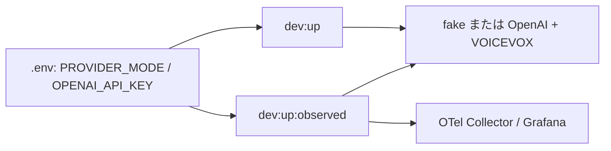

# ADR-0047: observed stackもアプリのprovider modeを継承する

- Status: Accepted
- Date: 2026-08-15
- Decision owners: Product owner / Platform
- Supersedes: ADR-0040（observed stackのprovider選択に限る）
- Superseded by: N/A
- Related: ADR-0038、ADR-0046、ADR-0077、`compose.observability.yaml`

## コンテキストと変更契機

`pnpm dev:up:observed`は、`.env`が`PROVIDER_MODE=live`で有効な
`OPENAI_API_KEY`を持っていても、observability overlayがEpisode Productionを
`fake`かつ空キーへ強制していた。そのため、通常stackとobserved stackで
生成結果が異なり、Grafanaで実provider経路を観測できなかった。

## 決定

`compose.observability.yaml`はtelemetry設定だけを追加し、provider modeと資格情報を
上書きしない。通常stackとobserved stackは、どちらも`.env`の設定を継承する。

- `PROVIDER_MODE=fake`なら外部OpenAI APIを呼ばない。
- `PROVIDER_MODE=live`ならOpenAI Responses APIとCompose内VOICEVOXを使う。
- observed stackを起動する操作自体はprovider modeを変更しない。
- productionで許可するmodeと資格情報のfail-closed規則は[ADR-0077](0077-fail-closed-production-provider-mode.md)に従う。

## 判断要因

- telemetry有無で業務動作を変えず、実providerのtrace・log・metricを観測する。
- provider選択と資格情報の正本を`.env`へ一元化する。
- live利用と課金を`PROVIDER_MODE=live`という明示設定に限定する。

## 却下案

| 案 | 却下理由 | 再検討条件 |
| --- | --- | --- |
| observed stackは常にfake | 実provider経路を観測できず、通常stackと挙動が分岐する | 課金APIを一切使わない専用監視環境が必要になった場合 |
| `dev:up:observed:live`を別途追加 | 起動経路が増え、Compose設定のdriftを生む | providerごとに独立した配備単位が必要になった場合 |
| overlayで常にliveを強制 | キー未設定環境を起動不能にし、意図しない課金を招く | N/A |

## 結果

### 利点

- 通常・observed両stackで同じ生成経路を使い、実providerのtelemetryを確認できる。
- fake/liveの切り替え箇所が`.env`だけになる。

### 欠点とリスク

- `.env`が`live`ならobserved stackでもOpenAI API利用料金が発生する。
- live smokeは外部APIのavailability、quota、model契約に依存する。

## 影響と同期

| 対象 | 必要な変更 | 状態 | 証拠 |
| --- | --- | --- | --- |
| 設計書 | observed stackのprovider継承を記載 | Done | `docs/development.md` |
| ドメイン/ユースケース | N/A — provider portと生成フローは不変 | Done | ADR-0038 |
| OpenAPI/外部契約 | N/A — HTTP契約は不変 | Done | Gateway contract unchanged |
| コード/ポート | N/A — runtimeのfake/live選択は既存 | Done | `services/episode-production/src/runtime/service.ts` |
| データ/ストレージ | N/A — schema変更なし | Done | migration差分なし |
| 実行/配備 | provider強制上書きを削除 | Done | `compose.observability.yaml` |
| 認証/セキュリティ | キーは`.env`からのみ注入し、記録しない | Done | Compose resolved config check |
| フロント/品質保証 | N/A — Web表示契約は不変 | Done | Web unchanged |
| テスト/運用 | overlayがprovider設定を所有しない契約を追加 | Done | `scripts/observed-provider-config.test.mjs` |

## 再検討条件

- observed stackのOpenAI利用料金がローカル開発予算を継続的に超過した場合。
- 実provider telemetryを別のstaging環境だけで収集する運用へ移行した場合。

## 受け入れゲートと未決事項

- None

## 検証証拠

- `node --test scripts/observed-provider-config.test.mjs`
- `pnpm observability:validate`
- Compose解決結果でEpisode Productionの`PROVIDER_MODE=live`とキー設定済みを
  値を表示せず確認する。
