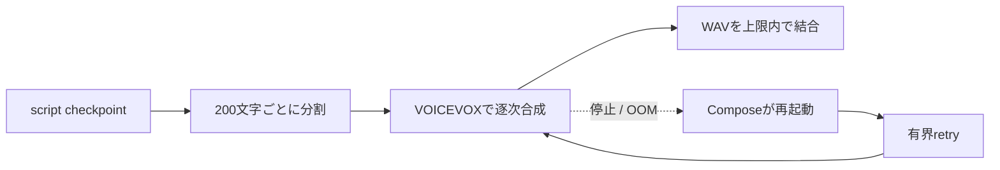

# ADR-0048: VOICEVOX長文合成のメモリ境界と自己回復

- Status: Accepted
- Date: 2026-08-15
- Decision owners: Product owner / Platform
- Supersedes: N/A
- Superseded by: N/A
- Related: ADR-0004、ADR-0016、`services/episode-production/src/adapters/providers/voicevox/`

## コンテキストと変更契機

2,982文字の台本を既定1,000文字単位で合成した際、VOICEVOXが2026-08-15 17:26:47 JSTにOOM終了した。Composeに再起動policyがなく、最初の合成失敗後もEpisode Productionのretryが停止済みproviderへ接続し続け、4回目で`Failed / speech_unavailable`になった。

長文の推論memoryと外部process停止をEpisode Productionから隔離し、一時障害後のretryを実際に回復へ収束させる必要がある。

## 決定

VOICEVOXへの長文入力は既定200文字ごとに分割し、逐次合成してから音声byte上限内でWAVを結合する。`VOICEVOX_MAXIMUM_TEXT_CHARACTERS`で調整可能にするが、増加時は代表台本でpeak memoryを確認する。

ComposeのVOICEVOX serviceは`unless-stopped`で再起動する。Episode Productionは既存の有界retryを維持し、provider回復後にscript checkpointから音声合成を再開する。

## 判断要因

- VOICEVOX推論のpeak memoryを台本全長から分離する。
- 停止済みproviderへのretryを、process回復へ収束させる。
- 検証済みscript checkpointを再利用し、OpenAIの再課金を避ける。
- 既存の逐次合成・WAV上限・retry境界を維持する。

## 却下案

| 案 | 却下理由 | 再検討条件 |
| --- | --- | --- |
| 1,000文字単位を維持 | 2,982文字の実台本でVOICEVOXがOOM終了した | 同一imageと代表台本で十分なmemory余裕を継続観測できる |
| 再起動だけ追加 | 同じ長文requestが再度OOMを起こす | providerが長文推論のmemory上限を保証する |
| 文字上限だけ縮小 | 別要因でprocessが停止するとretry中に回復しない | 外部orchestratorが再起動を保証する |

## 結果

### 利点

- 長文合成のpeak memoryと一時的なprocess停止を、分割と再起動で局所化できる。
- Episode Productionのretryがprovider回復後の成功へ収束できる。

### 欠点とリスク

- 分割数が増え、VOICEVOXへのHTTP往復と合成latencyが増える。
- host全体のmemory枯渇は防げないため、監視とcapacity管理は引き続き必要になる。
- `unless-stopped`は永続的な起動失敗も再試行するため、health監視が必要になる。

## 影響と同期

| 対象 | 必要な変更 | 状態 | 証拠 |
| --- | --- | --- | --- |
| 設計書 | 開発時の長文上限と回復契約 | Done | `docs/development.md` |
| ドメイン/ユースケース | N/A — retry state machineは変更しない | Done | ADR-0016 |
| OpenAPI/外部契約 | N/A — HTTP APIとVOICEVOX API shapeは変更しない | Done | `pnpm contract:check` |
| コード/ポート | VOICEVOXの既定分割上限 | Done | `runtime/env.ts` |
| データ/ストレージ | N/A — schemaとcheckpoint形式は変更しない | Done | existing persistence tests |
| 実行/配備 | OOM後のVOICEVOX自己回復 | Done | `compose.yaml` |
| 認証/セキュリティ | N/A — trust boundaryは変更しない | Done | ADR-0004 |
| フロント/品質保証 | N/A — job status契約は変更しない | Done | existing Web tests |
| テスト/運用 | 既定上限とCompose再起動policy | Done | `env.test.ts`、`voicevox-runtime-config.test.mjs` |

## 再検討条件

- 同一VOICEVOX imageと代表台本で、200文字を超えても十分なmemory余裕を継続観測できた場合。
- 合成latencyがSLOを超過した場合。
- 外部orchestratorへ移行し、Composeの再起動policyが正本でなくなった場合。

## 受け入れゲートと未決事項

- なし。

## 検証証拠

- 修正前test: 既定値1,000とrestart policy欠落を検出して失敗。
- `pnpm test`、`pnpm lint`、`pnpm typecheck`、`pnpm observability:validate`。
- 失敗jobのscript checkpoint 2,982文字を200文字単位で実合成し、24,472,108 bytesのWAV生成に成功。VOICEVOXは`OOMKilled=false`を維持。
