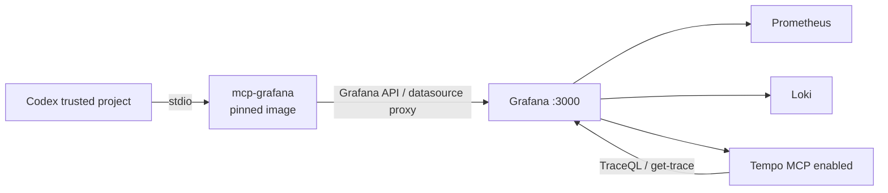

# ADR-0048: Grafana LGTM向けプロジェクト単位MCPを採用する

- Status: Accepted
- Date: 2026-08-15
- Decision owners: Product owner / Platform
- Supersedes: N/A — 旧SigNoZ MCPは運用手順であり、独立したADRではない
- Superseded by: N/A
- Related: ADR-0032、ADR-0040、`infra/observability`、`.codex/config.toml`

## コンテキストと変更契機

現行の監視基盤はOpenTelemetry Collector、Prometheus、Loki、Tempo、Grafanaで構成される。
旧SigNoZ MCPのグローバル登録は廃止済みの保存先・URL・資格情報を参照しており、現在の
Grafana相関監視をCodexから調査できない。

Codexからの調査は、metrics・logs・traces・dashboard・alertをread-onlyで扱い、
監視設定の変更はGit管理されたprovisioning fileに限定する必要がある。

## 決定

リポジトリスコープの`.codex/config.toml`から、公式`grafana/mcp-grafana:1.0.0`を
digest固定したDockerコンテナとしてローカルstdioで起動する。コンテナは既存の
`news-podcast-observability` networkへ接続し、Grafana内部サービス`grafana:3000`へ
接続する。MCP用HTTP serverや追加portは作らない。

- 有効なGrafana MCPカテゴリは`search`、`datasource`、`prometheus`、`loki`、`alerting`、
  `dashboard`、`navigation`、`proxied`に限定する。
- `--disable-write`を必須とし、Codex側の承認モードは`writes`にする。write toolが
  将来追加されても、MCP server側で拒否し、Codex側でも承認を要求する。
- Grafana専用Service Accountから`GRAFANA_SERVICE_ACCOUNT_TOKEN`を環境変数として
  注入する。token、Grafana admin password、API keyはリポジトリへ保存しない。
- Service Accountには現行Prometheus・Loki・Tempo datasourceのquery/read、dashboardと
  folderのread、alert ruleとnotificationのreadだけを付与する。
- Tempoの`query_frontend.mcp_server.enabled`を有効化し、Grafana datasource proxyから
  TraceQL検索とtrace取得を利用できるようにする。
- Tempo trace、Loki log、Prometheus query結果はLLMのコンテキストへ渡り得るため、
  telemetryへcredentialや機密なpayloadを記録しない。

## 判断要因

- 現在の保存・検索基盤とMCPの接続先が一致する。
- stdioによりMCP serverを外部公開せず、既存のDocker network境界を維持できる。
- Service Account、tool allowlist、server側write禁止の三層で権限を制限できる。
- Tempoを含むmetrics・logs・tracesの相関調査を一つのMCP serverから実行できる。
- image digest固定により、`latest`の予期せぬ変更を防止できる。

## 却下案

| 案 | 却下理由 | 再検討条件 |
| --- | --- | --- |
| グローバルMCPへGrafanaを登録 | 他リポジトリへ監視権限と接続先が漏れ、プロジェクト境界を失う | 複数リポジトリで同一の監視権限を正式運用する場合 |
| Streamable HTTP MCPを追加公開 | MCP用port、認証、TLS、caller validationが必要になる | リモート複数clientからの共有が必要になった場合 |
| Editor/Admin Service Account | Codexから監視設定を変更でき、provisioningの正本と衝突する | 読み取り以外の運用操作を明示的に採用する場合 |
| Tempo MCPを無効化 | trace調査がGrafana UIに分断され、metrics/logsとの相関を完結できない | traceのLLM送信が組織ポリシーで禁止された場合 |
| 独自Grafana MCP adapterを実装 | Grafana公式serverとのAPI差分・保守負担が増える | 公式serverで必要なquery契約を提供できなくなった場合 |

## 結果

### 利点

- 現在のGrafana LGTM stackをCodexから直接調査できる。
- 外部公開portを増やさず、既存のDocker networkとGrafana RBACを利用できる。
- 監視設定への書き込みをMCPの仕様として禁止できる。
- 旧SigNoZのグローバル資格情報と実行ファイルを廃止できる。

### 欠点とリスク

- Codex起動時にobserved stackとGrafana networkが利用可能である必要がある。
- Service Accountの作成・token rotationは配備先の運用作業になる。
- Tempo MCPは実験的機能であり、trace内容がLLMへ送信される可能性がある。
- 公式image更新時はdigest、tool一覧、read-only動作の再検証が必要になる。

## 影響と同期

| 対象 | 必要な変更 | 状態 | 証拠 |
| --- | --- | --- | --- |
| 設計書 | 現行ADR一覧とGrafana MCP運用を更新 | Done | `docs/design.md`、`docs/architecture.md` |
| ドメイン/ユースケース | N/A —業務ドメインとMCPを結合しない | Done | application packages unchanged |
| OpenAPI/外部契約 | N/A —公開APIとMCPの外部契約を変更しない | Done | OpenAPI unchanged |
| コード/ポート | N/A —MCPはローカルstdioで追加portなし | Done | `.codex/config.toml` |
| データ/ストレージ | N/A —既存Prometheus/Loki/Tempoを利用する | Done | `infra/observability` |
| 実行/配備 | Tempo MCP設定、project MCP設定を追加 | Done | Tempo config、`.codex/config.toml` |
| 認証/セキュリティ | read-only RBAC、token非保存、trace露出注意を追加 | Done | development/observability docs |
| フロント/品質保証 | N/A —Web UIを変更しない | Done | frontend unchanged |
| テスト/運用 | MCP設定検査とread-only接続手順を追加 | Done | `pnpm mcp:check` |

## 再検討条件

- Tempo traceのLLM送信がprivacy・規制・顧客契約に適合しないと判断された場合。
- Grafana MCPのread-only toolが現行の監視調査を満たさなくなった場合。
- 同一MCPを複数host・複数clientへ公開する必要が生じた場合。
- pinned imageの脆弱性、非互換変更、またはtool仕様変更が検出された場合。

## 受け入れゲートと未決事項

- Grafana Service Account tokenは配備先secretとして別途作成する。
- `pnpm mcp:check`、既存observability validation、MCP tool一覧確認、read-only拒否確認を完了する。
- None

## 検証証拠

- `pnpm mcp:check`
- `pnpm observability:validate`
- `codex mcp list`、`codex mcp get grafana`
- dashboard一覧、PromQL、LogQL、Tempo TraceQL、trace取得のread-only確認
- `update_dashboard`、`create_annotation`などwrite toolが公開されないことの確認
