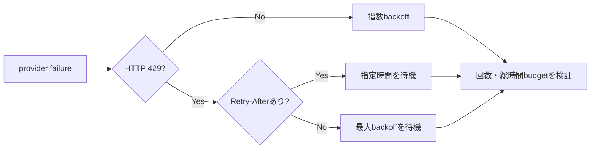

# ADR-0049: Rate limit時のprovider retryを保守的に間隔制御する

- Status: Accepted
- Date: 2026-08-15
- Decision owners: Product owner / Platform
- Supersedes: N/A
- Superseded by: N/A
- Related: ADR-0016、ADR-0038、`services/episode-production/src/domain/provider-reliability.ts`

## コンテキストと変更契機

定期生成がOpenAIからHTTP 429を受けた際、応答に`Retry-After`がないとprovider adapterは1秒、2秒で再送していた。1 job内のprovider試行3回とjob試行4回が重なり、約2分で最大12 requestへ増幅する。2026-08-15にはこの経路でscheduled jobが2件連続して`script_rate_limited`で終端失敗した。一方、同じAPI keyとmodelへの小さい疎通requestはrate limit回復後に成功し、request上限500、token上限200,000を確認した。

一時的なrate limitを短周期の再送で延命せず、既存の時間・回数上限内でproviderの回復を待つ必要がある。

## 決定

HTTP 429に有効な`Retry-After`がある場合は、その値を既存どおり厳守する。`Retry-After`がない場合は、通常の指数backoffではなくprovider policyの`maximumDelayMillis`を次回試行までの待機時間として使う。現在のlive既定値は30秒である。

429以外のtimeout、transport failure、incomplete、5xxは従来どおり指数backoffを使う。試行回数、総経過時間、最大delayの上限は変更しない。

## 判断要因

- rate limit中の再送増幅を抑える。
- providerが明示した回復時刻を短縮しない。
- 5xxなど短時間で回復し得る障害のlatencyは悪化させない。
- 既存の有界retry契約を維持する。

## 却下案

| 案 | 却下理由 | 再検討条件 |
| --- | --- | --- |
| 429も1秒から指数backoff | provider内試行とjob試行が短時間に増幅し、実障害で回復しなかった | providerが全429へ短い`Retry-After`を保証する |
| 429を即時に非retryable化 | 一時的なtoken/request windowでも生成を終端失敗させる | 429を恒久quota不足と一意に判別できる契約になる |
| すべての一時障害を最大delayで待つ | 5xxや短いnetwork glitchの回復latencyを不必要に増やす | provider障害の大半が長時間化する |

## 結果

### 利点

- `Retry-After`なし429でtight retryを起こさない。
- job retryとの積で発生するrequest burstを抑えられる。

### 欠点とリスク

- rate limitが数秒で回復する場合も既定30秒待つ。
- 恒久的なquota不足は、既存budgetを使い切るまで判定できない。

## 影響と同期

| 対象 | 必要な変更 | 状態 | 証拠 |
| --- | --- | --- | --- |
| 設計書 | provider retryのrate-limit分岐 | Done | 本ADR |
| ドメイン/ユースケース | 429無header時のretry decision | Done | `provider-reliability.ts` |
| OpenAPI/外部契約 | N/A — job APIと状態契約は変更しない | Done | `pnpm contract:check` |
| コード/ポート | N/A — port shapeは変更しない | Done | existing types |
| データ/ストレージ | N/A — schemaとcheckpointは変更しない | Done | existing persistence tests |
| 実行/配備 | Episode Production imageの再作成 | Done | Compose health確認 |
| 認証/セキュリティ | N/A — credentialと入力境界は変更しない | Done | ADR-0038 |
| フロント/品質保証 | N/A — UIは既存retrying状態を表示する | Done | existing Web tests |
| テスト/運用 | domain decisionとOpenAI adapterの429回帰test | Done | focused test、live generation |

## 再検討条件

- OpenAIが全429へ標準`Retry-After`を返すことをcontract testで継続確認できる。
- p95生成時間がSLOを超え、429の実測回復時間に基づく別policyが必要になる。
- 恒久quota不足をresponse codeから安全に分類できるようになる。

## 受け入れゲートと未決事項

- なし。

## 検証証拠

- 修正前test: 429無headerで1秒/25msの通常backoffを選び失敗。
- `provider-reliability.test.ts`、`openai-script-generator.test.ts`。
- live OpenAI疎通、修正imageのhealth、scheduled retryからPodcast公開までの確認。
