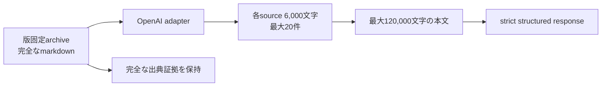

# ADR-0050: OpenAI台本生成のsource本文を入力前に有界化する

- Status: Accepted
- Date: 2026-08-15
- Decision owners: Product owner / Architecture
- Supersedes: N/A
- Superseded by: N/A
- Related: ADR-0038、ADR-0049、`services/episode-production/src/adapters/providers/openai-script-generator.ts`

## コンテキストと変更契機

ADR-0038は台本生成の入力を有界化すると決定したが、実装は出力6,000文字とresponse byteだけを制限し、版固定article markdownを無制限にrequestへ含めていた。2026-08-15のscheduled jobは20記事のmarkdown合計が826,239 bytesとなり、OpenAIのtoken rate limit 200,000を単一requestだけで超え得る状態だった。このrequestは待機しても同じ429を再現し、job retryを使い切った。

手動・定期生成とも最大20記事を受け付ける公開契約を維持しながら、providerへ渡す本文量をrequest構築時に強制する必要がある。

## 決定

OpenAI台本生成adapterは各sourceのmarkdownをUnicode code point単位で先頭6,000文字へ制限してからrequestを構築する。title、URL、source件数は維持する。公開上限20記事の場合、markdown本文は合計最大120,000文字になる。

この境界はprovider adapterで強制し、Content Knowledgeが保持する版固定archive自体は切り詰めない。出典検証は従来どおり元のsource URL集合に対して行う。

## 判断要因

- 単一requestがtoken rate limitを超える状態を防ぐ。
- 手動・定期生成の1〜20記事契約を維持する。
- source間の公平性を保ち、1記事だけが入力budgetを占有しない。
- Content Knowledgeの完全なarchiveと監査可能性を失わない。

## 却下案

| 案 | 却下理由 | 再検討条件 |
| --- | --- | --- |
| 20記事の完全本文を送る | 実測826,239 bytesで単一requestが継続的に429となった | provider token budgetが十分に増え、費用SLOも満たす |
| scheduledだけ記事数を減らす | 手動20記事で同じ障害が残り、公開契約の意味も変わる | productが記事数上限の変更を承認する |
| Content archiveを切り詰める | 再現性、読者表示、監査証拠まで失う | archive保持要件が廃止される |
| 全source合計だけを末尾切り捨てる | 後半sourceが本文なしになり、source間で不公平になる | source優先順位をproduct要件として定義する |

## 結果

### 利点

- 最大20記事でも本文入力が120,000文字以内に収まる。
- 完全archiveを保持したままprovider費用とtoken使用量を有界化できる。

### 欠点とリスク

- 6,000文字を超える記事の後半情報は台本生成へ渡らない。
- token数は文字数と一致しないため、title・URL・schema・outputを含む厳密なtoken上限ではない。

## 影響と同期

| 対象 | 必要な変更 | 状態 | 証拠 |
| --- | --- | --- | --- |
| 設計書 | 台本生成のsource本文上限 | Done | 本ADR、ADR-0038 |
| ドメイン/ユースケース | N/A — sourceと生成結果の型は変更しない | Done | existing ports |
| OpenAPI/外部契約 | N/A — 1〜20記事のjob契約は維持する | Done | `pnpm contract:check` |
| コード/ポート | request構築前のcode-point単位truncate | Done | `openai-script-generator.ts` |
| データ/ストレージ | N/A — 完全archiveとcheckpointを保持する | Done | Content persistence tests |
| 実行/配備 | Episode Production imageの再作成 | Done | Compose health確認 |
| 認証/セキュリティ | N/A — owner scopeとsource URL検証は維持する | Done | existing adapter tests |
| フロント/品質保証 | N/A — UI/APIの件数契約は変更しない | Done | existing Web tests |
| テスト/運用 | 20source requestの本文上限test | Done | `openai-script-generator.test.ts`、live generation |

## 再検討条件

- 6,000文字truncateにより台本品質指標が継続的に悪化する。
- providerのtoken budget、model tokenizer、費用SLOに合わせたtoken単位budgetを導入する。
- sourceごとの要約checkpointを入力にする構成へ移行する。

## 受け入れゲートと未決事項

- なし。

## 検証証拠

- 修正前test: 20記事×6,001文字が無制限にrequestへ入り失敗。
- `openai-script-generator.test.ts`、workspace品質gate、coverage。
- 20記事scheduled retryから台本・音声・Library公開・WAV取得までのlive確認。
