# ADR-0051: 記事Markdown変換を共有RuleとSite Profileで拡張する

- Status: Accepted
- Date: 2026-08-15
- Decision owners: Product owner / Content Platform
- Supersedes: N/A
- Superseded by: N/A
- Related: [ADR-0042](0042-structured-input-parser-boundaries.md)、`docs/design.md` §8、`services/content-knowledge/src/infrastructure/unsafe/article-markdown/`

## コンテキストと変更契機

従来の記事変換器は単一ファイルで文書全体をHASTへ変換していたため、Zenn・Qiita・GitHub Docs等ではnavigationやsidebarが本文へ混入し、Shikiの言語・filename・diff、callout、embedの意味が失われた。一方、媒体ごとにReadability相当の本文抽出とHTML変換を複製すると、通常の見出し・表・リンクまでサイト別実装になり継続的な拡張が難しい。

実サイト互換性を優先しつつ、サイト固有差分を小さな設定とRuleへ限定する必要がある。公開API・object key・DB schemaは変更せず、内部変換はローカル言語検出のため非同期化する。

## 決定

HTML→Markdown変換をBase Extractor、共有Feature Rule、宣言的Site Profileへ分離する。

```mermaid
flowchart LR
  HTML["untrusted HTML"] --> Limit["byte / node / depth budget"]
  Limit --> DOM["jsdom\nscript / resource disabled"]
  DOM --> Preserve["shared preservation rules\ncode / callout / embed / math"]
  Preserve --> Profile["site profile\nroot / selectors / meaning map"]
  Profile --> Extract["profile root → semantic article → Readability"]
  Extract --> Sanitize["rehype-sanitize"]
  Sanitize --> MDAST["rehype-remark + GFM + math"]
  MDAST --> Markdown["bounded Markdown + diagnostics"]
```

- DOM境界は`jsdom@30.0.1`に限定し、`runScripts`と外部resource取得を有効にしない。ReadabilityはcloneしたDOMで実行し、最終HASTを必ずsanitizeする。
- Zenn・QiitaのProfileはhostname完全一致、本文root、除去selector、filename selector、callout意味対応だけを所有する。ProfileからReadability・serializerへ直接依存することを静的gateで禁止する。
- code、callout、embed、math、URL安全化は共有Ruleとして全サイトへ適用する。明示言語→サイト属性→filename→shebang/modeline→VS Codeローカルモデルの順に証拠を使い、モデルは80非空白文字、confidence 0.35、次点差0.20を満たす場合だけ採用する。
- 保存方言はGFM、math、Mermaid、Obsidian/GitHub型callout、`@[card]`、`@[embed]`、code metaへ限定する。表示側は`@r4ai/remark-callout`を使い、外部embedはHTTPS provider allowlist、空sandbox、`no-referrer`でのみ自動ロードする。
- `createArticleArchiveArtifacts`は`Promise`を返す。archive storage key、hash、media type、DB/OpenAPI契約は維持する。
- 診断情報はProfile ID、適用Rule ID、入力/出力byte数、処理時間だけとし、URLや本文を含めない。

## 判断要因

- 実世界の記事DOMから本文と技術的意味を安定して保持する。
- サイト追加時に汎用変換を複製せず、UNIX哲学に沿う小さな責務を合成する。
- untrusted HTMLのscript、外部通信、危険URLを実行しない。
- 実サイト変更を固定corpus、任意live smoke、100% scoped coverageで早期検出する。

## 却下案

| 案 | 却下理由 | 再検討条件 |
| --- | --- | --- |
| Happy DOM | unpacked sizeがjsdomより小さくなく、Mozilla Readabilityの公式Node例・互換性根拠がない | Readability corpusで同等精度と明確なmemory/latency改善を継続観測できる |
| LinkeDOM | 小さいがReadability公式サポートがなく、実サイトDOM互換性の証拠が不足 | 固定/live corpusが全件同等で、運用計測でも有意な改善が出る |
| サイト別の完全adapter | 見出し・表・リンク・抽出まで媒体ごとに重複し、変更追随コストが増える | 媒体が共通Ruleでは表現不能な独自文書モデルを公開する |
| Readabilityだけを使用 | Shiki metadata、callout、embed等の意味を抽出前に失う | 対象Markdownがplainな本文だけに縮小される |
| LLM言語判定 | 外部通信、cost、非決定性をコードブロックごとに持ち込む | offlineモデルでは満たせない測定済み精度要件が確定する |

## 結果

### 利点

- 新サイトはProfileまたは再利用可能Ruleの追加で対応でき、汎用変換を複製しない。
- Zenn/Qiita、Shiki、GitHub callout、math、embedの意味をportableなMarkdownへ保持できる。
- DOM副作用、抽出、正規化、sanitize、serializeの境界が独立して単体テスト可能になる。

### 欠点とリスク

- Content serviceのruntime依存とconverterの非同期処理が増える。
- Readability・実サイトDOM・provider embed pathの変更へ追随する必要がある。
- 自動embedは第三者への通信を発生させるため、allowlistとsandboxを保守する必要がある。
- ML言語判定モデルの初回loadでlatencyとmemoryが増える。

## 影響と同期

| 対象 | 必要な変更 | 状態 | 証拠 |
| --- | --- | --- | --- |
| 設計書 | 記事抽出・Profile/Rule・Markdown方言を同期 | Done | `docs/design.md`、`docs/development.md` |
| ドメイン/ユースケース | N/A — archiveのdomain schemaは不変 | Done | capture integration tests |
| OpenAPI/外部契約 | N/A — HTTP/OpenAPI shapeは不変 | Done | contract差分なし |
| コード/ポート | 非同期converterとcaptureの`await` | Done | `article-markdown/`、`http-s3-article-capture.ts` |
| データ/ストレージ | N/A — object key、hash、DB schemaは不変 | Done | capture integration tests |
| 実行/配備 | jsdom、Readability、VS Code detector依存 | Done | package manifests、lockfile |
| 認証/セキュリティ | script/resource無効、sanitize、embed allowlist | Done | converter/renderer tests |
| フロント/品質保証 | callout、code meta、card/embed renderer | Done | `apps/web/src/shared/markdown/` |
| テスト/運用 | 固定corpus、任意live smoke、4指標100% gate | Done | `test:article-markdown:coverage`、`test:markdown:coverage` |

## 再検討条件

- 固定/live corpusで本文欠落またはchrome混入が同一Profileに継続して発生する。
- converterのp95 latencyまたはpeak memoryがContent serviceの運用上限を超える。
- LinkeDOM等が全corpusで同等精度かつ20%以上のmemoryまたはlatency改善を示す。
- provider embed仕様変更でallowlist fallback率が継続的に増える。

## 受け入れゲートと未決事項

- なし。jsdom、Profile/Rule責務、外部embed自動ロード、scoped 100% coverageはproduct owner確認済み。

## 検証証拠

- Red: Zenn/Qiita fixtureでnavigation混入、callout・code metadata欠落を再現した。
- Green: `pnpm --filter @news-podcast/content-knowledge test:article-markdown:coverage`。
- Green: `pnpm --filter web test:markdown:coverage`。
- Boundary: `pnpm parser:check`。
- 任意の実通信確認: `pnpm --filter @news-podcast/content-knowledge test:article-markdown:live`。
