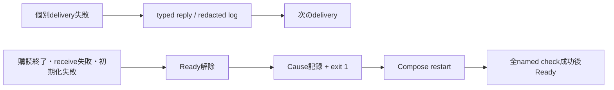

# ADR-0052: RPC障害隔離と自己回復可能なサービスランタイム

- Status: Accepted
- Date: 2026-08-15
- Decision owners: Product owner / Platform
- Supersedes: N/A
- Superseded by: N/A
- Related: ADR-0036、ADR-0040、ADR-0048、`@news-podcast/service-runtime`、`@news-podcast/nats-runtime`

## コンテキストと変更契機

Content Knowledgeの1件のRPC処理失敗がEffectの常駐loopを終了させ、Composeにrestart policyが
なかったためサービスが停止した。終了logはCauseを`[Object]`へ潰し、未使用の
`content.article-archived.v1`はconsumer/streamがないまま多数のrecordをOutboxへ滞留させていた。
同じ停止パターンと重複process controllerは4 Context serviceにも存在した。

ADR-0036の永続整合性、ADR-0040の観測検証、ADR-0048のread-only Grafana調査を維持しつつ、
delivery障害とruntime障害の境界を全サービスで同じ契約にする必要がある。

## 決定

- `@news-podcast/nats-runtime`がNATS transportと逐次RPC loopを所有する。handler、reply、encodeの
  失敗はdelivery単位で隔離し、request/reply payloadをlogへ残さない。
- subscription終了、receive失敗、接続終了はterminalである。複数subscriptionの最初のterminal
  errorをbufferより優先してSupervisorへ通知する。各RPC serviceは全subjectを1接続へ束ね、
  capacity 1のbackpressureでread-aheadを制限する。内部再接続は行わずCompose再起動へ接続し、
  壊れたtransportのdrainは1秒でcloseへ切り替える。
- `@news-podcast/service-runtime`がsignal、fatal process event、resource interruption、期限付き
  telemetry flush、終了codeを一元管理する。Effect Causeはservice/component/scope/error typeと
  redacted reasonへ構造化する。
- readinessはnamed checkの論理積とする。Episode completion relayは失敗中503、成功後200へ戻す。
  局所的な記事/provider失敗はprocess readinessを落とさない。
- init/provision job以外の長期稼働Compose serviceは`restart: unless-stopped`、healthcheck、
  graceful stop期間を持つ。Docker healthは観測専用で、回復不能状態はprocess自身がexitする。
- consumerが存在しないContent archive event、Content Outbox、relay、JetStream接続を廃止する。
  記事snapshot/S3 archiveとContent RPCを正本として維持する。
- Watchdogは通常Composeでも常駐し、SMTP未設定時は構造化stderr、完全設定時はメール、部分設定は
  起動エラーとする。自身と対象状態をPrometheusへ公開する。
- ローカルGrafana MCP tokenはViewer Service Accountへ限定して冪等発行し、gitignored 0600 fileへ
  保存する。本番は明示secretを優先する。MCP image、write禁止、tool allowlistは維持する。

## 障害分類

| 分類 | 例 | 契約 |
| --- | --- | --- |
| 業務/入力 | invalid、unauthenticated、not found、conflict | typed reply、継続 |
| delivery局所 | reply先消失、timeout、encode、予期しないhandler failure | payloadなしlog/metric、継続 |
| runtime terminal | receive失敗、購読/接続終了 | Ready解除、drain、exit 1 |
| 初期化 | DB open、必須resource取得失敗 | Readyにせずexit 1 |
| 正常終了 | SIGINT/SIGTERM | 一度だけdrain/flush、exit 0 |
| process fatal | uncaught exception/unhandled rejection | OTel状態によらず捕捉、期限付きflush、exit 1 |

## 却下案

| 案 | 却下理由 | 再検討条件 |
| --- | --- | --- |
| すべてのRPC失敗でprocess終了 | client由来の局所障害が全利用者へ波及する | deliveryを安全に再実行できない共有破損が証明された場合 |
| Docker healthだけで再起動 | Compose healthcheckはunhealthy containerを自動再起動しない | orchestratorがhealth連動restartを保証する場合 |
| Content event用streamを追加 | consumerも業務要件もなく、滞留と障害面だけ増やす | 独立consumerとdelivery SLOが承認された場合 |
| Watchdogをobserved構成だけで起動 | 通常構成の停止を検知できない | 外部監視が全supported deploymentを常時覆う場合 |
| Grafana Admin tokenをMCPへ渡す | read-only調査の権限を超え、provisioning正本と衝突する | N/A |

## 影響と同期

| Surface | 変更 | 状態 |
| --- | --- | --- |
| 設計/ADR | runtime障害境界、Content event経路、監視構成を同期 | Done |
| Domain/application | 未使用ArticleArchived型とevent生成を削除 | Done |
| OpenAPI | N/A — 外部HTTP契約は不変 | Done |
| Protocol | `content.article-archived.v1`だけ削除 | Done |
| Data | backup後に`content_outbox`だけdrop | Done |
| Runtime/Compose | 共通Supervisor/transport、named health、restart/healthcheck | Done |
| Observability | Watchdog metrics/alerts、no-data alerting、MCP Viewer token | Done |
| Web | N/A — API/UI契約は不変、container healthのみ追加 | Done |

## Migration証跡

| 項目 | 値 |
| --- | --- |
| backup | `/home/<operator>/backups/news-podcast/content-<timestamp>.sqlite` |
| `PRAGMA quick_check` | `ok` |
| 未配信Outbox | <verified-count>件 |
| SHA-256 | `<verified-sha256>` |
| file mode | `0600` |
| migration | `20260815135150_jittery_makkari` |

## 再検討条件

- Kubernetes等、Compose以外をsupported deploymentへ追加する場合。
- 並列RPC処理が必要になり、owner単位orderingを別機構で保証できる場合。
- Content archive eventの独立consumerと保持/SLOが承認された場合。
- Grafana Service Account APIまたはMCP read-only仕様が変更された場合。

## 検証証拠

- 共通runtime line/branch coverage 90%以上
- 4 Context serviceのRPC/terminal/process lifecycle試験
- Content migration保持試験とbackup整合性/SHA-256
- Watchdog通知・状態・metrics試験、Prometheus/Grafana provisioning検証
- Grafana token新規発行・再利用・失効時再発行・0600/gitignore・Viewer/write禁止検査
- `pnpm reliability:chaos`によるservice/NATS停止・再起動・Ready・SQLite/JetStream検査
