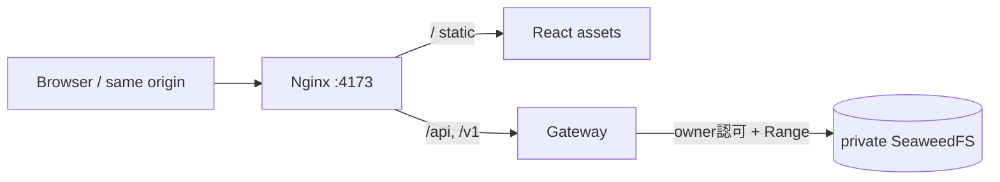

# ADR-0055: Web・API・音声を単一オリジンで配信する

- Status: Accepted
- Date: 2026-08-16
- Decision owners: rai
- Supersedes: [ADR-0002](0002-openapi-async-jobs.md)（短期音声URLの公開契約のみ）
- Superseded by: N/A
- Related: [ADR-0011](0011-s3-compatible-object-storage.md)、[design.md](../design.md) §3、[architecture.md](../architecture.md)

## コンテキストと変更契機

音声アクセスAPIが返した署名URLはDocker内部名`seaweedfs`を含み、ブラウザから到達できなかった。S3の公開URLを別途設定しても別オリジン、CORS、内部構成露出が残る。最終配備ではWeb・API・音声を一つの公開入口から返す必要がある。

## 決定

Nginxを唯一のブラウザ向け入口にし、静的Reactを直接配信、`/api`・`/v1`・`/docs`・`/openapi.json`・`/health`をGatewayへ転送する。公開音声契約は`GET /v1/episodes/{id}/audio`とし、Gatewayがowner認可後に内部署名URLを取得してS3からstreamする。単一Rangeだけを転送し、応答headerをallowlistする。

## 判断要因

- 内部S3 hostname・署名URLをブラウザへ公開しない。
- Cookie認証とCORSを単一オリジンへ閉じる。
- Rangeを維持し、長い音声をGatewayへ全量bufferしない。

## 却下案

| 案 | 却下理由 | 再検討条件 |
| --- | --- | --- |
| S3公開endpointを別設定 | 別オリジンと内部構成露出が残る | 音声を公開CDNへ移す |
| NginxからS3へ直接proxy | owner認可を安全に適用できない | Nginx側に同等の認可機構を持つ |
| Gatewayが全量buffer | 大容量音声でmemoryを圧迫する | 音声上限が十分小さくなる |

## 結果

- Browserは相対URLだけを扱い、既存音声も再生成なしで再生できる。
- Gatewayの転送帯域は増える。将来CDNへ移す場合も公開契約は維持できる。
- 複数Rangeは`416`、S3障害は内部詳細を隠した`503`とする。

## 影響と同期

| 対象 | 変更 | 状態 | 証拠 |
| --- | --- | --- | --- |
| OpenAPI | `audio-access`をsame-origin streamへ変更 | Done | `packages/contracts/openapi/openapi.json` |
| Web | 相対音声URLをaudio要素へ設定 | Done | `use-episode-library.ts` |
| Gateway | owner認可、Range転送、header allowlist | Done | `definitions.ts`、`http.test.ts` |
| 配備 | Nginx static + reverse proxy image | Done | `infra/Dockerfile.web`、`nginx.web.conf.template` |
| Object storage | private/internalのまま維持 | Done | `compose.yaml` |

## 再検討条件

- Gateway転送帯域がSLOを圧迫する。
- CDNでowner認可済み配信を安全に実現できる。

## 受け入れゲートと未決事項

- None

## 検証証拠

- Gateway HTTP test: `200/206/416`、Range転送、内部URL/header非露出。
- `docker compose build web`、生成Nginx設定の`nginx -t`。
