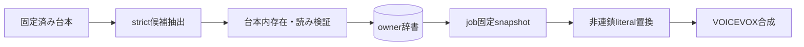

# ADR-0056: 読み辞書をowner別テキスト置換として適用する

- Status: Accepted
- Date: 2026-08-16
- Decision owners: rai
- Supersedes: [ADR-0028](0028-structured-reading-dictionary-extraction.md)
- Superseded by: N/A
- Related: [ADR-0031](0031-complete-isolated-llm-response-boundaries.md)、[design.md](../design.md) §8

## コンテキストと変更契機

旧自動辞書実装は削除済みで、現行EpisodeProductionへ移植されていなかった。またVOICEVOX共有辞書への登録はowner Aの読みをowner Bへ漏らし、ジョブ再現性もproviderの共有状態へ依存させる。

## 決定

ADR-0028のstrict抽出・検証・NFKC重複排除・失敗隔離を維持してEpisodeProductionへ復元する。候補はowner別SQLiteへ`ai_auto`として保存し、そのジョブの辞書snapshotを固定する。VOICEVOX共有辞書は変更せず、snapshotの表記を長い順・一回のliteral置換でカタカナ読みに変換してから合成する。既存Episodeには遡及せず、今後の生成だけへ適用する。

## 判断要因

- owner間で読み設定を共有しない。
- retry中に辞書が変更されても同じ音声入力を再現する。
- 抽出障害を音声生成の障害へ昇格させない。

## 却下案

| 案 | 却下理由 | 再検討条件 |
| --- | --- | --- |
| VOICEVOX共有辞書へ登録 | owner分離と再現性を保証できない | providerがtenant別versioned辞書を提供する |
| 単純な逐次replace | 置換結果を別語として再置換する | N/A |
| 既存Episodeを自動再生成 | 音声が暗黙に変わる | 明示的再生成機能を提供する |

## 結果

- 自動候補は手動CRUDと同じowner辞書で確認・修正・削除できる。
- 抽出失敗は`reading_dictionary.extraction_failed`、登録は`reading_dictionary.term_added`で観測する。
- 読み置換は文字列一致であり、形態素・文脈に応じた多義語選択は行わない。

## 影響と同期

| 対象 | 変更 | 状態 | 証拠 |
| --- | --- | --- | --- |
| Provider | OpenAI strict抽出adapter | Done | `openai-reading-term-extractor.ts` |
| Application | 重複排除、登録、snapshot固定 | Done | `reading-dictionary.ts`、`execute-job.ts` |
| TTS | owner snapshotの非連鎖置換 | Done | `apply-reading-dictionary.ts` |
| 永続化 | 既存owner辞書を利用 | Done | migration変更なし |
| Observability | 成功・抽出失敗event | Done | `runtime/service.ts` |

## 再検討条件

- 自動登録語の手動修正率が10%を超える。
- 文脈依存の同表記異読が継続的に観測される。

## 受け入れゲートと未決事項

- None

## 検証証拠

- 抽出境界、owner重複排除、失敗継続、snapshot再利用、最長一致・非連鎖置換のunit/integration test。
