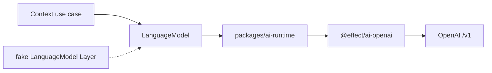

# ADR-0057: Effect AIをLLM境界の正本とする

- Status: Accepted
- Date: 2026-08-16
- Decision owners: Product owner / Architecture
- Supersedes: ADR-0026、ADR-0029の手書きResponses解析、ADR-0031の手書きprovider境界
- Superseded by: N/A
- Related: `packages/ai-runtime`、`docs/external-provider-contracts.md`

## Context and change trigger

台本、読み辞書、記事enrichmentが独自fetch、Bearer header、JSON Schema、`output_text`探索を重複実装していた。provider API差分と失敗分類を各Contextで別々に追随する構成は保守性と秘密情報のredactionを弱める。

## Decision

全LLM呼び出しを`effect@4.0.0-rc.109`と`@effect/ai-openai@4.0.0-rc.109`の`LanguageModel.generateObject`へ統合する。共通packageは技術的なLayer・timeout・byte上限・redaction・`AiError`変換だけを所有し、prompt、業務Schema、出典集合検証は各Bounded Contextが所有する。

既存の429 `Retry-After`、30秒上限、最大試行/経過時間、caller cancellationはapplication policyとして維持する。設定は`OPENAI_API_URL`をbase URLとして使い、key、prompt、本文、台本、完全URLをtelemetryへ出さない。

## Decision drivers

- SDK/schema/Effect Layerへtransport副作用を集約する
- AI use caseを実HTTPなしで決定論的にテストする
- Provider errorを既存job retry契約へ一貫して入力する

## Rejected alternatives

| Alternative | Reason rejected | Reconsider when |
| --- | --- | --- |
| 手書きfetchを維持 | request/response処理とredactionが重複する | Effect AIが必要なResponses機能を失う |
| 汎用ExecutionPlanへretryも統合 | 既存のjob attempt・Retry-After契約を変える | 全provider policyを同時再設計する |
| OpenAI SDKを各serviceで直接利用 | Layer、制限、失敗変換が再び分散する | serviceごとに異なるproviderが必要になる |

## Consequences

### Positive

- strict structured outputとtoken usageの取得経路が共通化される
- fake `LanguageModel`でuse caseを高速に検証できる

### Negative and risks

- RC依存のため、version更新はcontract testの追随を伴う
- SDK内部のrequest差分をbounded live smokeで継続確認する必要がある

## Impact and synchronization

| Surface | Required change | Status | Evidence |
| --- | --- | --- | --- |
| Design documents | AI境界と依存を更新 | Done | `docs/design.md`、`docs/architecture.md` |
| Domain and use cases | 業務Schema/検証はContext所有 | Done | Content/Production application tests |
| OpenAPI and external contracts | N/A — LLM transportは非公開 | Done | Gateway contract差分なし |
| Application code and ports | `LanguageModel.generateObject`へ統合 | Done | `packages/ai-runtime`、provider adapters |
| Data and storage | token usageは既存enrichment使用量へ保存 | Done | provider tests |
| Runtime and deployment | `OPENAI_API_URL`へ変更 | Done | `.env.example`、loadtest Compose |
| Authentication and security | keyとcontentのredaction | Done | runtime failure tests |
| Frontend and quality assurance | N/A — wire shape不変 | Done | Web tests |
| Tests and operations | fake Layerとbounded live contract | Done | `pnpm test`、provider contract tests |

## Reconsideration conditions

- pinned RC更新で公式schema/API contract testが失敗した場合
- OpenAI以外のproviderが本番要件になり共通OpenAI Layerが不適切になった場合

## Acceptance gates and open questions

- None

## Validation evidence

- workspace typecheck/unit test、OpenAI bounded contract test（key設定時）
