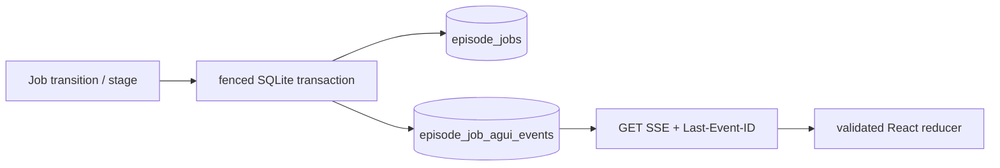

# ADR-0058: Episode Job進捗をdurable AG-UIへ一本化する

- Status: Accepted
- Date: 2026-08-16
- Decision owners: Product owner / Architecture
- Supersedes: ADR-0029の独自`CUSTOM`/`STATE_DELTA`進捗、ADR-0038のAgent監査API
- Superseded by: N/A
- Related: [Episode Job進捗プロトコル](../protocols/episode-job-ag-ui.md)

## Context and change trigger

既存SSEは状態履歴をGatewayで`STATE_SNAPSHOT`へ変換するだけで、手書きAG-UI型には未使用のtool、delta、custom eventが混在していた。旧Agent監査・Memory APIは本番生成経路で使われず、進捗と監査の正本が分裂していた。

## Decision

`episode_job_agui_events`を進捗の唯一のdurable logとし、`@ag-ui/core@0.0.58`の`EventSchemas`へ適合する標準eventだけを保存・配信する。状態遷移とevent追記は同一transactionで行う。

POST型`HttpAgent`は非同期job作成とowner認可に合わないため使わず、GET SSEをtransport extensionとする。旧Agent HTTP/NATS/domain/application/adapters/tableは移行せず削除する。

## Decision drivers

- 再接続後も失われないowner-scoped progress
- 標準eventによるclient/tooling互換性
- job状態と通知の不整合をtransactionで防ぐ

## Rejected alternatives

| Alternative | Reason rejected | Reconsider when |
| --- | --- | --- |
| status rowを都度snapshot化 | stageとrun境界をreplayできない | stage進捗を廃止する |
| `@ag-ui/client` HttpAgent | POST同期run前提で既存job APIに合わない | API全体をAG-UI run endpointへ変更する |
| 旧Agent APIをdeprecated維持 | 二重正本と不要なowner dataが残る | 後方互換が明示要件になる |

## Consequences

### Positive

- 100件超のreplay、retry run、owner isolationを同じlogで検証できる
- UIは破損・重複・逆順eventを安全に拒否できる

### Negative and risks

- AG-UI 0.xを完全固定し、更新時にschema追随が必要
- 旧Agentデータとstatus event履歴は移行しない

## Impact and synchronization

| Surface | Required change | Status | Evidence |
| --- | --- | --- | --- |
| Design documents | protocolとretry sequenceを明記 | Done | protocol仕様、design/architecture |
| Domain and use cases | 6 stageとrun/attempt規則 | Done | progress modules |
| OpenAPI and external contracts | SSE union一括切替、旧API削除 | Done | generated OpenAPI |
| Application code and ports | stage portと公式validation | Done | Production/Gateway/Web |
| Data and storage | durable event table、旧5 table drop | Done | migrations 20260816030332/030936 |
| Runtime and deployment | 100件replay/tail/terminal close | Done | Gateway handler tests |
| Authentication and security | owner queryで404正規化 | Done | RPC/Gateway tests |
| Frontend and quality assurance | reconnect、dedupe、fallback | Done | Web component tests |
| Tests and operations | official schema contract | Done | `contract.agui.test.ts` |

## Reconsideration conditions

- AG-UIが非同期durable GET transportを公式化した場合
- stage以上の粒度が利用者価値または運用SLOに必要になった場合

## Acceptance gates and open questions

- None

## Validation evidence

- [protocol contract tests](../../apps/gateway/src/contract.agui.test.ts)
- Episode Production persistence tests、Gateway SSE tests、Web stream tests
