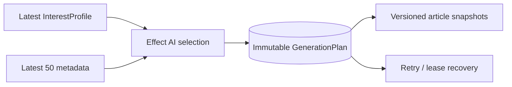

# ADR-0059: 最新InterestProfileによる生成計画をfirst-write-winsで固定する

- Status: Accepted
- Date: 2026-08-16
- Decision owners: Product owner / Editorial
- Supersedes: ADR-0037のAgent Memory嗜好、ADR-0038の「手動選択だけ」の生成入力
- Superseded by: N/A
- Related: ADR-0061、`GenerationPlan`、Content Knowledge personalization

## Context and change trigger

定期生成はschedulerが記事IDを先に決め、Content Knowledgeが所有する`InterestProfile`を記事選定へ利用していなかった。retry時に最新候補やプロフィールを再評価すると、同じjobの内容が変わり再現性も失う。

## Decision

`InterestProfile { include, exclude }`を唯一の嗜好正本にする。自動jobはworker最初の段階で最大50候補から1〜20件をEffect AIで順序付き選定し、プロフィールsnapshot・記事ID・model・時刻を`GenerationPlan`としてfirst-write-wins保存する。

空profileはLLMを呼ばず、媒体をround-robinする新着順fallbackを使う。手動jobは全指定記事を維持し、profileを台本の重点にだけ利用する。候補ゼロは`no_generation_candidates`で終端する。

## Decision drivers

- 嗜好を使うContextと正本を一致させる
- retry・lease回収・profile変更後も同じ入力を再現する
- 本文を選定promptへ渡さず費用と情報量を制限する

## Rejected alternatives

| Alternative | Reason rejected | Reconsider when |
| --- | --- | --- |
| Agent Memory preferenceを復活 | Contentのprofileと二重正本になる | InterestProfileを廃止する |
| schedulerで記事IDを固定 | 実行時の最新嗜好を利用できない | schedulerが編集責任を持つ設計へ変える |
| retryごとに再選定 | 同じjobが非決定的に変わる | jobをattempt単位の成果物へ変える |

## Consequences

### Positive

- 自動生成が最新嗜好を反映し、再試行は再現可能になる
- profileが空の利用者には追加LLM費用が発生しない

### Negative and risks

- jobごとにplan storageと追加のContent RPCが必要
- 自動選定品質はモデルとmetadata品質に依存する

## Impact and synchronization

| Surface | Required change | Status | Evidence |
| --- | --- | --- | --- |
| Design documents | 自動/手動flowを更新 | Done | design/architecture |
| Domain and use cases | GenerationPlanと選定validation | Done | Production/Content tests |
| OpenAPI and external contracts | 手動POSTは維持 | Done | generated OpenAPI |
| Application code and ports | planning RPC/port追加 | Done | `content.plan-generation.v1` |
| Data and storage | plan table追加 | Done | migration 20260816030332 |
| Runtime and deployment | schedulerはIDなしjobを受付 | Done | scheduled generation tests |
| Authentication and security | owner profile/candidatesだけをquery | Done | RPC peer/owner tests |
| Frontend and quality assurance | selection modeと選定記事をsnapshot表示 | Done | AG-UI state/Web tests |
| Tests and operations | fallback/invalid/reuseを網羅 | Done | generation planning/execute tests |

## Reconsideration conditions

- 選定evalで決定論fallbackがLLMを継続して上回る場合
- 候補50件または上限20件が編集要件を満たさなくなった場合

## Acceptance gates and open questions

- None

## Validation evidence

- Content generation planning tests、Production retry/plan tests、functional E2E
