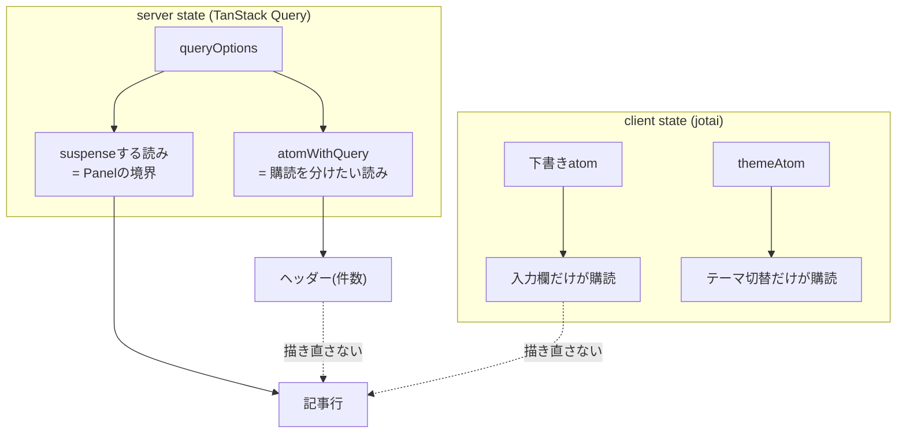

# ADR-0060: 描画範囲をatomで区切り、フロントエンドの予算を実測で守る

- Status: Accepted
- Date: 2026-08-16
- Decision owners: Product owner / Web
- Supersedes: N/A（ADR-0047の骨格は有効。本ADRは状態の所在と計測を追加する）
- Superseded by: N/A
- Related: ADR-0006、ADR-0018、ADR-0025、ADR-0047、`apps/web/src/shared/state`、`apps/web/tests/perf`

## コンテキストと変更契機

ADR-0047はAsync UIの責務を1つずつに固定した。その骨格は妥当だったが、**「状態をどこに置くか」と「速いかどうかをどう知るか」は決めていなかった**。結果、次の2つが計測して初めて分かった。

確認済みの事実（本ADRの作業で実測）:

| 事象 | 実測値 |
| --- | ---: |
| 検索欄に5文字打つと再描画される記事行 | 30行 × 6回 = **180回** |
| 件数(facets)が1つ動くと再描画される記事行 | **30回** |
| 初期ロード（`index.html`が宣言する資産、gzip） | **275.0 kB** |
| `/articles` 到達時の追加JS（gzip） | **288 kB** |
| dashboard の FCP / LCP | **2856 ms** |
| `/articles` の FCP / LCP | **4180 ms** |

React Compilerは入っているが、**これらは1つも防げていなかった**。Compilerが memo 化するのは「同じ値なら同じ要素」までで、値そのものが親のstateにあれば、親が描き直る限り部分木も描き直る。

原因は共通していた。

- **stateの置き場が高すぎる**: 入力欄の下書きや件数を、一覧全体を持つhookが抱えていた。propsで配る以上、購読の単位はcomponentツリーの形に縛られる。
- **critical pathに要らないものが載っていた**: OTelのweb SDK（43 kB gz）は`main.tsx`から同期import、markdownパイプライン（katex 586k・parse5 269k・shiki）は記事を開く前から`/articles`のchunkに同梱、sonnerとbetter-authはentryに常駐していた。
- **速さを測る手段が無かった**: 予算も基準値も無く、退行は体感でしか分からなかった。

## 決定

ADR-0047の割り当てに、**状態の所在**と**計測**を足す。

| 関心事 | 担当 |
| --- | --- |
| client state（テーマ・下書き・ダイアログ開閉） | jotai atom。値の持ち主はatomで、購読は読む場所まで下ろす |
| 派生値 | 読み取り専用の派生atom。冗長なstateを持たない |
| 「操作」 | 書き込み専用atom。更新規則をatom側へ閉じる |
| 外部への購読（OSの配色・キーボード） | atomの`onMount`。Effectを使わない |
| server stateの取得・鮮度・invalidation | TanStack Query（ADR-0047のまま） |
| server stateのうち**suspendしない**もの | `atomWithQuery`。件数や同期状態など、購読の単位を分けたいもの |
| server stateのうち**suspendする**もの | TanStack Queryのsuspense hook。`Panel`の回復境界がこれに依存する |
| 初回表示と回復 | `Panel`（ADR-0047のまま） |
| メモ化 | React Compiler（ADR-0047のまま） |
| 速さの基準 | 本番ビルドに対する実測と、描画回数の単体テスト |

適用規則:

- **stateは読む場所に置く。** 入力欄の値は入力欄が、件数はヘッダーが購読する。1つのhookが全部を返してpropsで配ると、購読の単位がツリーの形に縛られ、無関係な部分木まで巻き込む。
- **読みと書きを分ける。** `useAtom`ではなく`useAtomValue`／`useSetAtom`を使う。書くだけのcomponentが値の変化で描き直されるのを防ぐ。
- **購読せずに読む場合は`useStore()`。** 送信時に下書きの中身が要るhookは`store.get(atom)`で読む。購読しないので打鍵で描き直されない。
- **前の値を覚えるstateを作らない。** URLと下書きの突き合わせのような「外から変わったら捨てる」は、`{ base, value }`のように**由来を値に含める**ことで純粋な関数として書ける。
- **外部システムの購読はatomの`onMount`へ。** リスナの寿命が購読の有無と一致し、Effectと依存配列が消える。DOMへの書き込みのように`onMount`で表せないものだけEffectを使い、custom hookへ閉じ込める。
- **critical pathには初回のフレームに要るものだけを置く。** それ以外は動的importにする。ただし遅延で観測が欠けてはならない（ADR-0025）。OTelは`pre-init-fetch`が計装前のfetchを記録し、SDKが載った時点で実時刻のままspanへ起こす。
- **予算はテストに書く。** 描画回数はVitest（`shared/test/render-count`）、Web Vitalsとバンドルは本番ビルドへの実測（`tests/perf`、`scripts/measure-bundle.ts`）。

計測の条件は固定する。本番ビルドを`vite preview`で配り、CPUを4倍抑制、Slow 4G相当（1.6 Mbps / 150 ms）、**キャッシュが空のcontext**で初回訪問を測る。ログイン後のページ内遷移を測ると初期chunkは既にキャッシュにあり、バンドルを削っても数字が動かない。

## 判断要因

- 描画範囲の問題は目視で見つからず、Web Vitalsにも埋もれる。数字にして初めて直せる。
- React Compilerは「値の持ち主が高すぎる」設計を救わない。置き場そのものを決める必要がある。
- 帯域を絞らずに測ると、localhostの速さがバンドル分割の効果を消してしまう。
- 観測の欠落と引き換えに速さを買うのは、Observabilityを最重要視する方針に反する。

## 却下案

| 案 | 却下理由 | 再検討条件 |
| --- | --- | --- |
| React Compilerに任せ、stateの置き場は変えない | 実測で防げていない（180回・30回の再描画） | Compilerがcomponent境界を越えて購読を分けられるようになる |
| server stateも含めて`jotai-tanstack-query`へ全面移行 | suspense系atom（`atomWithSuspenseQuery` / `atomWithSuspenseInfiniteQuery`）がReact 19のSuspenseで解決しない。storeレベルでは解決するがReact経由では永久にsuspendすることを実測した。`Panel`の表示・回復境界が成立しなくなる | 当該パッケージがReact 19のSuspenseに対応する。非suspenseの`atomWithQuery`は問題なく、既に採用している |
| 入力欄の下書きをcomponentのlocal stateへ留める | 送信ボタンや別のパネルから同じ値を読めず、結局持ち上げることになる | 下書きを読むのが常に1つのcomponentだけに収まる |
| 下書きとURLの突き合わせをEffectで行う | デバウンス中の打鍵と競合し、1描画分遅れる。由来を値に持てば純粋に解ける | N/A |
| OTelを同期importのまま維持 | entry chunkの1/4を占め、初回フレームを遅らせる。記録の欠落は`pre-init-fetch`で防げる | ブラウザ計装が十分小さくなる |
| markdownパイプラインを`/articles`のchunクへ同梱したまま | 一覧を見るだけの利用者に288 kB (gz) を配る | 記事本文が一覧と同時に必ず要る画面構成になる |
| Web Vitalsの実測をCIの必須ゲートにする | 実行環境で揺れ、落ちても原因が特定できない。バンドル予算は決定的なので、そちらで退行を捕らえる | セルフホストのrunnerで実行時間が安定する |
| axe検査を視覚回帰(`tests/visual`)へ相乗りさせる | あちらはスナップショットの基準が環境に縛られ対象を絞らざるを得ない。a11yに環境差は無く、画面を増やさない理由にならない | N/A |

## 結果

### 利点

実測での変化:

| 指標 | 前 | 後 | 差 |
| --- | ---: | ---: | ---: |
| 検索5打鍵での記事行の再描画 | 180回 | **0回** | −100% |
| 件数更新での記事行の再描画 | 30回 | **0回** | −100% |
| 初期ロード（gzip） | 275.0 kB | **219.5 kB** | −20% |
| `/articles` の追加JS（gzip） | 288 kB | **32.7 kB** | −89% |
| dashboard FCP / LCP | 2856 ms | **2592 ms** | −9% |
| `/articles` FCP / LCP | 4180 ms | **2860 ms** | −32% |

- 退行が数字で止まる。予算はテストにあり、条件は固定されている。
- Effectが減る。テーマ制御は3つのEffectがatomの`onMount`と1つのEffectになった。
- a11yの検査対象が全ページへ広がり、`/articles`と`/settings`が初めて継続的に検査される。

### 欠点とリスク

- jotaiとjotai-tanstack-queryが実行時依存に加わる（初期ロードで約4 kB gz）。
- server stateの読み方が2種類ある。「suspendするか」で選ぶという規則を守る必要がある。境界を跨ぐときは`Panel`に投げるべき失敗かをその都度判断する（ADR-0047の注意点がそのまま効く）。
- `atomFamily`は引数の同一性で要素を持つ。絞り込み条件のような物体を鍵にする場合、`keyedAtomFamily`で値としての同一性を明示しないと購読が張り直しになる。
- OTelが初回フレームの後ろへ回るため、SDK到着前のfetchのspanは`pre-init-fetch`が起こしたものになる。`otel.instrumentation.deferred`属性が付き、自動計装のspanと属性が完全には揃わない。
- 計測はCIで非ブロッキングなので、数字の悪化は人が見ないと気づかない。

## 影響と同期

| 対象 | 必要な変更 | 状態 | 証拠 |
| --- | --- | --- | --- |
| 設計書 | UI構成節へ状態の所在と計測を追記 | Done | `docs/design.md` §7 |
| ドメイン/ユースケース | N/A — Web層の構成のみ | Done | 変更なし |
| OpenAPI/外部契約 | N/A — 呼び出すエンドポイントは不変 | Done | `packages/contracts` |
| コード/ポート | client stateのatom化、購読の分割、動的importの導入 | Done | `apps/web/src/shared/state`、`apps/web/src/shared/ui` |
| データ/ストレージ | N/A | Done | N/A |
| 実行/配備 | `vite preview`のproxy設定、計測用の偽スタック | Done | `apps/web/vite.config.ts`、`apps/web/scripts/run-fake-preview.ts` |
| 認証/セキュリティ | better-authのclientをGoogleログイン時まで遅延。認証状態の確認は素のfetchのまま | Done | `apps/web/src/features/auth/api/auth-state.ts` |
| 認証/セキュリティ（観測） | 計装前のfetchを記録し、SDK到着時にspanへ起こす | Done | `apps/web/src/shared/observability/pre-init-fetch.ts` |
| フロント/品質保証 | 描画回数の回帰テスト、axe検査の全ページ化、スキップリンクとlive region | Done | `apps/web/src/shared/test/render-count.tsx`、`apps/web/tests/e2e/accessibility.spec.ts` |
| テスト/運用 | Web Vitalsとバンドル予算をCIへ（非ブロッキング） | Done | `.github/workflows/ci.yml` の `web-perf` |

## 再検討条件

- `jotai-tanstack-query`のsuspense系atomがReact 19のSuspenseで解決するようになる（server stateの読み方を1つに揃えられる）。
- 実測がCIで安定し、Web Vitalsをブロッキングなゲートにできる。
- 一覧の件数が数万件規模になり、`atomFamily`より細かい購読単位（行ごとのatom）が要る。
- React Compilerがcomponent境界を越えて購読を分けられるようになり、atomでの分割が不要になる。

## 受け入れゲートと未決事項

- `tests/visual`のbaselineは`*-win32.png`しか無く、Linux上の`test:visual`はADR-0018以前から欠落snapshotで失敗する。本ADRでもこの状況は変えていない。スキップリンクは`focus`時のみ可視なので、baselineへの影響は無い見込みだが、Windows環境での撮り直しで確認する。
- 計測値は実行環境に依存する。上表はローカル（CPU 4倍抑制・Slow 4G相当）の値であり、CIの絶対値とは一致しない。

## 検証証拠

- `pnpm --filter web typecheck` / `lint` / `format:check`
- `pnpm --filter web test`（402 passed。検索打鍵と件数更新での再描画0回を含む）
- `pnpm --filter web test:e2e`（28 passed。全ページのaxe検査、スキップリンク、live regionを含む）
- `pnpm --filter web perf:vitals`（3 passed。予算内）
- `pnpm --filter web perf:bundle`（219.5 kB / 予算 240 kB）
- `pnpm --filter web build` / `build-storybook`
