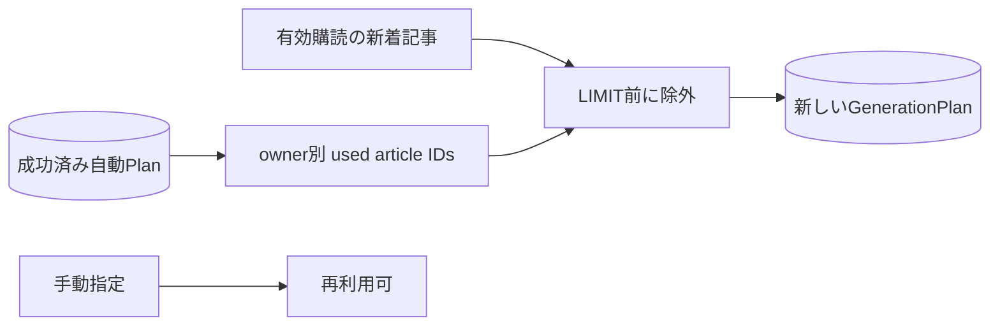

# ADR-0061: 自動生成では成功済み記事を再利用しない

- Status: Proposed
- Date: 2026-08-16
- Decision owners: Product owner / Editorial
- Supersedes: N/A
- Superseded by: N/A
- Related: ADR-0059、`GenerationPlan`

## コンテキストと変更契機

ADR-0059は最新50候補からGenerationPlanを固定するが、過去の成功済み自動jobで使った記事を候補から除外していなかった。新着が少ない利用者では日次番組が同じ記事を繰り返す。一方、手動生成は再編集用途があるため再利用を禁止できない。

## 決定

Productionが成功済みの自動GenerationPlanからowner別の使用済み`articleId`を復元し、Content Knowledgeの候補検索へ除外集合として渡す。除外はSQLの`LIMIT 50`より前に適用する。手動生成と、retry時に固定済みのGenerationPlanには適用しない。

## 判断要因

- 日次生成の新規性を業務不変条件として保証する。
- Context間でDBを共有せず、Productionが自ら確定したPlanを利用履歴の正本にする。
- retryの再現性と手動再編集を維持する。

## 却下案

| 案 | 却下理由 | 再検討条件 |
| --- | --- | --- |
| 一定期間だけ再利用禁止 | 期間境界で同じ記事が再登場し、商品挙動が説明しにくい | 候補枯渇率が継続的にSLOを超える |
| 自動でも重複を許可 | 日次番組の新規性を保証できない | 再放送を明示する商品仕様へ変える |
| Content側へ別の使用済み台帳を複製 | completionとの二重書き込みと整合処理が増える | 複数の生成Contextが同じ利用履歴を共有する |

## 結果

### 利点

- 成功済みの自動番組と同じ記事を再選定しない。
- 失敗jobは記事を消費せず、手動では意図的に再利用できる。

### 欠点とリスク

- 未使用候補が枯渇した自動jobは`no_generation_candidates`で終端する。
- 使用済み集合が増えるため、将来は専用索引または集約表が必要になり得る。

## 影響と同期

| 対象 | 必要な変更 | 状態 | 証拠 |
| --- | --- | --- | --- |
| 設計書 | 自動/手動の再利用規則 | Done | `docs/design.md` §5、§8.4 |
| ドメイン/ユースケース | 自動選定へ除外集合を追加 | Done | Production execute / Content planning |
| OpenAPI/外部契約 | N/A — 公開requestは変更しない | Done | N/A |
| コード/ポート | 成功Plan照会と候補除外 | Done | Production/Content ports |
| データ/ストレージ | N/A — 既存GenerationPlanを正本にする | Done | migration不要 |
| 実行/配備 | N/A — 新規service/secretなし | Done | N/A |
| 認証/セキュリティ | owner scopeで履歴を抽出 | Done | repository predicate |
| フロント/品質保証 | N/A — 本変更はbackendのみ | Done | N/A |
| テスト/運用 | 自動除外、手動再利用、retry固定 | Done | Content/Production tests |

## 再検討条件

- 未使用候補枯渇が自動jobの5%以上で30日継続する。
- ownerあたりの成功Planが候補照会レイテンシSLOを超える。

## 受け入れゲートと未決事項

- Product ownerが「自動生成では期限なしで再利用しない」ことを承認する。

## 検証証拠

- `pnpm --filter @news-podcast/content-knowledge test`
- `pnpm --filter @news-podcast/episode-production test`

