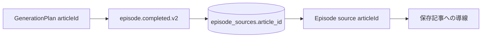

# ADR-0062: Episode provenanceに保存記事IDを保持する

- Status: Accepted
- Date: 2026-08-16
- Decision owners: Product owner / Architecture
- Supersedes: N/A
- Superseded by: N/A
- Related: ADR-0007、ADR-0036、`episode.completed.v2`

## コンテキストと変更契機

Productionは生成入力の`articleId`を保持していたが、完了eventではsnapshot IDと外部URLだけへ射影していた。元URL失効後にEpisodeから保存記事へ戻れず、型強制キャストが契約欠落を隠していた。

## 決定

新しく発行する`episode.completed.v2`の各sourceで`articleId`を必須にし、Libraryの`episode_sources.article_id`へ保存してRESTへ投影する。既存Library行は移行後も読めるようnullableとし、legacy行だけRESTで省略を許す。

## 判断要因

- URLではなく内部IDで保存済みsnapshotへ追跡できる。
- 完了eventをself-containedに保ち、LibraryからProduction DBを参照しない。
- 既存データの読み取り互換性を維持する。

## 却下案

| 案 | 却下理由 | 再検討条件 |
| --- | --- | --- |
| 外部URLだけを保持 | URL失効・変更時に保存記事へ戻れない | archive機能を廃止する |
| LibraryがContentへURL逆引き | URLの一意性と可用性へ依存し、eventの自己完結性を壊す | 完了eventを廃止する |
| legacy行も必須化 | migration時に値を復元できない | 全legacy行の対応表が得られる |

## 結果

### 利点

- 新規Episodeは生成入力、保存snapshot、公開sourceを同じ記事IDで追跡できる。
- `as unknown as`なしでprotocolが欠落を検出する。

### 欠点とリスク

- legacy Episodeのsourceには`articleId`がない場合がある。
- event producer/consumer/DB/RESTを同時に更新する必要がある。

## 影響と同期

| 対象 | 必要な変更 | 状態 | 証拠 |
| --- | --- | --- | --- |
| 設計書 | provenance keyを明記 | Done | `docs/design.md`、`docs/architecture.md` |
| ドメイン/ユースケース | sourceへarticleId追加 | Done | Production/Library domain |
| OpenAPI/外部契約 | Episode sourceへlegacy-compatibleなarticleId追加 | Done | generated OpenAPI |
| コード/ポート | producer/consumer/projector更新 | Done | protocols/Production/Library/Gateway |
| データ/ストレージ | nullable `episode_sources.article_id` | Done | Library migration 20260816141945 |
| 実行/配備 | migrationをconsumer起動前に適用 | Done | service bootstrap |
| 認証/セキュリティ | Episode owner scopeを維持 | Done | Library repository |
| フロント/品質保証 | N/A — frontend変更は別作業 | Done | N/A |
| テスト/運用 | event parse、outbox、materialization | Done | protocol/Production/Library tests |

## 再検討条件

- legacy行を全廃でき、RESTとDBで`articleId`を必須化できる。

## 受け入れゲートと未決事項

- None

## 検証証拠

- `pnpm --filter @news-podcast/protocols test`
- `pnpm --filter @news-podcast/episode-production test`
- `pnpm --filter @news-podcast/episode-library test`

