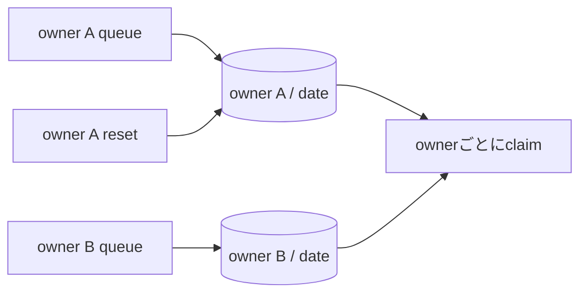

# ADR-0063: AI記事補完の日次枠をowner単位で所有する

- Status: Proposed
- Date: 2026-08-17
- Decision owners: Product owner / Platform
- Supersedes: N/A
- Superseded by: N/A
- Related: ADR-0037、`docs/design.md` §4、`content_enrichment_daily_progress`

## コンテキストと変更契機

AI記事補完のキュー、結果、タグはowner単位である一方、日次使用量だけは`local_date`を主キーとする全owner共通カウンターだった。1人が上限を消費すると他の利用者の処理が止まり、`/v1/me/enrich/reset-daily`も全員の使用量を削除していた。`/v1/me`が表す所有範囲と、Content Knowledge内の永続化・ユースケース境界が一致していなかった。

## 決定

AI記事補完の日次上限は`ownerId + UTC localDate`ごとに評価する。完了時の加算、workerの残量判定、状態表示、開発用リセットを同じowner境界で実行する。

## 判断要因

- ある利用者の処理量やリセットが別の利用者へ影響しないこと。
- `/v1/me`、RPC actor、Application Port、SQLite主キーのowner境界を一致させること。
- 完了と使用量加算を同じtransactionに保つこと。

## 却下案

| 案 | 却下理由 | 再検討条件 |
| --- | --- | --- |
| 全owner共通の日次枠を維持 | tenant間の枯渇とリセット干渉を仕様として説明できない | 管理者だけが操作する単一tenant製品へ変更する |
| 共通枠とowner枠を二重に持つ | 現時点では費用上限と公平性の2段制御を要求されておらず、claim規則と運用が複雑になる | provider費用の全体hard limitが必要になる |
| リセットAPIだけを削除 | 枯渇の共有は残り、owner境界の不整合を解消しない | N/A |

## 結果

### 利点

- 1人が日次枠を使い切っても、他のownerの処理は継続する。
- 認証actorから導出したownerが、RPCからDBまで型付きPortで伝播する。
- owner Aのリセットはowner Bの使用量を変更しない。

### 欠点とリスク

- 設定値`CONTENT_ENRICH_DAILY_LIMIT`は全体上限ではなくownerごとの上限になるため、owner数に比例して最大provider利用量が増える。
- 旧カウンターはownerへ正しく帰属できないため、migration時に当日分を破棄する。deploy直後だけ追加処理が発生し得る。

## 影響と同期

| 対象 | 必要な変更 | 状態 | 証拠 |
| --- | --- | --- | --- |
| 設計書 | 日次枠の所有単位とworker規則を明記 | Done | `docs/design.md` §4 |
| ドメイン/ユースケース | ownerごとに使用量を読み、枯渇ownerだけをskip | Done | `application/enrichment.ts` |
| OpenAPI/外部契約 | N/A — endpointとresponse shapeは不変 | Done | contract差分なし |
| コード/ポート | `budgetUsed`と`resetDaily`へ`OwnerId`を必須化 | Done | Content Application/RPC/adapters |
| データ/ストレージ | 主キーを`(owner_id, local_date)`へ変更 | Done | Drizzle schema/migration |
| 実行/配備 | N/A — service、secret、設定項目は不変 | Done | N/A |
| 認証/セキュリティ | reset対象をRPC user actorのownerへ限定 | Done | personalization RPC test |
| フロント/品質保証 | N/A — 公開契約とUI操作は不変 | Done | N/A |
| テスト/運用 | owner分離、枯渇skip、migrationを検証 | Done | Content tests |

## 再検討条件

- provider費用の全体hard limitが必要になり、owner別上限の合計が予算を超える。
- owner別の契約プランによって異なる日次上限が必要になる。
- 利用者のIANA time zone基準で補完日を切り替える要件が決まる。

## 受け入れゲートと未決事項

- Product ownerが`CONTENT_ENRICH_DAILY_LIMIT`をownerごとの上限として扱うことを承認する。

## 検証証拠

- `pnpm --filter @news-podcast/content-knowledge test`
- `pnpm --filter @news-podcast/content-knowledge typecheck`
- `pnpm test:e2e:functional`
