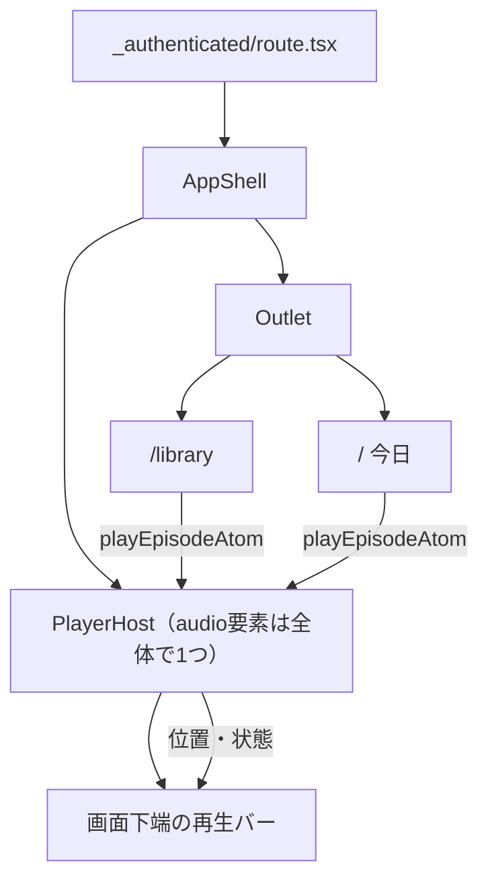

# ADR-0064: 再生をrouteの外へ出し、ライブラリを一覧と原稿の2ペインにする

- Status: Accepted
- Date: 2026-08-19
- Decision owners: Product owner / Web
- Supersedes: N/A
- Superseded by: N/A
- Related: ADR-0018、ADR-0047、ADR-0055、ADR-0060、`docs/design.md` §7.1 / §7.3

## コンテキストと変更契機

ライブラリは「完成した番組のカードを縦に積み、押すと`<audio controls>`が一覧の上に現れる」画面だった。確認済みの事実:

| 事象 | 由来 |
| --- | --- |
| ページを移ると音が止まる | `<audio>`がrouteのcomponentの中にあり、遷移でunmountされる |
| 番組を読み返せない | `Episode.script`は`GET /v1/episodes`の応答に**最初から載っている**のに、画面のどこにも出していなかった |
| 再生位置が残らない | 位置の記録が無く、閉じると毎回先頭から |
| 出典が畳まれている | 「出典を確認」を開かないと、台本の根拠が見えない |
| 一覧が伸び続ける | ページングが無く、`hasMore`を読んでいなかった |

台本は最大20,000字ある。カードへ積む形では、番組が増えるほど一覧性と可読性のどちらも成り立たない。

## 決定

### 1. 音を出す場所はrouteの外に1つだけ置く

- `<audio>`は`AppShell`の中、`Outlet`の外に**1つだけ**置く。ページ遷移は`Outlet`の中しか入れ替えないので、再生は遷移から独立する。
- **正本は要素側**。atomはその写しを配るだけで、逆向き（atomを正本にして要素へ同期する）にはしない。OSのメディアキーやロック画面は要素を直接動かすので、二重の真実ができる。
- 操作（再生・シーク・速度）は書き込み専用atomが持ち、要素へ命令する。要素が起こした出来事は`PlayerHost`がatomへ書き戻す。
- バーの高さは`AppShell`が`:has([data-slot=player-bar])`で確保する。有無をstateで配ると、鳴らし始めた瞬間に画面全体が描き直される。

### 2. 購読は「その値を実際に描く場所」まで下ろす（ADR-0060の適用）

`timeupdate`は毎秒数回届く。購読の単位を誤ると、鳴っている間ずっと画面が描き直される。

| 値 | 購読する場所 |
| --- | --- |
| 現在位置・総時間 | 目盛り（`PlaybackScrubber`）だけ |
| 鳴っているか | 操作ボタンと、**その番組の**再生ボタンだけ（`episodePlayingAtomFamily`） |
| 載っている番組 | バーの見出しと、一覧の選択表示（IDのみ） |
| 番組ごとの再生記録 | その行の聴取状態だけ（`progressEntryAtomFamily`） |

### 3. 再生位置は端末に残し、続きから再開する

- 番組ごとに`{position, duration, updatedAt}`をlocalStorageへ持つ。保存は一時停止・終了・番組の切り替え・10秒ごとの間引きで行う。
- 末尾から`FINISH_TAIL_SECONDS`(15秒)以内まで達していれば「再生済み」とし、次は先頭から鳴らす。末尾から再開しても何も鳴らないため。
- リロード後はバーに前回の番組が戻り、**押せば続きから**鳴る。音そのものは自動では鳴らさない（ブラウザが止めるうえ、意図しない再生になる）。

### 4. ライブラリは一覧と原稿の2ペインにする

- 左が番組一覧（日付で括った行だけ）、右が詳細（原稿を主、出典を右レール）。選択は`?episode=`でURLが正本。
- 出典は`articleId`があれば保存版の記事へも辿れるようにする（外部URLは失効するため。`docs/design.md` §8）。
- 一覧は`cursor`ページングを読む。

## 判断要因

- podcastは「画面を見ていない時間」が長い。音が遷移で切れるのは、機能の欠落ではなく**壊れている**に近い。
- 台本はAPIに既にあり、出す/出さないはUIだけの判断だった。根拠（出典）と読み上げ内容（原稿）が揃って初めて「確認できる番組」になる。
- 記事ページが既に2ペイン + 右レールの型を持っている。同じ型を使えば、操作もコードも学び直しが要らない。
- 音声の総時間は契約に無い。`loadedmetadata`まで判らない値を前提にした表示は作れない。

## 却下案

| 案 | 却下理由 | 再検討条件 |
| --- | --- | --- |
| `<audio>`をrouteの中に置いたまま、遷移時に位置を引き継ぐ | 要素が作り直されるので音は必ず途切れる。バッファも捨てる | N/A |
| 再生状態をatom正本にし、Effectで要素へ同期する | メディアキー・ロック画面・要素自身の`ended`が要素側を直接動かすため、正本が2つになる | 要素の状態を購読だけで完全に表せるAPIが増える |
| 位置をサーバへ保存する | 契約に無く、追加の書き込みAPIが要る。端末をまたぐ継続は今の要求に無い | 複数端末での続き再生を求められたとき |
| 原稿をMarkdownの描画器へ通す | 台本は読み上げ用の地の文で、Markdownとして書かれていない。見出しもコードも出ない | 生成が構造化された台本を返すようになる |
| 原稿と出典をタブで切り替える | 「聴きながら根拠を確かめる」が2手になる。幅があるなら並べれば足りる | N/A |
| 音声の総時間を契約へ足す | 表示のためだけにproduction側の保存とeventを変えることになる。`loadedmetadata`で足りる | 一覧に総時間を出す要求が生じたとき |
| モバイルでも目盛りを行として置く | 下端の占有が下部ナビと合わせて8remを超え、本文が読めなくなる | N/A |

## 結果

### 利点

- ページを移っても音が続く（`tests/e2e/local-flow.spec.ts`が遷移後の`paused === false`まで確認する）。
- 原稿と出典が同じ画面で読める。出典は保存版の記事へも辿れる。
- 続きから聴ける。一覧は「残り M:SS / 再生済み」を示す。
- 再生位置が毎秒動いても、一覧の行は**1回も**描き直されない（`episode-list.render-count.test.tsx`が予算にしている）。
- OSのロック画面とメディアキーから操作できる（Media Session）。

### 欠点とリスク

- 端末に再生記録が残る（`player.progress` / `player.track` / `player.rate`）。共有端末では前の利用者の続きが見える。上限200件で古いものから捨てる。
- 総時間が判るのは`loadedmetadata`の後なので、押した直後の一瞬だけ目盛りが操作できない。
- 下端の常設バーが1行ぶん（3.5rem）を恒久的に占める。`:has()`が効かない環境では余白が確保されず、本文の末尾がバーに隠れる。
- Media Sessionの`setActionHandler`は端末により未対応の操作がある。個別に握り潰しているので、対応状況は画面から見えない。

## 影響と同期

| 対象 | 必要な変更 | 状態 | 証拠 |
| --- | --- | --- | --- |
| 設計書 | §7.1へ再生バーとライブラリの原則、§7.3へ画面構成 | Done | `docs/design.md` |
| ドメイン/ユースケース | N/A — Web層の構成のみ | Done | 変更なし |
| OpenAPI/外部契約 | N/A — `script`も`sources`も既存の応答に含まれる | Done | `packages/contracts/openapi/openapi.json` |
| コード/ポート | `features/player`の新設、ライブラリの再構成、日付の括りの共通化 | Done | `apps/web/src/features/player`、`apps/web/src/routes/_authenticated/library` |
| データ/ストレージ | 再生位置を端末のlocalStorageへ（サーバ側の変更なし） | Done | `apps/web/src/features/player/atoms.ts` |
| 実行/配備 | N/A | Done | N/A |
| 認証/セキュリティ | 音声はsame-originのcookie認証のまま（ADR-0055） | Done | `apps/web/src/features/player/atoms.ts` |
| フロント/品質保証 | 描画回数の予算、a11y検査へ「番組を開いた状態」を追加、視覚回帰へ再生バー | Done | `apps/web/tests/e2e/accessibility.spec.ts`、`apps/web/tests/visual/app-pages.spec.ts` |
| テスト/運用 | 偽Gatewayへ番組seedと`GET /v1/episodes/{id}`、無音WAVを30秒へ | Done | `apps/web/scripts/fake-api.ts` |

## 再検討条件

- 端末をまたいだ続き再生が求められる（位置の保存先をサーバへ移す）。
- 番組に章立てやタイムスタンプが載る（原稿と再生位置を同期できるようになる）。
- 連続再生（キュー）が求められる。今は1番組ずつで、`ended`で止まる。
- `:has()`に依存しない余白の確保が必要になる（古いブラウザを支援対象へ入れる）。

## 受け入れゲートと未決事項

- 原稿と音声の同期ハイライトは**実装できない**。台本にタイムスタンプが無く、生成側の契約変更が要る。

## 検証証拠

- `pnpm --filter web typecheck` / `lint` / `format:check`
- `pnpm --filter web test`（描画回数の予算、再生モデル、バーの操作を含む）
- `pnpm --filter web test:e2e`（全ページのaxe検査と、遷移を跨いだ再生継続）
- `pnpm test:visual`（ライブラリの一覧・原稿・再生バーをlight/dark × desktop/mobileで固定）
